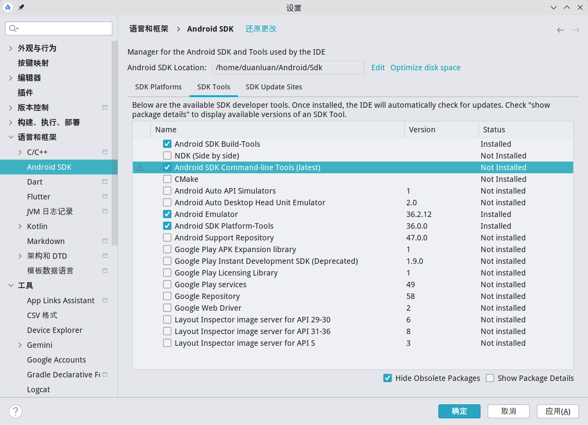

# 开发类

## Git

创建 SSH Key：

参考 [Generating a new SSH key and adding it to the ssh-agent - GitHub Docs](https://docs.github.com/en/authentication/connecting-to-github-with-ssh/generating-a-new-ssh-key-and-adding-it-to-the-ssh-agent)。

```shell
ssh-keygen -t ed25519 -C "your_email@example.com"
cat ~/.ssh/id_ed25519.pub
```

设置 Git 用户信息，否则 clone 时可能会报错`GnuTLS recv error (-110)`。

```shell
git config --global user.name "your_name"
git config --global user.email "your_email@example.com"
```

其他一些忽略：

```shell
# 忽略换行分隔符差异
git config --global core.autocrlf input
# 忽略文件权限修改
git config --global core.fileMode false
```

## act

本地运行 GitHub Actions。

[Releases · nektos/act](https://github.com/nektos/act/releases) 下载压缩包。

```shell
$ tar zxvf act_Linux_x86_64.tar.gz
$ sudo mkdir /opt/act
$ sudo mv act /opt/act/

# 可执行文件链接到系统路径
$ sudo ln -s /opt/act/act /usr/local/bin/act

# 用本项目做测试
# 查看任务
$ act --list
INFO[0000] Using docker host 'unix:///var/run/docker.sock', and daemon socket 'unix:///var/run/docker.sock' 
Stage  Job ID           Job name         Workflow name  Workflow file    Events
0      deploy-gh-pages  deploy-gh-pages  docs           deploy-docs.yml  pus

# 测试
$ sudo act -j deploy-gh-pages
```

## nvm + Node.js + pnpm + nrm

- [脚本安装 nvm](https://github.com/nvm-sh/nvm?tab=readme-ov-file#install--update-script)
- [Node.js — Download Node.js®](https://nodejs.org/zh-cn/download)

```shell
# 代理下载安装脚本
proxychains wget https://raw.githubusercontent.com/nvm-sh/nvm/v0.40.3/install.sh
# 替换安装脚本中 git clone 为 proxychains git clone（可选）
sed -i 's/command git clone/command proxychains git clone/g' install.sh
# 执行脚本
bash install.sh
# 代替重启 shell
\. "$HOME/.nvm/nvm.sh"
# 下载并安装 Node.js
nvm install 24
# 安装 pnpm 方法一
corepack enable pnpm
# 安装 pnpm 方法二
npm install -g pnpm
# 自动安装配置 pnpm
pnpm setup
source ~/.zshrc
# 安装 nrm
pnpm add -g nrm
# 查看所有镜像源
nrm ls
  npm ---------- https://registry.npmjs.org/
  yarn --------- https://registry.yarnpkg.com/
  tencent ------ https://mirrors.tencent.com/npm/
  cnpm --------- https://r.cnpmjs.org/
  taobao ------- https://registry.npmmirror.com/
  npmMirror ---- https://skimdb.npmjs.com/registry/
  huawei ------- https://repo.huaweicloud.com/repository/npm/
# 使用镜像源
nrm use xxx
```

## JDK

[Java 8, 11, 17, 21, 23 Download for Linux, Windows and macOS](https://www.azul.com/downloads/?os=debian&architecture=x86-64-bit&package=jdk#zulu)

```shell
tar zxvf zulu17.64.17-ca-jdk17.0.18-linux_x64.tar.gz
sudo mkdir /opt/java
sudo mv zulu17.64.17-ca-jdk17.0.18-linux_x64 /opt/java/zulu17.64.17-ca-jdk17.0.18
# 创建固定别名，后续升级只改软链接
sudo ln -sfn /opt/java/zulu17.64.17-ca-jdk17.0.18 /opt/java/jdk17
# 末尾追加环境变量
$ nano ~/.zshrc
# JDK
export JAVA_HOME="/opt/java/jdk17"
export PATH=$JAVA_HOME/bin:$PATH

$ source ~/.zshrc
$ java -version
openjdk version "17.0.18" 2026-01-20 LTS
OpenJDK Runtime Environment Zulu17.64+17-CA (build 17.0.18+8-LTS)
OpenJDK 64-Bit Server VM Zulu17.64+17-CA (build 17.0.18+8-LTS, mixed mode, sharing)
```

## Gradle

[Gradle | Releases](https://gradle.org/releases/) 下载`binary-only`。

```shell
# 代理下载压缩包（可选）
proxychains axel -n 10 -o gradle-8.14.3-bin.zip 'https://services.gradle.org/distributions/gradle-8.14.3-bin.zip'

unzip gradle-8.14.3-bin.zip
sudo mkdir /opt/gradle
sudo mv gradle-8.14.3 /opt/gradle/
# 末尾追加环境变量
$ nano ~/.zshrc
# Gradle
export GRADLE_HOME="/opt/gradle/gradle-8.14.3"
export PATH=$GRADLE_HOME/bin:$PATH

$ source ~/.zshrc
$ gradle -v

Welcome to Gradle 8.14.3!
……

# 创建全局脚本
$ nano ~/.gradle/init.gradle

# 配置镜像
settingsEvaluated { settings ->
    settings.pluginManagement {
        repositories {
            maven { url 'https://maven.aliyun.com/repository/public' }
            maven { url 'https://maven.aliyun.com/repository/google' }
            maven { url 'https://maven.aliyun.com/repository/gradle-plugin' }
        }
    }
}

allprojects {
    buildscript {
        repositories {
            maven { url 'https://maven.aliyun.com/repository/public' }
            maven { url 'https://maven.aliyun.com/repository/google' }
            maven { url 'https://maven.aliyun.com/repository/gradle-plugin' }
        }
    }
    repositories {
        maven { url 'https://maven.aliyun.com/repository/public' }
        maven { url 'https://maven.aliyun.com/repository/google' }
    }
}
```

## JetBrains Toolbox APP

[JetBrains Toolbox App：轻松管理您的工具](https://www.jetbrains.com/zh-cn/toolbox-app/)

```shell
# 安装 Toolbox
paru jetbrains-toolbox

# 创建 Shell 脚本位置
sudo mkdir -p /opt/jetbrains/scripts

# 更改想要安装的目录所有者为当前用户
sudo chown -R $USER:$USER /opt/jetbrains

# 将想要设置的 Shell 脚本目录添加到环境变量
$ nano ~/.zshrc
# jetbrains toolbox scripts
export PATH="/opt/jetbrains/scripts:$PATH"

# 生效环境变量
$ source ~/.zshrc
```

在 Toolbox APP 右上角齿轮图表-`设置`-`工具`中修改`工具安装位置`为`/opt/jetbrains`，`Shell 脚本位置`为`/opt/jetbrains/scripts`并应用。

## JetBrains IntelliJ IDEA

适用于专业开发的卓越 IDE，适用于 Java 和 Kotlin。


[下载 IntelliJ IDEA](https://www.jetbrains.com/zh-cn/idea/download/?section=linux)

[MIME 类型（MIME Type）完整对照表](https://mime.wcode.net/zh-hans/)

方式一：通过 JetBrains Toolbox 安装。

方式二：手动安装。
```shell
# 解压并移动到 /opt 下
tar zxvf ideaIU-2024.3.4.1.tar.gz
sudo mkdir /opt/jetbrains
sudo mv idea-IU-243.25659.59/ /opt/jetbrains/intellij-idea-ultimate
# 创建快捷方式
$ sudo nano /usr/share/applications/idea.desktop

[Desktop Entry]
Name=IntelliJ IDEA Ultimate
Comment=The IDE for Professional Development in Java and Kotlin
GenericName=IDE
Exec=/opt/jetbrains/intellij-idea-ultimate/bin/idea %F
Icon=/opt/jetbrains/intellij-idea-ultimate/bin/idea.svg
Type=Application
# 禁用启动时进度通知
StartupNotify=false
# 与应用程序窗口关联的 WM_CLASS 属性
StartupWMClass=jetbrains-idea
Categories=TextEditor;Development;IDE;
MimeType=application/java;application/java-archive;application/java-byte-code;application/java-vm;
Keywords=idea;
```

**快捷键调整：**

`设置`-`按键映射`-`主菜单`-`导航`-`通过引用转到`-`选择位置…`在`KDE`按键方案中不是`Alt+F1`而是`Alt+Shift+1`，因为`Alt+F1`是`plasmashell`的快捷键。我们之前在系统配置中已经取消了`plasmashell`的这个快捷键，所以可以修改一下，或者直接将按键方案修改为`Windows`。

**IDEA 占用内存过高只升不降：**

使用 IDEA 2025.3.1.1，发现内存占用一直在升高（>20G），关闭 IDEA 后内存也没有释放，`ps aux | grep idea`发现很多`ExternalJavacProcess`进程。

解决方法：

- `pkill -f "ExternalJavacProcess"`杀掉所有`ExternalJavacProcess`进程。
- IDEA 打开`设置` / `Settings (Ctrl+Alt+S)`。
- 进入`构建、执行、部署` -> `编译器` / `Build, Execution, Deployment` -> `Compiler`。
- `并行编译独立模块` / `Compile independent modules in parallel`下拉框选择`已禁用` / `Disabled`。  
  需注意除了在`新建项目设置` -> `为新项目设置` / `New Projects Settings` -> `Settings for New Projects`中设置外，还需要在当前项目中也进行相同设置。
- 应用后重启 IDEA。


## Maven (Daemon)

- Maven

  此处用的是 IDEA 自带的。也可以自己下载：[Download Apache Maven – Maven](https://maven.apache.org/download.cgi)
  
  ```shell
  # 末尾追加环境变量
  $ nano ~/.zshrc
  # Maven
  export MAVEN_HOME="/opt/jetbrains/intellij-idea-ultimate/plugins/maven/lib/maven3/"
  export PATH=$MAVEN_HOME/bin:$PATH
  
  $ source ~/.zshrc
  $ mvn -v
  Apache Maven 3.9.9 (8e8579a9e76f7d015ee5ec7bfcdc97d260186937)
  Maven home: /opt/jetbrains/intellij-idea-ultimate/plugins/maven/lib/maven3
  Java version: 17.0.18, vendor: Azul Systems, Inc., runtime: /opt/java/zulu17.64.17-ca-jdk17.0.18-linux_x64
  Default locale: zh_CN, platform encoding: UTF-8
  OS name: "linux", version: "6.12.9-amd64-desktop-rolling", arch: "amd64", family: "unix"
  ```

- Maven Daemon

  [Maven Daemon](https://maven.apache.org/tools/mvnd.html)（mvnd）是一个用于 Maven 的守护进程基础设施。

  它通过这些方式帮助减少构建时间：**在构建之间保持 JVM 运行**、**管理 Maven 进程池**、**跨构建重用 JVM 和 Maven 进程**。
  
  功能：**构建速度显著更快**、**兼容现有的 Maven 插件和扩展**、**守护进程管理**、**智能内存管理**、**原生可执行文件可用**。
  
  [Download Apache Maven Daemon – Maven](https://maven.apache.org/download.cgi#Maven_Daemon)
  
  ```shell
  $ tar zxvf maven-mvnd-1.0.3-linux-amd64.tar.gz
  $ sudo mv maven-mvnd-1.0.3-linux-amd64 /opt/maven-mvnd
  
  # 末尾追加环境变量
  $ nano ~/.zshrc
  # Maven Daemon
  export MVND_HOME="/opt/maven-mvnd"
  export MAVEN_HOME=$MVND_HOME/mvn
  export PATH=$MVND_HOME/bin:$MAVEN_HOME/bin:$PATH
  
  $ source ~/.zshrc
  $ mvnd -v
  Apache Maven Daemon (mvnd) 1.0.3 linux-amd64 native client (824a1fd42088e27dec6cc7cc392b9122379e7bf0)
  Terminal: org.jline.terminal.impl.PosixSysTerminal with pty org.jline.terminal.impl.jni.linux.LinuxNativePty
  Apache Maven 3.9.11 (3e54c93a704957b63ee3494413a2b544fd3d825b)
  Maven home: /opt/maven-mvnd/mvn
  Java version: 17.0.18, vendor: Azul Systems, Inc., runtime: /opt/java/zulu17.64.17-ca-jdk17.0.18-linux_x64
  Default locale: zh_CN, platform encoding: UTF-8
  OS name: "linux", version: "6.12.48-1-manjaro", arch: "amd64", family: "unix"
  
  $ mvn -v
  ```

## Apache JMeter

Apache JMeter 是一个 Java 应用程序，可以测试各种应用程序、服务器、协议和资源的性能和功能。


[Apache JMeter - Download Apache JMeter](https://jmeter.apache.org/download_jmeter.cgi)

```shell
# 安装
$ paru jmeter

# 创建环境变量脚本
$ sudo nano /opt/jmeter/setenv.sh

# 设置 JVM UI 缩放比例
JVM_ARGS="-Dsun.java2d.uiScale=2.0"
```

## JetBrains WebStorm

JavaScript 和 TypeScript IDE。


[下载 WebStorm](https://www.jetbrains.com/zh-cn/webstorm/download/#section=linux)

方式一：通过 JetBrains Toolbox 安装。

方式二：手动安装。
```shell
# 解压并移动到 /opt 下
tar zxvf WebStorm-2024.3.4.tar.gz
sudo mkdir /opt/jetbrains
sudo mv WebStorm-243.25659.40/ /opt/jetbrains/webstorm
# 创建快捷方式
$ sudo nano /usr/share/applications/webstorm.desktop

[Desktop Entry]
Name=WebStorm
Comment=The JavaScript and TypeScript IDE by JetBrains
GenericName=IDE
Exec=/opt/jetbrains/webstorm/bin/webstorm %F
Icon=/opt/jetbrains/webstorm/bin/webstorm.svg
Type=Application
# 禁用启动时进度通知
StartupNotify=false
# 与应用程序窗口关联的 WM_CLASS 属性
StartupWMClass=jetbrains-webstorm
Categories=TextEditor;Development;IDE;
MimeType=application/xhtml+xml;text/javascript;text/css;
Keywords=webstorm;
```

## JetBrains PyCharm

用于数据科学和 Web 开发的 Python IDE。


[下载 PyCharm](https://www.jetbrains.com/zh-cn/pycharm/download/?section=linux)

方式一：通过 JetBrains Toolbox 安装。

方式二：手动安装。
```shell
# 解压并移动到 /opt 下
tar zxvf pycharm-2025.1.2.tar.gz
sudo mkdir /opt/jetbrains
sudo mv pycharm-2025.1.2 /opt/jetbrains/pycharm
# 创建快捷方式
$ sudo nano /usr/share/applications/pycharm.desktop

[Desktop Entry]
Name=PyCharm
Comment=Pycharm is a Python IDE for professional developers by JetBrains.
GenericName=IDE
Exec=/opt/jetbrains/pycharm/bin/pycharm %F
Icon=/opt/jetbrains/pycharm/bin/pycharm.svg
Type=Application
# 禁用启动时进度通知
StartupNotify=false
# 与应用程序窗口关联的 WM_CLASS 属性
StartupWMClass=jetbrains-webstorm
Categories=TextEditor;Development;IDE;
MimeType=application/xhtml+xml;text/javascript;text/css;
Keywords=pycharm;
```

## Python + pipx + cnpip 切换最快 pip 镜像源 + uv

自带 Python，但当你想全局安装依赖时会报错：
```shell
$ pip install cnpip

error: externally-managed-environment

× This environment is externally managed
╰─> To install Python packages system-wide, try 'pacman -S
    python-xyz', where xyz is the package you are trying to
    install.
    
    If you wish to install a non-Arch-packaged Python package,
    create a virtual environment using 'python -m venv path/to/venv'.
    Then use path/to/venv/bin/python and path/to/venv/bin/pip.
    
    If you wish to install a non-Arch packaged Python application,
    it may be easiest to use 'pipx install xyz', which will manage a
    virtual environment for you. Make sure you have python-pipx
    installed via pacman.

note: If you believe this is a mistake, please contact your Python installation or OS distribution provider. You can override this, at the risk of breaking your Python installation or OS, by passing --break-system-packages.
hint: See PEP 668 for the detailed specification.
```
解决方案是使用它推荐的 pipx：
```shell
# pacman 安装 pipx
sudo pacman -S python-pipx
# pipx 安装 cnpip
pipx install cnpip
# cnpip 切换最快镜像源
cnpip set
# pipx 安装 uv
pipx install uv
```

uv 全局换源：
```shell
# 创建 uv 配置文件
$ mkdir ~/.config/uv
$ nano ~/.config/uv/uv.toml

[[index]]
url = "https://pypi.tuna.tsinghua.edu.cn/simple"
default = true

# 创建测试虚拟环境
$ cd /tmp
$ uv venv test-env
# 进入虚拟环境
$ source test-env/bin/activate
# 使用 uv pip 尝试安装 torch（仅测试，不真正安装）
(test-env) $ uv pip install torch --dry-run
# 退出虚拟环境
(test-env) $ deactivate
# 删除测试虚拟环境
$ rm -rf test-env
```

## Android Studio

Android Studio 是开发 Android 应用的官方 IDE，包含构建 Android 应用所需的所有功能。


[下载 Android Studio 和应用工具 - Android 开发者 | Android Developers](https://developer.android.google.cn/studio?hl=zh-cn)

方式一：通过 JetBrains Toolbox 安装。

方式二：手动安装。
```shell
# 解压并移动到 /opt 下
tar zxvf android-studio-2025.2.1.7-linux.tar.gz
sudo mv android-studio /opt/jetbrains/android-studio
# 创建快捷方式
$ sudo nano /usr/share/applications/android-studio.desktop

[Desktop Entry]
Name=Android Studio
Comment=Android Studio is the official IDE for Android development, and includes everything you need to build Android apps.
GenericName=IDE
Exec=/opt/jetbrains/android-studio/bin/studio %F
Icon=/opt/jetbrains/android-studio/bin/studio.png
Type=Application
# 禁用启动时进度通知
StartupNotify=false
# 与应用程序窗口关联的 WM_CLASS 属性
StartupWMClass=jetbrains-studio
Categories=TextEditor;Development;IDE;
MimeType=text/x-java;text/x-kotlin;text/x-groovy;application/xml;text/xml;application/vnd.android.package-archive;inode/directory;
Keywords=android;studio;
```

### 安装 Android SDK / NDK / Command-line Tools

首次启动 Android Studio 后，进入 `Tools`-`SDK Manager`（或 `Settings`-`Language & Frameworks`-`Android SDK`）：

1. `SDK Platforms`：选择并安装需要的 Android API（建议至少安装一个稳定版，如 API 35/36）。
2. `SDK Tools`：勾选并安装以下组件：
   - `Android SDK Build-Tools`
   - `NDK (Side by side)`
   - `Android SDK Command-line Tools (latest)`
   - `Android SDK Platform-Tools`

安装完成后确认目录（默认）：
```shell
$ ls -lah ~/Android/Sdk
$ ls -1 ~/Android/Sdk/ndk
29.0.14206865
```

配置环境变量（`nano ~/.zshrc`）：
```shell
# Android SDK / NDK
export ANDROID_HOME="$HOME/Android/Sdk"
export NDK_HOME="$ANDROID_HOME/ndk/29.0.14206865"
# Android command-line tools + Android Studio
export PATH="$ANDROID_HOME/platform-tools:$ANDROID_HOME/cmdline-tools/latest/bin:$ANDROID_HOME/emulator:/opt/jetbrains/android-studio/bin:$PATH"
```

如果是通过 JetBrains Toolbox 安装 Android Studio，把上面 `PATH` 里的 `/opt/jetbrains/android-studio/bin` 替换为实际安装目录。

使环境变量生效并验证：
```shell
source ~/.zshrc
adb version
sdkmanager --version
echo $ANDROID_HOME
echo $NDK_HOME
which studio
```

### 安装 IDEA 的中文插件

此处修改是最新版 IDEA 安装目录下的`plugins/localization-zh/lib/localization-zh.jar`，使用 [JetBrains Marketplace](https://plugins.jetbrains.com/plugin/13710/versions) 下载的 [v242.152](https://plugins.jetbrains.com/plugin/download?rel=true&updateId=557305) 来修改也是差不多的。

```shell
# 查看 Android Studio 版本
$ cat /opt/jetbrains/android-studio/build.txt 
AI-252.27397.103.2522.14617522% 

# 复制 IDEA 安装目录下的中文插件到下载目录
sudo cp /opt/jetbrains/intellij-idea-ultimate/plugins/localization-zh/lib/localization-zh.jar ~/Downloads/
cd ~/Downloads/
# 解压出 META-INF/plugin.xml
unzip localization-zh.jar META-INF/plugin.xml
```

编辑`META-INF/plugin.xml`：
- `<version>253.29346.138</version>`修改为`<version>AI-252.25557.131</version>`。
- `<idea-version since-build="253.29346.138" until-build="253.29346.138"/>`修改为`<idea-version since-build="AI-252.27397.103" until-build="252.*"/>`。
- 删除`<description>`标签内的内容，只保留`<description></description>`。

```shell
# 将修改后的 plugin.xml 更新回 jar 包
sudo zip localization-zh.jar META-INF/plugin.xml
```

打开 Android Studio，`Settings`-`Plugins`-右上角齿轮图标-`Install Plugin from Disk...`，选择修改后的`localization-zh.jar`，重启软件。

`Settings`-`Appearance & Behavior`-`System Settings`-`Language and Region`中`Language`选择`Chinese (Simplified) 简体中文`。

## Visual Studio Code

开源轻量代码编辑器。


[Download Visual Studio Code - Mac, Linux, Windows](https://code.visualstudio.com/download)

```shell
paru visual-studio-code-bin
```

## Cursor

Cursor 旨在大幅提升您的生产力，是使用 AI 编码的最佳方式。


[Cursor · Download](https://cursor.com/cn/download)

```shell
paru cursor-bin
```

## Windsurf

Windsurf 是一款直观的 AI 编程工具，旨在让您和您的团队始终保持高效的工作状态。

[Download Windsurf Editor and Plugins | Windsurf](https://windsurf.com/download)

```shell
paru windsurf
```

## Antigravity

Google Antigravity AI IDE 是谷歌推出的“Agent-First”智能开发环境，把代码编辑、终端和浏览器级自动化整合到一起，让 AI 能直接参与从编写、调试到验证的整条开发流程。


[Google Antigravity Download](https://antigravity.google/download)

```shell
paru antigravity
```

## Kiro

Kiro 通过基于规格说明的开发，为 AI 编程提供结构化框架，助您发挥最佳水平。


[Downloads - Kiro](https://kiro.dev/downloads/)

```shell
paru kiro-ide
```

## Trae

TRAE（/treɪ/）深度融合 AI 能力，是一名能够理解需求、调用工具并独立完成各类开发任务的“AI 开发工程师”，帮助你高效推进每一个项目。


[Download | TRAE - Collaborate with Intelligence](https://www.trae.ai/download)

```shell
paru trae-bin
```

## Qoder

Qoder，面向真实软件的智能体编程平台


[下载 | Qoder - 智能体编程平台](https://qoder.com/download)

```shell
paru qoder-bin
```

## FVM + Flutter 换源 + Dart

```shell
# 下载 FVM 安装脚本
wget https://fvm.app/install.sh
# 代理安装 FVM
proxychains -q bash install.sh

# 末尾追加环境变量
echo 'export PATH="$HOME/fvm/bin:$PATH"' >> ~/.zshrc
source ~/.zshrc

# 代理安装 Flutter SDK 稳定版
proxychains -q fvm install stable

# 将 stable 设为全局默认的 Flutter 版本
$ fvm global stable 
Flutter SDK: Channel: Stable is now global

# 查看 FVM 缓存
$ fvm list
Cache directory:  /home/duanluan/fvm/versions
Directory Size: 739.33 MB

# 通过 FVM 检查当前 Flutter 版本
$ fvm flutter --version
Flutter 3.38.5 • channel stable • https://github.com/flutter/flutter.git
Framework • revision f6ff1529fd (4 周前) • 2025-12-11 11:50:07 -0500
Engine • hash c108a94d7a8273e112339e6c6833daa06e723a54 (revision 1527ae0ec5) (27 days ago) • 2025-12-11 15:04:31.000Z
Tools • Dart 3.10.4 • DevTools 2.51.1

# 通过 FVM 检查当前 Dart SDK 版本
$ fvm dart --version
Dart SDK version: 3.10.4 (stable) (Tue Dec 9 00:01:55 2025 -0800) on "linux_x64"
```

- Flutter SDK 路径：`/home/duanluan/fvm/versions/stable`
- Dart SDK 路径：`/home/duanluan/fvm/versions/stable/bin/cache/dart-sdk`

查看并解决环境问题：
```shell
# 查看环境问题
$ proxychains -q fvm flutter doctor -v

[!] Flutter (Channel stable, 3.35.7, on Manjaro Linux 6.12.48-1-MANJARO, locale zh_CN.UTF-8) [29ms]
    • Flutter version 3.35.7 on channel stable at /home/duanluan/fvm/versions/stable
    ! Upstream repository https://gh-proxy.com/https://github.com/flutter/flutter.git is not a standard remote.
      Set environment variable "FLUTTER_GIT_URL" to https://gh-proxy.com/https://github.com/flutter/flutter.git to dismiss this
      error.
    • Framework revision adc9010625 (3 周前), 2025-10-21 14:16:03 -0400
    • Engine revision 035316565a
    • Dart version 3.9.2
    • DevTools version 2.48.0
    • Feature flags: enable-web, enable-linux-desktop, enable-macos-desktop, enable-windows-desktop, enable-android,
      enable-ios, cli-animations, enable-lldb-debugging
    • If those were intentional, you can disregard the above warnings; however it is recommended to use "git" directly to
      perform update checks and upgrades.

[!] Android toolchain - develop for Android devices (Android SDK version 36.1.0) [193ms]
    • Android SDK at /home/duanluan/Android/Sdk
    • Emulator version 36.2.12.0 (build_id 14214601) (CL:N/A)
    ✗ cmdline-tools component is missing.
      Try installing or updating Android Studio.
      Alternatively, download the tools from https://developer.android.com/studio#command-line-tools-only and make sure to set
      the ANDROID_HOME environment variable.
      See https://developer.android.com/studio/command-line for more details.
    ✗ Android license status unknown.
      Run `flutter doctor --android-licenses` to accept the SDK licenses.
      See https://flutter.dev/to/linux-android-setup for more details.

[✗] Chrome - develop for the web (Cannot find Chrome executable at google-chrome) [9ms]
    ! Cannot find Chrome. Try setting CHROME_EXECUTABLE to a Chrome executable.

[✓] Linux toolchain - develop for Linux desktop [257ms]
    • clang version 20.1.8
    • cmake version 4.1.1
    • ninja version 1.12.1
    • pkg-config version 2.5.1
    • OpenGL core renderer: AMD Radeon 780M Graphics (radeonsi, phoenix, LLVM 20.1.8, DRM 3.61, 6.12.48-1-MANJARO) (X11)
    • OpenGL core version: 4.6 (Core Profile) Mesa 25.2.3-arch1.2 (X11)
    • OpenGL core shading language version: 4.60 (X11)
    • OpenGL ES renderer: AMD Radeon 780M Graphics (radeonsi, phoenix, LLVM 20.1.8, DRM 3.61, 6.12.48-1-MANJARO) (X11)
    • OpenGL ES version: OpenGL ES 3.2 Mesa 25.2.3-arch1.2 (X11)
    • OpenGL ES shading language version: OpenGL ES GLSL ES 3.20 (X11)
    • GL_EXT_framebuffer_blit: yes (X11)
    • GL_EXT_texture_format_BGRA8888: yes (X11)

[✓] Android Studio (version 2025.2.1) [8ms]
    • Android Studio at /opt/jetbrains/android-studio
    • Flutter plugin can be installed from:
      🔨 https://plugins.jetbrains.com/plugin/9212-flutter
    • Dart plugin can be installed from:
      🔨 https://plugins.jetbrains.com/plugin/6351-dart
    • Java version OpenJDK Runtime Environment (build 21.0.8+-14196175-b1038.72)

[✓] IntelliJ IDEA Ultimate Edition (version 2025.2) [7ms]
    • IntelliJ at /opt/jetbrains/intellij-idea-ultimate
    • Flutter plugin can be installed from:
      🔨 https://plugins.jetbrains.com/plugin/9212-flutter
    • Dart plugin can be installed from:
      🔨 https://plugins.jetbrains.com/plugin/6351-dart

[✓] Connected device (1 available) [56ms]
    • Linux (desktop) • linux • linux-x64 • Manjaro Linux 6.12.48-1-MANJARO

[✓] Network resources [1,696ms]
    • All expected network resources are available.

! Doctor found issues in 3 categories.
```

- Flutter SDK 换源：

  ```shell
  cd /home/duanluan/fvm/versions/stable
  git remote set-url origin https://mirrors.tuna.tsinghua.edu.cn/git/flutter-sdk.git
  
  # 末尾追加环境变量
  $ nano ~/.zshrc
  
  # flutter
  export PUB_HOSTED_URL="https://mirrors.tuna.tsinghua.edu.cn/dart-pub"
  export FLUTTER_STORAGE_BASE_URL="https://mirrors.tuna.tsinghua.edu.cn/flutter"
  export FLUTTER_GIT_URL="https://mirrors.tuna.tsinghua.edu.cn/git/flutter-sdk.git"
  
  # 生效环境变量
  $ source ~/.zshrc
  ```

- 解决`Unable to locate Android SDK`：

  按照开发类中安装 Android Studio，打开软件会提示安装 Android SDK 和相关工具。


- 解决`cmdline-tools component is missing`：
  
  在 Android Studio `Settings`-`Language & Frameworks`-`Android SDK`-`SDK Tools`中勾选`Android SDK Command-line Tools (latest)`并应用安装。
  
  再运行`fvm flutter doctor --android-licenses`，全部选`y`。


- 解决`Cannot find Chrome executable at google-chrome`：

  先按照系统类中安装 Google Chrome，然后设置环境变量：
  ```shell
  # 末尾追加环境变量
  $ nano ~/.zshrc
  
  # chrome
  export CHROME_EXECUTABLE="/usr/bin/google-chrome-stable"
  
  # 生效环境变量
  $ source ~/.zshrc
  ```

- 解决`Due to an error, the doctor check did not complete.`、`Error: Unable to run "adb", check your Android SDK installation and ANDROID_HOME environment variable`：

  不用代理运行`fvm flutter doctor -v`。

## 微信开发者工具

[msojocs/wechat-web-devtools-linux: 适用于微信小程序的微信开发者工具 Linux 移植版](https://github.com/msojocs/wechat-web-devtools-linux)

```shell
$ cd /opt
$ sudo git clone --recurse-submodules https://github.com/msojocs/wechat-web-devtools-linux.git
$ cd wechat-web-devtools-linux
$ sudo tools/build-with-docker.sh

Unable to find image 'msojocs/wechat-devtools-build:v1.0.6' locally
docker: Error response from daemon: Get "https://registry-1.docker.io/v2/": context deadline exceeded

# 替换镜像源
$ sudo sed -i 's|msojocs/wechat-devtools-build:v1.0.6|swr.cn-north-4.myhuaweicloud.com/ddn-k8s/docker.io/msojocs/wechat-devtools-build:v1.0.6|g' tools/build-with-docker.sh

# 构建开发者工具
$ sudo tools/build-with-docker.sh
# 创建快捷方式
$ sudo nano /usr/share/applications/wechat-web-devtools.desktop

[Desktop Entry]
Name=WeChat Dev Tools
Name[zh_CN]=微信开发者工具
Comment=The development tools for wechat projects
Comment[zh_CN]=提供微信开发相关项目的开发IDE支持
Categories=Development;WebDevelopment;IDE;
Exec=/opt/wechat-web-devtools-linux/bin/wechat-devtools
Icon=/opt/wechat-web-devtools-linux/res/icons/wechat-devtools.svg
Type=Application
Terminal=false
StartupWMClass=wechat-devtools
Actions=
MimeType=x-scheme-handler/wechatide
```

## Rust + Cargo 换源

```shell
# 安装基础开发包和 rustup
$ sudo pacman -S base-devel rustup                                                                                                                                         1 ✘ 

:: rustup-1.28.2-3 与 rust-1:1.89.0-1 有冲突。删除 rust 吗？ [y/N] y

# 长期启用镜像源加速 rustup 下载
$ echo 'export RUSTUP_UPDATE_ROOT=https://mirrors.tuna.tsinghua.edu.cn/rustup/rustup' >> ~/.zshrc
$ echo 'export RUSTUP_DIST_SERVER=https://mirrors.tuna.tsinghua.edu.cn/rustup' >> ~/.zshrc
$ source ~/.zshrc

# 安装 Stable 工具链
$ rustup default stable

  stable-x86_64-unknown-linux-gnu installed - rustc 1.91.1 (ed61e7d7e 2025-11-07)
```
配置 Cargo 镜像源：
```shell
mkdir -vp ${CARGO_HOME:-$HOME/.cargo}

cat << EOF | tee -a ${CARGO_HOME:-$HOME/.cargo}/config.toml
[source.crates-io]
replace-with = 'mirror'

[source.mirror]
registry = "https://mirrors.tuna.tsinghua.edu.cn/git/crates.io-index.git"
EOF
```
验证安装：
```shell
$ rustc --version                                                                                                                                                            ✔ 
rustc 1.91.1 (ed61e7d7e 2025-11-07)
```

取消 Rustup 和 Cargo 镜像（恢复官方源）：
```shell
# 1) 删除 shell 配置中的 Rustup 镜像环境变量（按实际 shell 配置文件调整）
sed -i '/RUSTUP_UPDATE_ROOT=.*mirrors.tuna.tsinghua.edu.cn/d' ~/.zshrc
sed -i '/RUSTUP_DIST_SERVER=.*mirrors.tuna.tsinghua.edu.cn/d' ~/.zshrc
source ~/.zshrc

# 2) 必须执行一次官方源更新，才能真正切回官方源
RUSTUP_DIST_SERVER="https://static.rust-lang.org" rustup update
```

Cargo 取消镜像：
```shell
# 删除 ${CARGO_HOME:-$HOME/.cargo}/config.toml 中以下镜像配置
[source.crates-io]
replace-with = 'mirror'

[source.mirror]
registry = "https://mirrors.tuna.tsinghua.edu.cn/git/crates.io-index.git"
```

- [rustup | 镜像站使用帮助 | 清华大学开源软件镜像站 | Tsinghua Open Source Mirror](https://mirrors.tuna.tsinghua.edu.cn/help/rustup/)
- [crates.io-index.git | 镜像站使用帮助 | 清华大学开源软件镜像站 | Tsinghua Open Source Mirror](https://mirrors.tuna.tsinghua.edu.cn/help/crates.io-index.git/)

## Apifox

API 设计、开发、测试一体化协作平台


[下载 Apifox - Apifox 帮助文档](https://docs.apifox.com/download)

```shell
paru apifox
```

## Apipost

API 开发管理工具


[下载中心-Apipost-中文版接口调试与文档管理工具](https://www.apipost.cn/download.html)

```shell
paru apipost-bin
```

## Postman

Postman 是全球领先的 API 平台，将 API 开发从一个分散的、多工具的挑战转变为一个统一的、协作的过程，涵盖设计、测试、文档和监控。


[Download Postman | Get Started for Free](https://www.postman.com/downloads/)

```shell
paru postman-bin
```

## JetBrains DataGrip

适用于关系型和 NoSQL 数据库的强大跨平台 IDE。


[下载 DataGrip](https://www.jetbrains.com/zh-cn/datagrip/download/?section=linux)

通过 JetBrains Toolbox 安装。

## Navicat Premium (Lite)

Navicat Premium 是强大的一体化数据库开发解决方案，可从单一应用程序无缝连接多个数据库，包括 MySQL、PostgreSQL、MongoDB、MariaDB、SQL Server、Oracle、SQLite、Redis 和 Snowflake。同时，它与 GaussDB 、OceanBase、TiDB、PolarDB 数据库及阿里云、腾讯云和华为云等主流云数据库兼容。


- AUR

  ```shell
  paru navicat-premium-lite-zh-cn
  ```

- Wine

  [Navicat | 下载 Navicat Premium Windows](https://www.navicat.com.cn/download/navicat-premium#windows)

  ```shell
  # 指定容器
  export WINEPREFIX=~/.wine-navicat
  # 初始化容器
  winecfg
  # 安装中文字体
  proxychains -q winetricks cjkfonts
  # 安装 Navicat Premium
  wine navicat17_premium_cs_x64.exe
  ```

- `ORA-12737:Instant Client Light:unsupported server character set ZHS16GBK`：
 
  [Oracle Instant Client Downloads | Oracle 中国](https://www.oracle.com/cn/database/technologies/instant-client/downloads.html) 下载 [Instant Client for Microsoft Windows (x64)](https://www.oracle.com/cn/database/technologies/instant-client/winx64-64-downloads.html) 中的`Basic Package`版本。
  ```shell
  unzip instantclient-basic-windows.x64-23.9.0.25.07.zip
  mv instantclient_23_9 /home/duanluan/.wine-navicat/drive_c/Program\ Files/PremiumSoft/Navicat\ Premium\ 17
  ```
  Navicat 菜单栏`工具`-`选项`-`环境`-`OCI 环境`-`OCI library (oci.dll) *`改成`C:\Program Files\PremiumSoft\Navicat Premium 17\instantclient_23_9\oci.dll`。

  同样的 Linux 版 Navicat 就下载`Instant Client for Linux`。

## DBeaver Enterprise Edition

功能齐全的数据库管理工具。


[Download DBeaver Ultimate](https://dbeaver.com/download/ultimate/)

```shell
# 方式一：直接安装（如果 dbeaver-agent 支持的版本和 dbeaver-ee 一致）
paru dbeaver-ee

# 方式二：安装指定版本（主要看 dbeaver-agent 能支持什么版本）
git clone https://aur.archlinux.org/dbeaver-ee.git
cd dbeaver-ee
# 切换到指定版本，以 25.0 举例
git checkout 18d7fe23f27e70c2db8ec413d3fdafa3ca355a34
makepkg -si
```

DBeaver Agent：

1. 安装 DBeaver Agent：

    [Releases · wgzhao/dbeaver-agent](https://github.com/wgzhao/dbeaver-agent/releases) 下载压缩包。
    ```shell
    sudo mv dbeaver-agent.jar /opt/dbeaver-ee/dbeaver-agent.jar
    
    # v25.0
    # unzip dbeaver-agent-25.0-SNAPSHOT-jar-with-dependencies.jar.zip
    # sudo mv dbeaver-agent-25.0-SNAPSHOT-jar-with-dependencies.jar /opt/dbeaver-ee/dbeaver-agent.jar
    ```

2. 配置 DBeaver：
    ```shell
    # 在文件末尾添加內容，保持在 -vmargs 后
    $ sudo nano /opt/dbeaver-ee/dbeaver.ini
    -javaagent:/opt/dbeaver-ee/dbeaver-agent.jar
    -Xbootclasspath/a:/opt/dbeaver-ee/dbeaver-agent.jar
    ```

3. 处理 JRE 依赖：
  
    如果已经安装过 JDK/JRE 21+，可以省略此步。
    
    [Azul Zulu](https://www.azul.com/downloads/#downloads-table-zulu) 下载 JRE 21。
    ```shell
    tar zxvf zulu21.42.19-ca-jre21.0.7-linux_x64.tar.gz
    # 可能没有
    sudo mv /opt/dbeaver-ee/jre /opt/dbeaver-ee/jre.bak
    sudo mv zulu21.42.19-ca-jre21.0.7-linux_x64 /opt/dbeaver-ee/jre
    ```

4. 屏蔽 stats.dbeaver.com 域名：
    ```shell
    # 将以下内容追加到 /etc/hosts
    $ sudo nano /etc/hosts
    127.0.0.1 stats.dbeaver.com
    ```

5. 生成许可证密钥：
    ```shell
    $ /opt/dbeaver-ee/jre/bin/java -cp /opt/dbeaver-ee/plugins/\*:/opt/dbeaver-ee/dbeaver-agent.jar com.dbeaver.agent.License -t ee
    --- dbeaver-ee(v25) LICENSE ---
    ……
    --- 请复制上一行 ---
    ```

6. 命令行启动 DBeaver 并导入许可证：
    ```shell
    # 命令行启动方便查看日志
    /opt/dbeaver-ee/dbeaver
    ```
    点击“Import License”，粘贴上一步生成的许可证密钥并确定。

鼓励大家支持正版软件，购买正版授权不仅能获得更好的技术支持，还能为软件开发者提供持续的创新动力。

## Another Redis Desktop Manager

更快、更好、更稳定的Redis桌面(GUI)管理客户端，兼容Windows、Mac、Linux，性能出众，轻松加载海量键值


[下载 - Another Redis Desktop Manager](https://goanother.com/cn/#download)

```shell
paru another-redis-desktop-manager-bin
```

解决启动报错“FATAL:gpu_data_manager_impl_private.cc(415)] GPU process isn't usable. Goodbye.”：开始菜单搜索`Another Redis Desktop Manager`，右键`编辑应用程序`，在 KDE 菜单编辑器对应软件的`常规`-`命令行参数`中追加` --no-sandbox`，保存后打开软件。


## Offset Explorer

Offset Explorer（前身为 Kafka Tool）是一款用于管理和使用 Apache Kafka®集群的 GUI 应用程序。它提供了一个直观的用户界面，使用户能够快速查看 Kafka 集群中的对象以及集群主题中存储的消息。

[Download - Offset Explorer](https://www.kafkatool.com/download.html)

```shell
# 安装
$ proxychains -q paru offsetexplorer
# 解决未缩放，追加配置
$ sudo nano /opt/offsetexplorer/offsetexplorer.vmoptions

-Dsun.java2d.uiScale=2.0
```

## MobaXterm Pro 汉化版

MobaXterm 是您远程计算的终极工具箱 。MobaXterm 提供了所有重要的 远程网络工具 （SSH、X11、RDP、VNC、FTP、MOSH、...）。


- [MobaXterm Xserver with SSH, telnet, RDP, VNC and X11 - Download](https://mobaxterm.mobatek.net/download.html)
- [mobaxterm 25.4 汉化 - Bing Search](https://cn.bing.com/search?q=mobaxterm%2025.4%20%E6%B1%89%E5%8C%96)
- [wzsx150/MobaXterm_CN: MobaXterm 综合远程工具 汉化版](https://github.com/wzsx150/MobaXterm_CN)
- [Mobaxterm Icon | Dashboard Icons](https://dashboardicons.com/icons/mobaxterm)

```shell
export WINEPREFIX=~/.wine-mobaxterm
# 初始化容器
winecfg
# 安装中文字体
proxychains -q winetricks cjkfonts
# 网络上搜索并下载 MobaXterm
mv MobaXterm /home/duanluan/.wine-mobaxterm/drive_c/Program\ Files
# 启动测试
wine /home/duanluan/.wine-mobaxterm/drive_c/Program\ Files/MobaXterm/MobaXterm.exe

# 下载图标
wget -O "/home/duanluan/.wine-mobaxterm/drive_c/Program Files/MobaXterm/mobaxterm.png" "https://cdn.jsdelivr.net/gh/homarr-labs/dashboard-icons/png/mobaxterm.png"
# 创建快捷方式
$ nano /home/duanluan/.local/share/applications/mobaxterm.desktop

# 创建快捷方式
[Desktop Entry]
Categories=Network;TerminalEmulator;
Comment=
Exec=env WINEPREFIX=/home/duanluan/.wine-mobaxterm wine '/home/duanluan/.wine-mobaxterm/drive_c/Program Files/MobaXterm/MobaXterm.exe'
Icon=/home/duanluan/.wine-mobaxterm/drive_c/Program Files/MobaXterm/mobaxterm.png
Name=MobaXterm
NoDisplay=false
Path=
PrefersNonDefaultGPU=false
StartupNotify=true
StartupWMClass=MobaXterm.exe
Terminal=false
TerminalOptions=
Type=Application
X-KDE-SubstituteUID=false
X-KDE-Username=
```

新增 Mosh 会话时，会提示 WINE 尚不支持 Mosh 功能。

## WindTerm

一个更快更好的 DevOps SSH/Telnet/Serial/Shell/Sftp 客户端。


[Releases · kingToolbox/WindTerm](https://github.com/kingToolbox/WindTerm/releases)

```shell
paru windterm-bin
```

解决文件管理器打开文件报错无法创建临时文件：
```shell
sudo mkdir -p /usr/lib/windterm/temp
sudo chmod 1777 /usr/lib/windterm/temp
```

## WoTerm 

集成所有主流远程通信协议，满足您的多样化需求：支持 SSH1/SSH2、FTP/FTPS、SFTP、TELNET、RLOGIN、RDP、VNC、SHELL、串口、TCP、UDP 等协议——无需在不同工具间切换。通过统一平台轻松应对各类远程访问与通信场景。


[Download – WoTerm](https://en.woterm.com/download/)

```shell
paru woterm-bin
```
