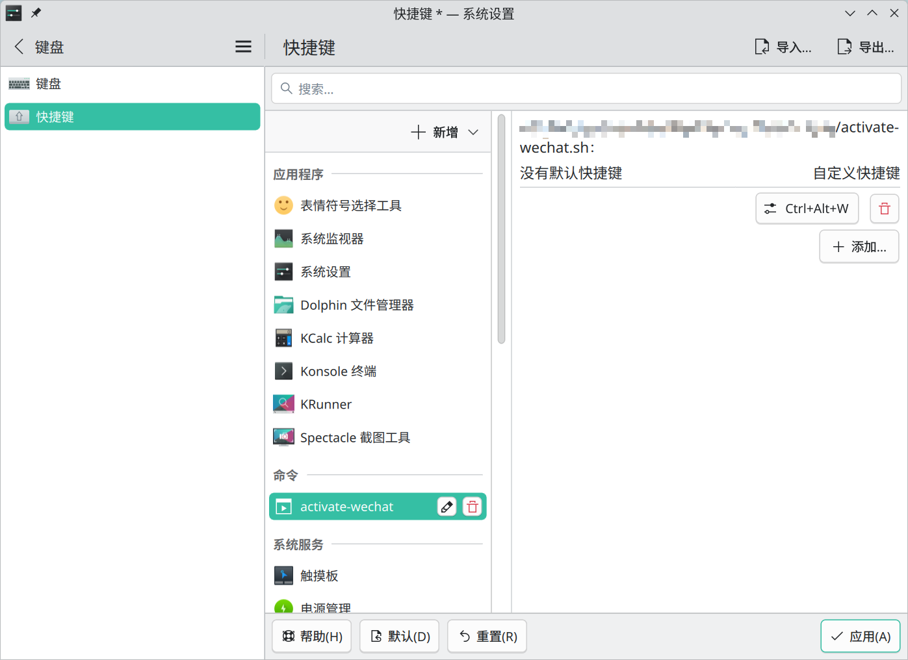
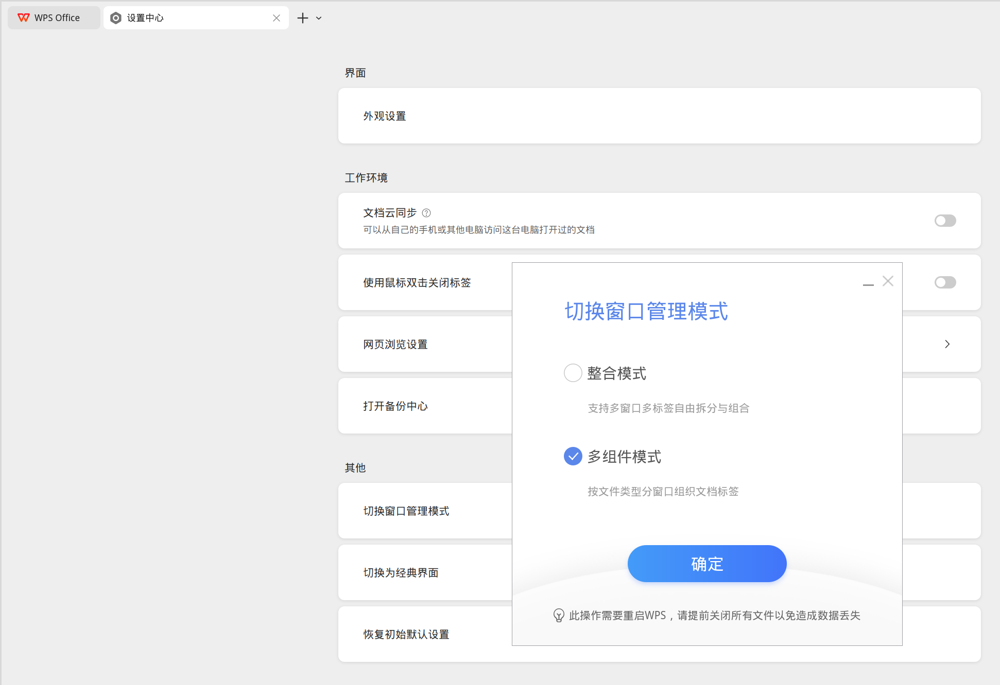

# General

## QQ


[QQ for Linux](https://im.qq.com/linuxqq/index.shtml)

```shell
paru -S linuxqq
```

## WeChat

[WeChat for Linux](https://linux.weixin.qq.com/)

```shell
paru -S wechat-bin
```

Download [activate-wechat.sh](https://github.com/duanluan/shell-scripts/blob/main/activate-wechat.sh).

Search for `Shortcuts` in the launcher, then go to `Add New` -> `Command or Script`, and set the command to `the-directory-where-you-saved-the-script/activate-wechat.sh`.

Click `Add` on the right, assign the shortcut `Ctrl` `Alt` `W`, then click `Apply`.



When WeChat is minimized to the panel or system tray, press `Ctrl` `Alt` `W` to bring the main window back.

## Feishu


[Download the Feishu App and Desktop Client](https://www.feishu.cn/download)

AUR:

```shell
paru -S feishu-bin
```

Latest version:

Download the script from [Get the latest Feishu Linux release info](https://gist.github.com/BoringCat/36288b399faff696d95a59dfe6476912?permalink_comment_id=5859554#gistcomment-5859554).

```shell
# get the latest release info
$ python getFeishuLatestInfo.py 

pkgver=7.50.14
_pkghash_x64=e91d15e2
md5sums_x86_64=('3660717a2e15ba21867d9a21b966acf9')
pkgver=7.50.14
_pkghash_arm64=f247fca9
md5sums_aarch64=('ba0ad73b8a4bffbb1a4344b423bfbe42')

# clone the AUR repository
$ git clone https://aur.archlinux.org/feishu-bin.git
$ cd feishu-bin
# update pkgver, _pkghash_x64, and _pkghash_arm64 to the values above
# replace sha256sums_x86_64 and sha256sums_aarch64 with md5sums_x86_64 and md5sums_aarch64
$ nano PKGBUILD
# build and install
$ makepkg -si
```

## DingTalk

[DingTalk download page](https://www.dingtalk.com/download)

```shell
paru -S dingtalk-bin
```

## WPS Office (365)


[WPS Office for Linux](https://www.wps.cn/product/wpslinux)

- WPS Office 365

  ```shell
  paru -S wps-office-365 wps-office-365-fonts
  ```

  If WPS still does not launch after installation, create or edit the WPS parsing config file:

  ```ini
  $ mkdir -p ~/.config/Kingsoft/
  $ nano ~/.config/Kingsoft/Office.conf
  
  [6.0]
  wpsoffice\Application%20Settings\AppComponentMode=prome_independ
  ```

- WPS Office

  ```shell
  # ttf-wps-fonts provides the symbol fonts required by wps-office.
  # freetype2-wps fixes overly bold rendering.
  paru -S wps-office-cn wps-office-mui-zh-cn ttf-wps-fonts freetype2-wps
  ```
  
  To fix the issue where files cannot open WPS directly:
  
  Launch `WPS Office` from the application menu, then in the upper-right corner go to `Global Settings` -> `Settings` -> `Other`, and switch the window management mode to `Multi-component mode`.
  
  

## LibreOffice

LibreOffice is a free and open-source office suite available on Microsoft Windows, GNU/Linux, and macOS. It includes Writer, Calc, Impress, Draw, Math, and Base for documents, spreadsheets, presentations, drawing, formulas, and database work.


[Download LibreOffice](https://zh-cn.libreoffice.org/download/libreoffice/)

```shell
sudo pacman -S libreoffice-still libreoffice-still-zh-cn
```

## OnlyOffice

A powerful online editor suite for text documents, spreadsheets, presentations, PDFs, and fillable forms. It is open-source, secure, cross-platform, and accessible.


[ONLYOFFICE desktop and mobile apps](https://www.onlyoffice.com/download-desktop#desktop)

```shell
paru -S onlyoffice-bin
```

## Thunderbird

Thunderbird is a free and open-source email client with support for multiple accounts, calendars, contacts, and extensions.


[Thunderbird](https://www.thunderbird.net/zh-CN/)

```shell
sudo pacman -S thunderbird
```

## Tencent Meeting


[Download Center - Tencent Meeting](https://meeting.tencent.com/download/index.html)

```shell
paru -S wemeet-bin
```

## electron-netease-cloud-music

A third-party NetEase Cloud Music client bundled with UnblockNeteaseMusic.


```shell
paru -S electron-netease-cloud-music-bin
```

## SPlayer

A minimalist music player that supports word-by-word lyrics, NetEase Cloud Music cloud storage and local library management, streaming from Jellyfin, Navidrome, and Emby, audio spectrum display, and mobile adaptation.


[Releases · imsyy/SPlayer](https://github.com/imsyy/SPlayer/releases)

```shell
paru -S splayer
```

## YesPlayMusic

A visually polished third-party NetEase Cloud Music player.


[Releases · qier222/YesPlayMusic](https://github.com/qier222/YesPlayMusic/releases)

```shell
paru -S yesplaymusic
```

## VutronMusic

A polished third-party NetEase Cloud Music client. It also supports Navidrome, Jellyfin, and Emby; local playback, offline playlists, word-by-word lyrics, desktop lyrics, Touch Bar lyrics, macOS menu bar lyrics, and lyrics in GNOME and KDE panels on Linux. It also supports pitch shift, playback speed changes, and custom themes.


[Releases · stark81/VutronMusic](https://github.com/stark81/VutronMusic/releases)

```shell
paru -S vutronmusic-bin
```

## go-musicfox

go-musicfox is another NetEase Cloud Music command-line client written in Go. It supports multiple audio quality levels, UnblockNeteaseMusic, Last.fm, MPRIS, and macOS integration features such as pause-on-sleep, Bluetooth disconnect handling, and menu bar controls.


[Installation - go-musicfox/go-musicfox](https://github.com/go-musicfox/go-musicfox?tab=readme-ov-file#%E5%AE%89%E8%A3%85)

```shell
# install the prebuilt binary
paru -S go-musicfox-bin
# or build from source
paru -S go-musicfox
```

## MoeKoeMusic: Third-Party Kugou Client

An open-source third-party Kugou client with a clean and polished interface.


[Releases · MoeKoeMusic/MoeKoeMusic](https://github.com/MoeKoeMusic/MoeKoeMusic/releases)

```shell
paru -S moekoemusic-bin
```

## LX Music


```shell
paru -S lx-music-desktop-bin
```

[LX Music Sources](https://github.com/pdone/lx-music-source)

Custom source: go to `Settings` -> `Custom Source` -> `Custom Source Management`, use `Import Online`, then close the import window and enable the imported source under `Custom Source`.

## Bilibili Client

A Linux port of the official Bilibili client, with roaming support.


[Releases · msojocs/bilibili-linux](https://github.com/msojocs/bilibili-linux/releases)

First check which Electron version is required on [AUR - bilibili-bin](https://aur.archlinux.org/packages/bilibili-bin).

```shell
paru -S electron28-bin
paru -S bilibili-bin
```

## Baidu Netdisk

[Baidu Netdisk client download](https://pan.baidu.com/download#pan)

```shell
paru -S baidunetdisk-bin
```
