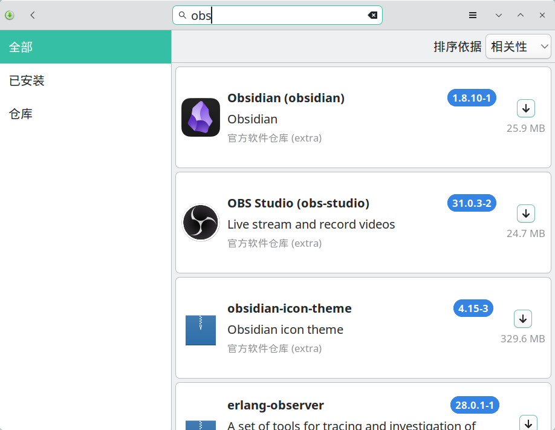
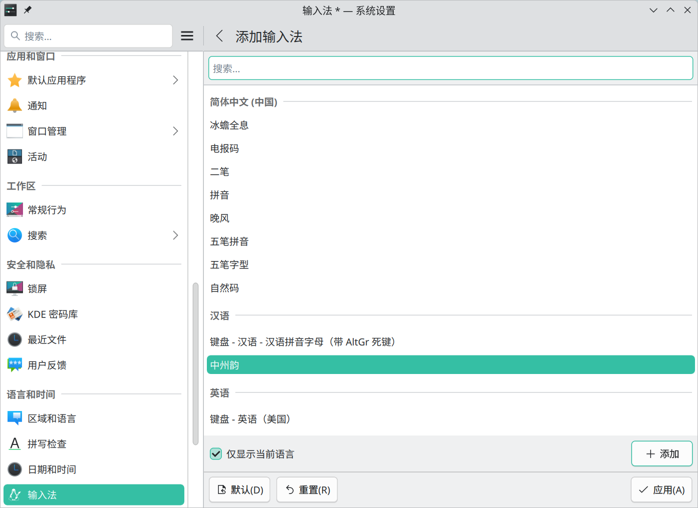

# ⚙️ 系统类

## 🏗️ base-devel + cmake + unzip（必须）

```shell
sudo pacman -S base-devel cmake unzip
```

- base-devel：基础开发工具包组，包含了编译软件包所需的常见工具。
- cmake：跨平台的构建系统工具，用于自动化编译过程，通常与源代码编译相关。
- unzip：解压缩 zip 格式文件。

## 🔙 恢复 X11 登录选项

```shell
# 安装 X11 会话支持及必要的窗口管理器组件
sudo pacman -S plasma-x11-session kwin-x11
```

注销到登录界面，左下角选择`Plasma (X11)`会话后登录。

## 📺 显卡驱动

没有正确安装显卡驱动可能会导致睡眠后无法唤醒等问题。

RTX 全系列（40系, 30系, 20系）、GTX 16/10 系列（1660, 1080, 1060 等）、GTX 900 系列（Maxwell 架构）：
```shell
# 更新系统数据库
sudo pacman -Syyu
# 安装闭源驱动 nonfree，自动屏蔽开源驱动 nouveau
# 0300 的含义：这是 PCI 设备分类代码（Class ID），03 代表 显示控制器 (Display Controller)，00 代表 VGA 兼容控制器（也就是我们常说的显卡）。
sudo mhwd -a pci nonfree 0300
# 重启后运行，应该能看到 video-nvidia
mhwd -li
```

其他显卡参考：
- [配置显卡 - Manjaro](https://wiki.manjaro.org/index.php/Configure_Graphics_Cards/zh-cn)（推荐）
- [archlinux 显卡驱动 | archlinux 简明指南](https://arch.icekylin.online/guide/rookie/graphic-driver)（推荐）
- [Intel 图形处理器 - Arch Linux 中文维基](https://wiki.archlinuxcn.org/wiki/Intel_%E5%9B%BE%E5%BD%A2%E5%A4%84%E7%90%86%E5%99%A8)
- [ATI - Arch Linux 中文维基](https://wiki.archlinuxcn.org/wiki/ATI)
- [NVIDIA - Arch Linux 中文维基](https://wiki.archlinuxcn.org/wiki/NVIDIA)
- [PRIME - Arch Linux 中文维基](https://wiki.archlinuxcn.org/wiki/PRIME)

## 📦 AUR 助手：Yay & Paru (必装)

Arch 用户软件仓库 (AUR) 的辅助工具，用于方便地安装社区包。

```shell
# 安装 yay
sudo pacman -S yay
# 配置 yay：启用开发版(如 -git)包更新检查，并保存到配置文件 ~/.config/yay/config.json 使其永久生效
yay -Y --devel --save
```

也可以使用 [paru](https://github.com/Morganamilo/paru)（功能更强，编译稍慢）：

```shell
# 克隆 paru 源码仓库
git clone https://aur.archlinux.org/paru.git
cd paru
# 构建并安装 paru
makepkg -si

# 安装完成后返回上级目录并删除源码文件夹
cd ..
rm -rf paru
```

核心区别：Yay 默认只比对 AUR 页面上的静态版本号，而 Paru 能主动运行脚本计算 源码的实时版本号。

下载的软件可以在 [AUR - Packages](https://aur.archlinux.org/packages) 搜索，或使用命令行：
```shell
yay -Ss 软件名
```

也可以在开始菜单搜索`添加/删除软件`，在其中搜索软件名安装。



常见问题：

- 在代码审阅界面（冒号“:”等待输入）时，按`q`可直接退出审阅并继续安装。
- [解决“一个或多个文件没有通过有效性检查”](../questions.html#解决-一个或多个文件没有通过有效性检查)
- `paru: error while loading shared libraries: libalpm.so.15: cannot open shared object file: No such file or directory`：系统更新后报错，重新克隆构建安装 paru 最新版。

## 🗜️ Zram 内存压缩与 Swappiness 策略优化

Zram 在内存中创建一个压缩块设备作为 Swap 使用。由于 RAM 的速度远快于磁盘，且 Zstd 压缩效率高，这能显著提升系统响应速度，避免系统在内存压力大时卡死。

[zram: Compressed RAM-based block devices — The Linux Kernel documentation](https://docs.kernel.org/admin-guide/blockdev/zram.html)

**通用配置原则：**
- **Zram 大小**：建议设为物理内存的 **50%** (`zram-fraction = 0.5`)。
  - **小内存设备 (<16GB)**：可激进设为 100% (1.0) 以防止内存耗尽。
  - **大内存设备 (≥32GB)**：50% (0.5) 已绰绰有余，既能提供巨大的交换空间，又保留了足够的物理内存安全红线。
- **Swappiness**：配合 Zram 时，建议保持默认 **60** 或更高（如 100）。这能让系统积极利用 Zram 压缩冷数据，腾出物理内存给文件缓存。**切勿**在使用 Zram 时将其设为 10。

**1. 安装与配置 Zram**

```shell
# 安装 zram-generator
sudo pacman -S zram-generator

# 创建配置文件
sudo nano /etc/systemd/zram-generator.conf
```

写入以下内容（注意：可以解除 4GB 默认限制）：

```ini
[zram0]
# 压缩算法，zstd 是性能和压缩率的最佳平衡
compression-algorithm = zstd
# Zram 大小：设置为物理内存的百分之多少除以 100
zram-fraction = 0.5
# 解除默认的 4096MB (4GB) 限制，否则大内存机器只会分到 4G
max-zram-size = none
# 优先级，确保比磁盘 Swap 高（如果有的话）
swap-priority = 100
```

启动服务：

```shell
# 重新加载 systemd 并启动 zram
sudo systemctl daemon-reload
sudo systemctl start dev-zram0.swap

# 验证状态
zramctl
# 预期输出示例（DISKSIZE 应接近你的物理内存大小，如 64G）：
# NAME       ALGORITHM DISKSIZE DATA COMPR TOTAL STREAMS MOUNTPOINT
# /dev/zram0 zstd           32G   4K   64B   20K      16 [SWAP]
```

如果修改了配置文件（如调整大小）想立即生效且不重启电脑，建议按照以下“彻底重置”步骤操作：

```shell
# 1. 停止相关服务
sudo systemctl stop dev-zram0.swap
sudo systemctl stop systemd-zram-setup@zram0.service

# 2. 【关键】卸载内核模块（清除旧设备状态，相当于拔掉旧内存条）
# 如果提示模块在使用，请先执行 sudo swapoff /dev/zram0，再执行此命令
sudo modprobe -r zram

# 3. 重新加载配置
sudo systemctl daemon-reload

# 4. 重新启动服务
sudo systemctl start dev-zram0.swap
```

**2. 调整 Swappiness（确保 Zram 被有效利用）**

```shell
# 查看当前值（Manjaro 默认通常为 60）
cat /proc/sys/vm/swappiness

# 确保其不为 10。如果需要强制指定为 60 或更高（如 100）：
sudo nano /etc/sysctl.d/99-swappiness.conf
```

写入：

```ini
# Zram 专用优化：保持积极的换页策略
vm.swappiness = 60
# 可选：如果希望系统更激进地利用 Zram，可设为 100
# vm.swappiness = 100
```

```shell
# 应用配置
sudo sysctl --system
```

## 🛡️ EarlyOOM 防止系统卡死

`earlyoom` 守护进程可以在系统完全卡死前介入，通过配置它可以**优先牺牲浏览器进程**（因为浏览器通常有标签页恢复功能，且占用内存最大），从而保住桌面环境和数据安全。

[rfjakob/earlyoom: earlyoom - Early OOM Daemon for Linux](https://github.com/rfjakob/earlyoom)

```shell
# 安装 earlyoom
sudo pacman -S earlyoom

# 启动并设置开机自启
sudo systemctl enable --now earlyoom

# 配置优先查杀策略
sudo nano /etc/default/earlyoom
```

写入以下内容：

```bash
# 1. 触发线：内存或 Swap 剩余 < 5%
# 2. 必须保护 (--avoid)：
#    - 初始化与系统总线: systemd, dbus
#    - 显示管理器: sddm (Manjaro KDE默认), gdm, lightdm
#    - 图形底层: Xorg, Xwayland
#    - 桌面环境核心: plasmashell (KDE), gnome-shell, kwin (KDE窗口管理器), niri, hyprland, sway
#    - 包管理器 (关键!): pacman, pamac (Manjaro GUI), yay, paru (防止更新中途被杀)
#    - 远程连接: sshd
# 3. 优先查杀 (--prefer): 所有主流浏览器
EARLYOOM_ARGS="-m 5 -s 5 -r 60 --avoid '^(init|systemd.*|dbus.*|sddm.*|gdm.*|lightdm.*|Xorg|Xwayland|kwin_.*|plasmashell|gnome-shell|gnome-session.*|niri|sway|hyprland|pacman|pamac.*|yay|paru|sshd)$' --prefer '^(firefox|chromium|chrome|brave|microsoft-edge-.*|vivaldi-bin|opera)$'"
```

应用更改：

```shell
# 重启 earlyoom 服务
sudo systemctl restart earlyoom

# 检查日志以验证正则表达式是否正确加载
journalctl -u earlyoom -n 20
```

## ⌨️ Rime 薄荷输入法 oh-my-rime / 雾凇拼音 / 万象拼音和模型

```shell
# 搜索并安装 Rime 拼音
paru fcitx5-rime
# 创建 Rime 配置目录
mkdir -p ~/.local/share/fcitx5/rime
# 如果之前安装过其他输入法，先删除
rm -rf ~/.local/share/fcitx5/rime/*
```

托盘区输入法图标，右键`重新启动`，再右键`配置`。

点击`添加输入法`按钮，添加`中州韵`，删除`键盘-汉语`。



**配置后需要在托盘区键盘图标，右键`重新启动`或`输入法名称`-`重新部署`。**

### 方案一：[oh-my-rime 输入法 | 薄荷输入法](https://www.mintimate.cc/zh/)

```shell
# 克隆安装薄荷输入法
git clone --depth 1 https://github.com/Mintimate/oh-my-rime.git /tmp/oh-my-rime
# 复制薄荷输入法方案到 Rime 配置目录
cp -r /tmp/oh-my-rime/* ~/.local/share/fcitx5/rime/
```

[输入法方案配置 - 配置覆写和定制 | oh-my-rime输入法](https://www.mintimate.cc/zh/guide/configurationOverride.html#%E8%BE%93%E5%85%A5%E6%B3%95%E6%96%B9%E6%A1%88%E9%85%8D%E7%BD%AE)

```shell
# 配置方案
$ nano ~/.local/share/fcitx5/rime/default.custom.yaml

patch:
  # 九宫格依赖于 rime_mint ，如果需要使用其他方案（比如: 小鹤双拼的 九宫格），可以使用 custom 文件覆写
  schema_list:
    # - schema: rime_mint             # 薄荷拼音
    - schema: double_pinyin_flypy     # 小鹤双拼
    # - schema: rime_mint_flypy       # 薄荷拼音-小鹤混输方案
    # - schema: terra_pinyin          # 地球拼音-薄荷定制
    # - schema: wubi98_mint           # 五笔98-五笔小筑
    # - schema: wubi86_jidian         # 五笔86-极点86
    # - schema: t9                    # 仓九宫格-全拼输入
    # 以下方案薄荷进行了适配，但是默认没有激活
    # - schema: double_pinyin_abc     # 智能ABC双拼
    # - schema: double_pinyin_mspy    # 微软双拼
    # - schema: double_pinyin_sogou   # 搜狗双拼
    # - schema: double_pinyin_ziguang # 紫光双拼
    # - schema: double_pinyin         # 自然码双拼


# 全拼配置 rime_mint.custom.yaml，小鹤双拼是 double_pinyin_flypy.custom.yaml
$ nano ~/.local/share/fcitx5/rime/rime_mint.custom.yaml

patch:
  # 候选词数量
  menu/page_size: 10
  # 拼音串最大长度（默认为 25）
  codeLengthLimit_processor: 100
  # 中文模式下标点直接输出而不是候选
  "punctuator/half_shape/[": "【"
  "punctuator/half_shape/]": "】"
```


### 方案二：[雾凇拼音](https://dvel.me/posts/rime-ice/)

```shell
# 安装雾凇拼音方案
$ paru rime-ice

1 aur/rime-ice-double-pinyin-abc-git r845.0d85dd5-1 [+10 ~0.11]
    Rime 配置：雾凇拼音 | 长期维护的简体词库 - 智能ABC双拼
2 aur/rime-ice-double-pinyin-flypy-git r845.0d85dd5-1 [+10 ~0.11]
    Rime 配置：雾凇拼音 | 长期维护的简体词库 - 小鹤双拼
3 aur/rime-ice-double-pinyin-git r845.0d85dd5-1 [+10 ~0.11]
    Rime 配置：雾凇拼音 | 长期维护的简体词库 - 自然码双拼
4 aur/rime-ice-double-pinyin-jiajia-git r845.0d85dd5-1 [+10 ~0.11]
    Rime 配置：雾凇拼音 | 长期维护的简体词库 - 拼音加加双拼
5 aur/rime-ice-double-pinyin-mspy-git r845.0d85dd5-1 [+10 ~0.11]
    Rime 配置：雾凇拼音 | 长期维护的简体词库 - 微软双拼
6 aur/rime-ice-double-pinyin-sogou-git r845.0d85dd5-1 [+10 ~0.11]
    Rime 配置：雾凇拼音 | 长期维护的简体词库 - 搜狗双拼
7 aur/rime-ice-double-pinyin-ziguang-git r845.0d85dd5-1 [+10 ~0.11]
    Rime 配置：雾凇拼音 | 长期维护的简体词库 - 紫光双拼
8 aur/rime-ice-git r845.0d85dd5-1 [+10 ~0.11]
    Rime 配置：雾凇拼音 | 长期维护的简体词库
9 aur/rime-ice-pinyin-git r845.0d85dd5-1 [+10 ~0.11]
    Rime 配置：雾凇拼音 | 长期维护的简体词库 - 拼音方案
:: 要安装的软件包（例如：1 2 3, 1-3）：
```

[以 patch 的方式打补丁 - Rime 配置：雾凇拼音](https://dvel.me/posts/rime-ice/#%E4%BB%A5-patch-%E7%9A%84%E6%96%B9%E5%BC%8F%E6%89%93%E8%A1%A5%E4%B8%81)

```shell
# 创建全局补丁
$ nano ~/.local/share/fcitx5/rime/default.custom.yaml

patch:
  # 引入雾凇拼音的 rime_ice_suggestion.yaml 配置
  __include: rime_ice_suggestion:/
  # 候选词数量
  menu/page_size: 10
  # 快捷键绑定
  key_binder:
    bindings:
      # , 键切换候选词到上页
      - { when: composing, accept: comma, send: Page_Up }
      # . 键切换候选词到下页
      - { when: composing, accept: period, send: Page_Down }
```

### 方案三：[万象拼音](https://github.com/amzxyz/rime_wanxiang)

安装方式一：

访问 [Releases · amzxyz/rime_wanxiang](https://github.com/amzxyz/rime_wanxiang/releases) 下载标准版输入方案或双拼辅助码增强版输入方案。

```shell
# 解压到 Rime 配置目录
unzip rime-wanxiang-flypy-fuzhu.zip -d ~/.local/share/fcitx5/rime
```

安装方式二：

先按照系统配置文档中临时切换为 ArchLinuxCN 源。

```shell
# 基础版包名：rime-wanxiang-[拼写方案名]，如：自然码方案：rime-wanxiang-zrm
$ paru rime-wanxiang-flypy
# 双拼辅助码增强版包名：rime-wanxiang-pro-[拼写方案名]，如：自然码方案：rime-wanxiang-pro-zrm
$ paru rime-wanxiang-pro-flypy
```

访问 [Releases · amzxyz/rime_wanxiang](https://github.com/amzxyz/rime_wanxiang/releases) 下载语法模型。

```shell
# 放到 Rime 配置目录
mv ~/Downloads/wanxiang-lts-zh-hans.gram ~/.local/share/fcitx5/rime/
```

[rime_wanxiang/README.md at wanxiang · amzxyz/rime_wanxiang](https://github.com/amzxyz/rime_wanxiang/blob/wanxiang/README.md)

[Rime 万象拼音输入方案新手安装配置指南](https://docs.qq.com/doc/DQ0FqSXBmYVpWVFpy)

```shell
# 基础版是 wanxiang.custom.yaml，增强版是 wanxiang_pro.custom.yaml
$ cp ~/.local/share/fcitx5/rime/custom/wanxiang_pro.custom.yaml ~/.local/share/fcitx5/rime
# 此处修改方案：不用辅助码改成间接辅助，否则选单字时拼音可能会被作为辅助码消耗掉
$ nano ~/.local/share/fcitx5/rime/wanxiang_pro.custom.yaml

patch:
  # 是否开启用户词典
  translator/enable_user_dict: true
  # 允许句子进入用户词典
  translator/enable_sentence: true
  # 是否启用自动造词，如果启用，输入法会根据用户输入的习惯自动添加新词到用户词典中
  # 如果是万象 Pro 方案则无效，它是固定词频，用 ↓/↑ 移动候选词高亮，用 Ctrl+P 置顶、Ctrl+J/K 调整顺序、Ctrl+L 重置 高亮候选词的词频
  translator/enable_encoder: true

  # 触发“自动施加辅助码/锁定当前候选”的快捷键，默认为句号
  force_upper_aux/hotkey: "Tab"
  # 逗号句号翻页
  key_binder/bindings/+:
    - { accept: comma, send: Page_Up, when: has_menu }
    - { accept: period, send: Page_Down, when: has_menu }

  speller/algebra:
    __patch:
      #- 模糊音                                  # 这里启用后，本文件末尾可配置具体条目
      - wanxiang_algebra:/pro/小鹤双拼           # 可选输入方案名称：自然码, 自然龙, 小鹤双拼, 搜狗双拼, 微软双拼, 智能ABC, 紫光双拼, 国标双拼
      - wanxiang_algebra:/pro/间接辅助           # 辅助码升级为：直接辅助和间接辅助两种类型，都是句中任意，不同点在于直接辅助是nire=你  而间接则需要/引导  ni/re=你 ，在这个基础上直接辅助支持拼音后任意位置数字声调参与，间接辅助声调在/引导前参与
  
  # …（中间省略你的其他配置）…
  
  # 下面是候选数量，未来7890分别代表1234声，请候选长度不要大于6避免冲突
  menu/page_size: 10
```

## 🔤 字体

- [LXGW WenKai / 霞鹜文楷](https://github.com/lxgw/LxgwWenKai)
  ```shell
  $ paru ttf-lxgw-wenkai
  
  1 aur/ttf-lxgw-wenkai 1.521-1 [+9 ~0.16]
      An open-source Chinese font derived from Fontworks' Klee One.
  2 aur/ttf-lxgw-wenkai-screen 1.520-1 [+3 ~0.00]
      本字体是霞鹜文楷的屏幕舒适阅读版本,增强了字重，包括LXGWWenKaiScreen（使用文楷完整版字库，不以其他任何字体打底）和LXGWWenKaiScreenR（在文楷完整版字库基础上，使用Roboto补全缺失字符，可能有文字形态不统一）。另外带
      GB 的表示 GB 2312、通用规范汉字表范围内汉字为陆标字形，不带 GB 的为原版文楷的半陆标字形。
  3 aur/ttf-lxgw-wenkai-mono-nerd 1.521-1 [+1 ~0.16]
      LXGW WenKai Mono patched with Nerd Font glyphs
  4 aur/ttf-lxgw-wenkai-nerd 1.521-1 [+1 ~0.16]
      LXGW WenKai patched with Nerd Font glyphs
  5 aur/ttf-lxgw-wenkai-tc 1.520-1 [+1 ~0.00]
      The Traditional Chinese Version of LXGW WenKai
  6 aur/ttf-lxgw-wenkai-tc-mono 1.520-1 [+1 ~0.00]
      The traditional chinese mono version of LXGW WenKai.
  7 aur/ttf-lxgw-wenkai-gb 1.520-1 [+0 ~0.00]
      An open-source Chinese font derived from Klee One, modified to conform to GB2312 standard.
  8 aur/ttf-lxgw-wenkai-lite 1.521-1 [+0 ~0.00]
      LXGW WenKai Lite / 霞鹜文楷轻便版 An open-source Chinese font derived from Fontworks' Klee One. 一款基于 FONTWORKS 出品字体 Klee One 
      改造的开源中文字体。
  9 aur/ttf-lxgw-wenkai-mono-lite 1.521-1 [+0 ~0.00]
      LXGW WenKai Mono Lite / 霞鹜文楷等宽轻便版 An open-source Chinese font derived from Fontworks' Klee One. 一款基于 FONTWORKS 出品字体 Klee 
      One 改造的开源中文字体。
  :: 要安装的软件包（例如：1 2 3, 1-3）：
  :: 2
  ```

- [LXGW Neo XiHei / 霞鹜新晰黑](https://github.com/lxgw/LxgwNeoXiHei)
  ```shell
  $ paru ttf-lxgw-neo-xihei
  
  1 aur/ttf-lxgw-neo-xihei 1.225-1 [+3 ~0.00]
      霞鹜新晰黑。一款衍生于「IPAexゴシック」的中文黑体字型。A Simplified Chinese sans-serif font derived from IPAex Gothic.
  2 aur/ttf-lxgw-neo-xihei-screen 25.10.22-1 [+3 ~0.00]
      霞鹜新晰黑屏幕阅读版。霞鹜新晰黑 的屏幕阅读版本，将原版 霞鹜新晰黑 加粗 6 个单位后，调整度量数据与 Android 默认字体 Roboto 相同。
  3 aur/ttf-lxgw-neo-xihei-plus 1.225-1 [+2 ~0.03]
      「霞鹜新晰黑＋ / LXGW Neo XiHei Plus」，在「霞鹜新晰黑」基础上补全扩展 A 区所有汉字，以使字库达到 GB 18030-2022 实现级别 2 的收字范围。
  4 aur/ttf-lxgw-neo-xihei-screen-full 25.12.07-1 [+2 ~0.00]
      霞鹜新晰黑屏幕阅读版Droid Sans Fallback打底补全版，更适合 PC 及 Android 手机屏幕显示。
  :: 要安装的软件包（例如：1 2 3, 1-3）：
  :: 4
  ```

- [LXGW Neo ZhiSong / 霞鹜新致宋 / 霞鶩新緻宋](https://github.com/lxgw/LxgwNeoZhiSong)
  ```shell
  $ paru ttf-lxgw-neo-zhisong
  
  1 aur/ttf-lxgw-neo-zhisong 1.050-1 [+0 ~0.00]
      霞鹜新致宋。一款衍生于「IPAmj明朝」的中文宋体字型。A Chinese serif font derived from IPAmj Mincho.
  2 aur/ttf-lxgw-neo-zhisong-screen 25.12.07-1 [+0 ~0.00]
      霞鹜新致宋屏幕阅读版。
  3 aur/ttf-lxgw-neo-zhisong-screen-full 25.12.07-1 [+0 ~0.00]
      霞鹜新致宋屏幕阅读版。
  :: 要安装的软件包（例如：1 2 3, 1-3）：
  :: 3
  ```
- [Sarasa Gothic (更纱黑体 / 更紗黑體 / 更紗ゴシック / 사라사고딕)](https://github.com/be5invis/Sarasa-Gothic)

  注意：此软件包体积巨大，因为它完整包含了简繁日韩全语言字符、所有字重与风格以及打入的 Nerd Font 全套图标。
  ```shell
  paru ttf-sarasa-gothic-nerd-fonts
  ```

- [文泉驿微米黑](http://wenq.org/wqy2/index.cgi?%E9%A6%96%E9%A1%B5)

  ```shell
  sudo pacman -S wqy-microhei
  ```

- [Maple Mono](https://github.com/subframe7536/Maple-font)
  ```shell
  # 通过 ArchLinuxCN 安装
  sudo pacman -S ttf-maplemono-nf-cn-unhinted
  ```

- [Myna](https://github.com/sayyadirfanali/Myna/)
  ```shell
  paru otf-myna
  ```

## 📟 Tmux

tmux 是一个终端复用器。它让你可以轻松地在同一个终端中切换多个程序，将它们分离（它们会在后台继续运行），并将它们重新附加到不同的终端。


[Home · tmux/tmux Wiki](https://github.com/tmux/tmux/wiki)

```shell
sudo pacman -S tmux
```

## 🐚 Nushell

[Nushell](https://www.nushell.sh/zh-CN/) 是一种新的 Shell。

- 利用管道控制任意系统：Nu 可以在 Linux、macOS、BSD 和 Windows 上运行。一次学习，处处可用。
- 一切皆数据：Nu 管道使用结构化数据，你可以用同样的方式安全地选择，过滤和排序。停止解析字符串，开始解决问题。
- 强大的插件系统：具备强大的插件系统，Nu 可以轻松扩展。


```shell
sudo pacman -S nushell
```

## 🔍 fzf 命令行模糊查找

```shell
# 安装 fzf
$ sudo pacman -S fzf

# 在文件末尾添加
$ kate ~/.zshrc

# 激活 fzf 的 Zsh 插件和按键绑定
[ -f /usr/share/fzf/key-bindings.zsh ] && source /usr/share/fzf/key-bindings.zsh
[ -f /usr/share/fzf/completion.zsh ] && source /usr/share/fzf/completion.zsh

$ source ~/.zshrc
```

## 🚀 zoxide 智能 cd

zoxide 是一个 更智能的 cd 命令，灵感来自 z 和 autojump。它记住你最常用的目录，因此只需几个按键就能“跳”到这些目录。

zoxide 模糊跳转需要先安装 fzf。


[Installation - ajeetdsouza/zoxide](https://github.com/ajeetdsouza/zoxide?tab=readme-ov-file#installation)

```shell
# 安装 zoxide
sudo pacman -S zoxide
```

- Zsh 初始化
  ```shell
  # 在文件末尾添加
  $ kate ~/.zshrc
  
  # zoxide
  eval "$(zoxide init zsh)"
  
  $ source ~/.zshrc
  ```
- Nushell 初始化
  ```shell
  zoxide init nushell | save -f ~/.zoxide.nu
  source ~/.zoxide.nu
  ```

使用示例：
```shell
# 第一次精确跳转
z ~/workspaces/my

# 之后模糊跳转
z work
z my
z wo my
```

## 🔄 debtap

一个用于将 .deb 软件包转换为 Arch Linux 软件包的脚本，专注于准确性。

[helixarch/debtap: A script for converting .deb packages into Arch Linux packages, focused on accuracy](https://github.com/helixarch/debtap)

```shell
# 安装 debtap
$ paru debtap

# 初始化 debtap 数据库
$ sudo debtap -u

cat: /var/cache/debtap/base-packages: 没有那个文件或目录
sort: 无法读取: /var/cache/debtap/extended-base-packages-list-temp: 没有那个文件或目录

# 因为用的是 Manjaro，所以需要预创建 debtap 需要的缓存目录与临时文件
$ sudo install -d -m755 /var/cache/debtap
$ sudo touch /var/cache/debtap/base-packages /var/cache/debtap/extended-base-packages-list-temp

# 重新初始化 debtap 数据库
$ sudo debtap -u
```

## 🍷 deepin-wine8/10-stable + spark-dwine-helper

spark-dwine-helper 用于修改和增强 deepin-wine 来提升体验，被一些 AUR 包依赖。

```shell
cd ~/.cache
paru -G deepin-wine8-stable
cd deepin-wine8-stable
nano PKGBUILD
```

修改`deepin-wine8-stable/PKGBUILD`中的`_pkgver`、`source`、`sha256sums`：
```shell
_pkgver=8.16deepin41_spark1

source=(
    "https://mirrors.sdu.edu.cn/spark-store/amd64-store/depends/deepin-wine8/deepin-wine8-stable_${_pkgver}_amd64.deb"
)

sha256sums=('SKIP')
```

```shell
# 构建安装 deepin-wine8-stable
makepkg -si

# 安装 deepin-wine10-stable
paru deepin-wine10-stable

# 安装 spark-dwine-helper
paru spark-dwine-helper
```

## 🔥 Spark Store 星火应用商店

```shell
$ paru amber-ce-bookworm

==> 获取源代码...
  -> 找到 amber-ce-bookworm-12.7.5.tar.gz
==> 正在验证 source 文件，使用sha256sums...
    amber-ce-bookworm-12.7.5.tar.gz ... 失败
==> 错误： 一个或多个文件没有通过有效性检查！
错误： 未能下载 'amber-ce-bookworm-12.7.5-1' 的源: 
错误： 未能构建的软件包：amber-ce-bookworm-12.7.5-1

```

因为 gitee 下载增加了机器验证，所以需要手动下载 [下载仓库 · Amber CE/amber-ce-bookworm - Gitee.com](https://gitee.com/amber-ce/amber-ce-bookworm/repository/archive/12.7.5.tar.gz)

```shell
# 将下载的文件放到 AUR 构建目录
cd ~/.cache/paru/clone/amber-ce-bookworm
mv -f ~/Downloads/.hmcl/amber-ce-bookworm-12.7.5.tar.gz ./

# 重新构建并安装
makepkg -si
```

无 N 卡报错“无法获取 NVIDIA 驱动版本 Can not determine NVIDIA Driver version”可以忽略，安装后需重启。

[下载星火应用商店 - Spark Store](https://www.spark-app.store/download/) 下载 DEB 文件。

开始菜单搜索`ACE Bookworm兼容环境`并打开：
```shell
sudo apt update
sudo apt install ./spark-store_4.8.2_amd64.deb
```

## 🌊 Microsoft Edge

微软基于 Chromium 开发的浏览器。


[官方下载 Microsoft Edge](https://www.microsoft.com/zh-cn/edge/download)

```shell
paru microsoft-edge-stable-bin
```

开始菜单搜索`默认应用程序`可以修改默认网页浏览器。

## 🌐 Google Chrome

[Google Chrome 网络浏览器](https://www.google.com/chrome/)

```shell
paru google-chrome
```

## 🧅 Tor Browser

Tor 浏览器是一款基于隐私保护的开源浏览器，通过多层加密和中继网络匿名访问互联网，隐藏用户的身份和位置。

```shell
# paru tor-browser-bin 时导入报错“gpg: 从公钥服务器接收失败：无数据 错误： 未能运行： gpg --recv-keys EF6E286DDA85EA2A4BA7DE684E2C6E8793298290”，所以手动导入
curl -s https://keys.openpgp.org/vks/v1/by-fingerprint/EF6E286DDA85EA2A4BA7DE684E2C6E8793298290 | gpg --import
paru tor-browser-bin
```
