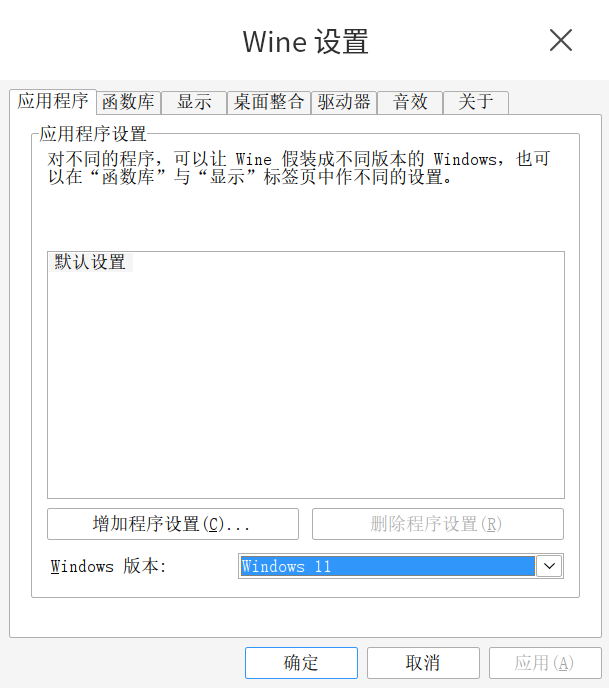
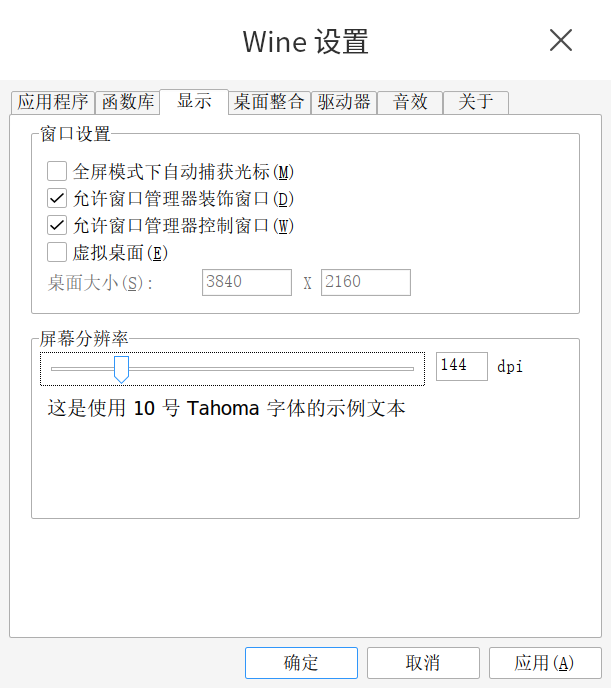
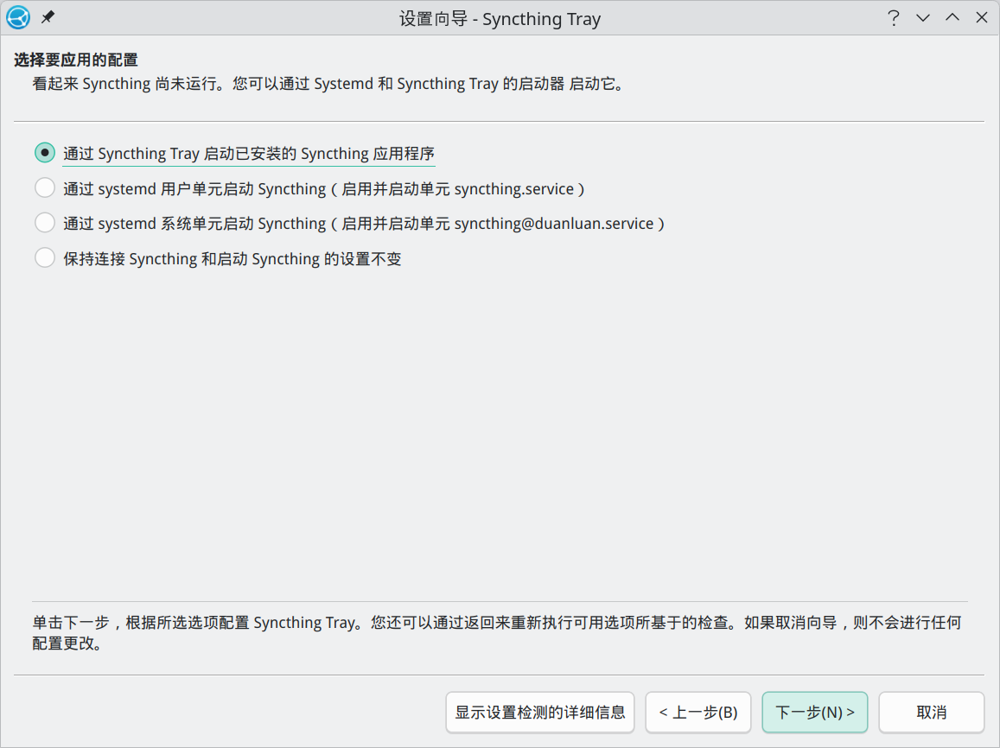
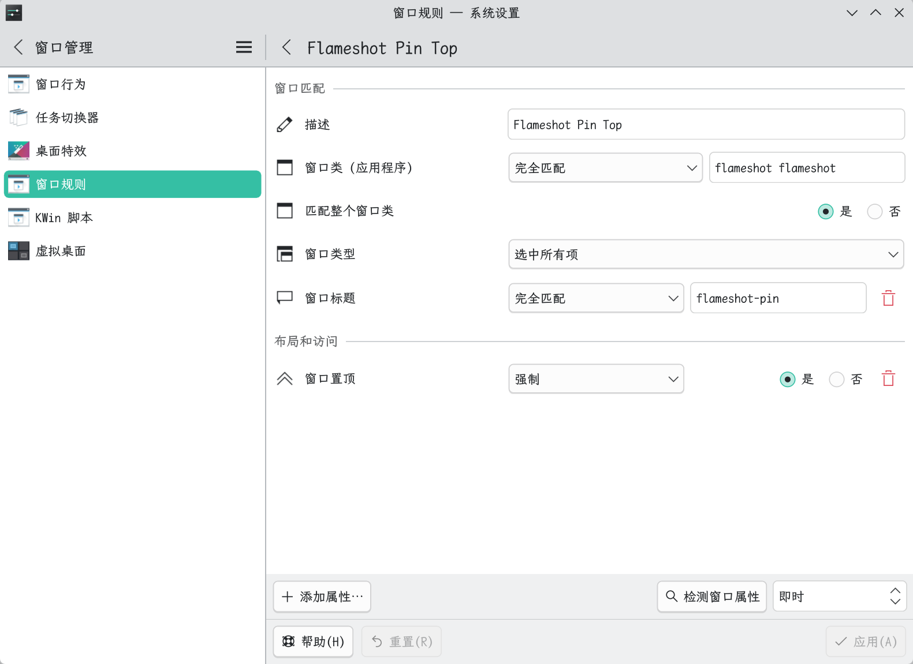

# Tools

## Geekbench 6

A cross-platform benchmarking tool.


[Download Geekbench 6 for Linux](https://www.geekbench.com/download/linux/)

```shell
paru -S geekbench
geekbench
```

## FlClash

A cross-platform Clash.Meta client that is simple, open-source, and ad-free.


[Releases · chen08209/FlClash](https://github.com/chen08209/FlClash/releases)

```shell
paru -S flclash-bin
```

- If you mainly use `TUN`, `FlClash` is the safer choice. In my own testing, `Clash Verge` still caused very slow `codex` installation inside IDEA AI Assistant even with `TUN` enabled, and the Codex login page in the terminal failed with `Token exchange failed: token endpoint returned status 403 Forbidden`.
- After adding a subscription, click enable in the lower-right corner of the `Dashboard`, or turn on auto-start in `Tools` -> `Applications`.

## Clash Verge

A Tauri-based GUI for Clash Meta.


[Releases · clash-verge-rev/clash-verge-rev](https://github.com/clash-verge-rev/clash-verge-rev/releases)

```shell
paru -S clash-verge-rev-bin
```

- If the window opens to a blank white screen, search for `Clash Verge`, right-click `Edit Applications...`, and add `WEBKIT_DISABLE_DMABUF_RENDERER=1` under `General` -> `Environment Variables`.

## Clash Party

A more user-friendly proxy client.


[Releases · mihomo-party-org/clash-party](https://github.com/mihomo-party-org/clash-party/releases)

```shell
paru -S clash-party-bin
```

## Stelliberty

A modern Clash client built with Flutter and Rust, using a distinctive Material Design 3 visual style.


[Kindness-Kismet/Stelliberty - GitHub](https://github.com/Kindness-Kismet/Stelliberty)

```shell
paru -S stelliberty-bin
```

## Clash Mi

An open-source mobile-oriented proxy tool with the Clash Mihomo core built in.


[Download Clash Mi](https://clashmi.app/download)

```shell
paru -S clash-mi
```

## Koala Clash

A modern Electron-based GUI proxy client for Windows, macOS, and Linux.


[Releases · coolcoala/koala-clash](https://github.com/coolcoala/koala-clash/releases)

```shell
paru -S koala-clash-bin
```

## proxychains

`proxychains` inserts a proxy chain between an application and the network, allowing traffic to be forwarded through the configured proxy server.

```shell
sudo pacman -S proxychains
```

Edit `/etc/proxychains.conf`, comment out the default entries after `[ProxyList]`, and add your own:

```shell
sudo nano /etc/proxychains.conf
```

```conf
[ProxyList]
socks5 127.0.0.1 7897
```

## Brook

A cross-platform programmable networking tool that can also be used as a proxy.

[Brook](https://www.txthinking.com/brook.html)

```shell
# option 1: temporary proxy env vars
$ export http_proxy=127.0.0.1:7897
$ export https_proxy=127.0.0.1:7897
# option 2: prefix commands with proxychains -q

# install brook through nami
$ bash <(curl https://bash.ooo/nami.sh)
$ nami install brook
```

- Server:

  ```shell
  $ nano brook-server.sh
  
  #!/bin/bash
  pkill -f "brook wsserver"
  sleep 1
  # -l listens on the port, -p is the password
  nohup brook wsserver -l :9999 -p 123456 > /dev/null &
  
  $ chmod +x brook-server.sh
  $ ./brook-server.sh
  ```

- Client:

  ```shell
  # create the brook helper script
  $ mkdir -p ~/.local/bin
  $ nano ~/.local/bin/brook.service.sh
  
  #!/bin/bash
  pids=$(ps aux | grep '[b]rook wsclient' | awk '{print $2}')
  if [ -n "$pids" ]; then
    for pid in $pids; do
      echo "Stopping brook wsclient process (PID: $pid)"
      kill "$pid"
    done
  else
    echo "No brook wsclient process found"
  fi
  /home/duanluan/.nami/bin/brook wsclient -s 1.2.3.4:9999 -p 123456 --socks5 127.0.0.1:1080
  
  
  $ mkdir -p ~/.local/state/brook
  $ mkdir -p ~/.config/systemd/user
  $ nano ~/.config/systemd/user/brook.service
  
  [Unit]
  Description=A cross-platform programmable network tool.
  After=network.target
  
  [Service]
  ExecStart=/bin/bash %h/.local/bin/brook.service.sh
  Restart=always
  RestartSec=5
  StandardOutput=null
  StandardError=null
  
  [Install]
  WantedBy=graphical-session.target
  
  $ systemctl --user daemon-reload
  $ systemctl --user enable brook
  $ systemctl --user start brook
  $ systemctl --user status brook
  ```

## Wine

Wine runs Windows applications by providing compatible Win32 APIs instead of emulation or virtualization.

```shell
sudo pacman -Syu wine wine-mono wine-gecko winetricks
```

- `wine-mono`: lets Wine run .NET-based applications
- `wine-gecko`: provides the HTML engine used by some apps
- `winetricks`: helper script for installing common components

```shell
# set a dedicated Wine prefix, otherwise ~/.wine is used
export WINEPREFIX=~/.wine-xxx
# initialize the prefix
winecfg
# install Chinese font support
proxychains -q winetricks cjkfonts
```

In Wine settings, you can switch the `Windows Version` under `Applications`, and increase the `Screen Resolution` under `Graphics`.




## Proton-GE-Custom

Proton-GE is the "Swiss army knife" version of Proton. If the official Proton build on Linux or Steam Deck cannot run a game, or if cutscenes stay black, Proton-GE often fixes it.

```shell
paru -S proton-ge-custom-bin
```

## Wine Runner

Wine Runner is a graphical wrapper around Wine, aimed at making Windows applications easier to run on Linux. It adds GUI-based Wine management, installers, app-store style integrations, helper tools, and runtime installers.


Install [Wine Runner](spk://store/tools/spark-deepin-wine-runner) from Spark Store.

## VMware Workstation Pro

VMware Workstation Pro is a powerful virtualization platform for creating and running multiple virtual machines on one physical host.

[How to download and install VMware Workstation Pro on Linux](https://www.sysgeek.cn/install-vmware-workstation-pro-on-linux/)

Register a [Broadcom account](https://profile.broadcom.com/web/registration), using your email as the login name.

Then download the Linux build by searching for `VMware Workstation Pro` on the [Broadcom Free Downloads Portal](https://support.broadcom.com/group/ecx/free-downloads).

```shell
# option 1
chmod u+x VMware-Workstation-Full-17.6.3-24583834.x86_64.bundle
sudo ./VMware-Workstation-Full-17.6.3-24583834.x86_64.bundle

# option 2
paru -S vmware-keymaps vmware-workstation
```

Choose `No` for VMware's Customer Experience Improvement Program if you do not want to participate.

- Install [open-vm-tools](https://github.com/vmware/open-vm-tools) inside guests to improve integration:

  ```shell
  sudo pacman -S open-vm-tools
  ```

- `Could not connect 'Ethernet0' to virtual network '/dev/vmnet8'`

  ```shell
  sudo systemctl enable --now vmware-networks
  ```

- `Fail Network configuration is missing. Ensure that /etc/vmware/networking exists`

  ```shell
  systemctl enable --now vmware-networks-configuration.service
  ```

## VirtualBox

VirtualBox is an open-source virtualization solution for creating and running VMs across platforms.

[Oracle VirtualBox Linux Downloads](https://www.virtualbox.org/wiki/Linux_Downloads)
[Oracle VirtualBox Downloads](https://www.virtualbox.org/wiki/Downloads)

```shell
# inspect the current kernel version
$ uname -r
6.12.48-1-MANJARO

# install VirtualBox and choose the module package matching your kernel
$ sudo pacman -S virtualbox
:: There are 14 providers available for VIRTUALBOX-HOST-MODULES:
:: Repository extra
   1) linux510-virtualbox-host-modules  2) linux515-virtualbox-host-modules
   3) linux54-virtualbox-host-modules  4) linux61-rt-virtualbox-host-modules
   5) linux61-virtualbox-host-modules  6) linux612-rt-virtualbox-host-modules
   7) linux612-virtualbox-host-modules  8) linux615-rt-virtualbox-host-modules
   9) linux616-rt-virtualbox-host-modules  10) linux616-virtualbox-host-modules
   11) linux617-virtualbox-host-modules  12) linux66-rt-virtualbox-host-modules
   13) linux66-virtualbox-host-modules  14) virtualbox-host-dkms
Enter a number (default=1): 7

# load the driver, otherwise you may see "Kernel driver not installed (rc=-1908)"
$ sudo modprobe vboxdrv

# install the extension pack (optional but recommended for USB 2.0/3.0, RDP, etc.)
paru -S virtualbox-ext-oracle
```

- `Cannot enumerate USB devices`

  ```shell
  sudo usermod -aG vboxusers $USER
  ```

  Reboot afterwards.

- `USB devices do not appear`

  ```shell
  # create the usbfs group if needed
  sudo groupadd usbfs
  # add the user to both groups
  sudo usermod -aG vboxusers $USER
  sudo usermod -aG usbfs $USER
  ```

  Reference: [How to enable USB in VirtualBox](https://www.jianshu.com/p/de430444a8ae)

- `VirtualBox can't enable the AMD-V extension`

  ```shell
  # unload the KVM modules
  sudo rmmod kvm_amd
  sudo rmmod kvm
  # blacklist them
  echo "blacklist kvm" | sudo tee /etc/modprobe.d/blacklist.conf
  echo "blacklist kvm_amd" | sudo tee -a /etc/modprobe.d/blacklist.conf
  sudo update-initramfs -u
  ```

  Reference: [VirtualBox can't enable the AMD-V extension](https://www.zhangjc.com/2025/01/20/VirtualBox-can-t-enable-the-AMD-V-extension/)

- `Cannot register the hard disk 'xxx.vdi' {new_uuid} because a hard disk 'xxx.vdi' with UUID {old_uuid} already exists`

  ```shell
  vboxmanage closemedium disk old_uuid
  ```

  Reference: [Fix "a hard disk with UUID already exists" in VirtualBox](https://cn.linux-terminal.com/?p=4755)

- `VT-x is being used by another hypervisor (VERR_VMX_IN_VMX_ROOT_MODE)`

  KVM is occupying the virtualization extensions (VT-x / AMD-V). Stop QEMU / libvirt, Android Emulator, Docker, or anything else currently using KVM.

## Docker + Buildx + Compose + lazydocker + Portainer

- **Docker + Docker Buildx + Docker Compose**

  ```shell
  # install Docker, Buildx, and Compose
  sudo pacman -Syu --noconfirm docker docker-buildx docker-compose
  # enable Docker on boot and start it now
  sudo systemctl enable --now docker
  # add the current user to the docker group
  sudo usermod -aG docker $USER
  ```

  [Install Portainer CE | Portainer Documentation](https://docs.portainer.io/start/install-ce/server/docker/linux)

  For mirror acceleration, see: [Docker notes, FAQ, and WSL2-related items](https://blog.zhjh.top/?p=io0ETi1lKgEyKR0OcDZgS)

- **lazydocker**

  A simple terminal UI for Docker and docker-compose.

  
  [Releases · jesseduffield/lazydocker](https://github.com/jesseduffield/lazydocker/releases)

  ```shell
  paru -S lazydocker-bin
  ```

- **Portainer**

  A web-based Docker management panel.

  [Releases · portainer/portainer](https://github.com/portainer/portainer/releases)

  ```shell
  # create the volume used by Portainer
  sudo docker volume create portainer_data
  # start Portainer
  proxychains sudo docker run -d -p 8000:8000 -p 9443:9443 --name portainer --restart=always -v /var/run/docker.sock:/var/run/docker.sock -v portainer_data:/data portainer/portainer-ce:lts
  ```

  Open [https://localhost:9443/](https://localhost:9443/) to initialize the admin account.

## WinBoat

Run Windows applications on Linux with seamless integration.


[WinBoat - Run Windows Apps on Linux with Seamless Integration](https://www.winboat.app/)

```shell
# install WinBoat
paru -S winboat-bin
```

### WinBoat prerequisites

- **Enable virtualization in BIOS (SVM / VT-x)**

  The exact path differs by motherboard. Usually you enter BIOS by repeatedly pressing `F2` or `Del` during boot, or by running `systemctl reboot --firmware-setup` in the terminal. Then find the CPU virtualization setting and enable `SVM Mode (AMD)` or `Intel Virtualization Technology`.

- **Docker**

  Install and enable it using the Docker section above.

- **FreeRDP**

  ```shell
  sudo pacman -S freerdp
  ```

- **Configure user permissions**

  ```shell
  # create the kvm group if needed
  sudo groupadd -f kvm
  
  # add the current user to docker and kvm
  sudo usermod -aG docker $USER
  sudo usermod -aG kvm $USER
  
  # refresh udev permissions
  sudo udevadm trigger
  
  # reboot so the group changes take effect
  sudo reboot
  ```

- **Install Docker Compose v2 manually**

  WinBoat requires Compose v2. At the time of writing, the last v2 release is `v2.40.3`.

  ```shell
  # create the Docker CLI plugin directory
  mkdir -p ~/.docker/cli-plugins
  # download the official binary
  curl -SL https://github.com/docker/compose/releases/download/v2.40.3/docker-compose-linux-x86_64 -o ~/.docker/cli-plugins/docker-compose
  # make it executable
  chmod +x ~/.docker/cli-plugins/docker-compose
  # verify
  $ docker compose version
  Docker Compose version v2.40.3
  ```

- **Force-load the KVM kernel module**

  ```shell
  # load the module immediately; replace kvm_amd with kvm_intel on Intel CPUs
  sudo modprobe kvm_amd
  # persist it across reboots
  echo "kvm_amd" | sudo tee /etc/modules-load.d/winboat_kvm.conf
  # reboot to be safe
  sudo reboot
  ```

- **Final verification and system install**

  ```shell
  # make sure the user belongs to docker and kvm
  $ groups
  
  # check the KVM module
  $ lsmod | grep kvm
  kvm_amd               241664  4
  kvm                  1384448  3 kvm_amd
  irqbypass              12288  1 kvm
  ccp                   184320  1 kvm_amd
  ```

  Restart WinBoat, confirm that all startup checks pass, then follow the prompts to install the Windows image.

### Custom ISO installation

**Note**: this route did not end up fully stable in my testing. WinBoat Guest API kept switching between working and offline, and clicking Apps did nothing.

In WinBoat, and in most Windows containers based on QEMU/KVM, the default disk controller is **VirtIO**. Many stripped-down Windows ISOs do not include VirtIO drivers, so the installer cannot see the disk.

The solution is to inject VirtIO drivers into the ISO.

```shell
# -----------------------------------------------------------------------------
# Step 1: prepare the environment and download the drivers
# Install the extraction tools, ISO packaging tools, and DOS utilities needed
# to create a UEFI boot image manually. Then fetch the latest VirtIO drivers.
# -----------------------------------------------------------------------------

# 1. Install the required tools
sudo pacman -S p7zip libisoburn mtools dosfstools

# 2. Create the workspace
mkdir -p ~/win11_mod/drivers
cd ~/win11_mod

# 3. Download the VirtIO driver ISO
wget https://fedorapeople.org/groups/virt/virtio-win/direct-downloads/stable-virtio/virtio-win.iso

# 4. Extract the required drivers
# We only need the Windows 11 amd64 drivers:
# - NetKVM: network adapter
# - viostor: storage controller
# - vioscsi: SCSI controller
7z x virtio-win.iso -o./temp_drivers
cp -r temp_drivers/NetKVM/w11/amd64/* ./drivers/
cp -r temp_drivers/viostor/w11/amd64/* ./drivers/
cp -r temp_drivers/vioscsi/w11/amd64/* ./drivers/

# 5. Clean up
rm -rf temp_drivers virtio-win.iso


# -----------------------------------------------------------------------------
# Step 2: unpack the Windows ISO and inject the drivers
# -----------------------------------------------------------------------------

# 1. Create the output directory
mkdir -p ~/win11_mod/iso_content

# 2. Extract the Windows ISO
# Important: the -o option for 7z must be immediately followed by the path.
# Do not use ~ after -o; use an absolute path.
7z x "/home/duanluan/Downloads/clean-win11.iso" -o/home/duanluan/win11_mod/iso_content

# 3. Copy the drivers directory into the extracted ISO root
cp -r ~/win11_mod/drivers ~/win11_mod/iso_content/


# -----------------------------------------------------------------------------
# Step 3: rebuild the UEFI boot image
# Many slimmed-down ISOs remove the optical-boot files.
# WinBoat cannot boot them unless we manually rebuild efisys.bin.
# -----------------------------------------------------------------------------

# 1. Create an empty 2.88 MB image file
dd if=/dev/zero of=efisys.bin bs=1024 count=2880
# 2. Format it as FAT12
mkfs.vfat efisys.bin
# 3. Build the EFI directory structure inside it
mmd -i efisys.bin ::/EFI
mmd -i efisys.bin ::/EFI/BOOT
# 4. Copy bootx64.efi into the boot image
mcopy -i efisys.bin iso_content/EFI/BOOT/bootx64.efi ::/EFI/BOOT/BOOTX64.EFI
# 5. Move the finished boot image into the ISO content directory
mv efisys.bin ./iso_content/


# -----------------------------------------------------------------------------
# Step 4: repack the ISO
# -----------------------------------------------------------------------------

xorriso -as mkisofs \
  -iso-level 4 \
  -J -l -R \
  -D \
  -V "WIN11_VIRTIO" \
  -o ./win11_final.iso \
  -e efisys.bin \
  -no-emul-boot \
  -isohybrid-gpt-basdat \
  ./iso_content

# The resulting file is ./win11_final.iso
```

When installing WinBoat, select `~/win11_mod/win11_final.iso`. In the Installation screen, click **in your browser** to open **QWMU (windows) - noVNC**.

If Windows setup cannot see the disk, click `Load driver`, choose `D:\drivers`, then select `Red Hat VirtIO SCSI pass-through controller`.

After Windows reaches the desktop, open **Device Manager**, find the **Ethernet Controller** with the yellow warning icon, update the driver manually from `D:\drivers`, and install `Red Hat VirtIO Ethernet Adapter`.

In Windows, open `https://github.com/TibixDev/winboat/releases`, download `winboat-guest-server.zip`, extract it into `C:\Program Files\WinBoat`, open `RDPApps.reg`, and run `install.bat` as administrator.

Close and reopen WinBoat afterwards.

## xDroid Android Emulator

Download it from [Beijing Linzhuo Information Technology](https://www.linzhuotech.com/Product/download).

```shell
tar xvf xDroidInstall-x86_64-v13.2.380-20250306.tar.xz
./xDroidInstall-x86_64-v13.2.380-20250306.run
```

## Sublime Text

[Linux Package Manager Repositories - Sublime Text](https://www.sublimetext.com/docs/linux_repositories.html)

```shell
paru -S sublime-text-4
```

- [Sublime Text notes](https://blog.zhjh.top/?p=d42feMmERGrK8UUTXUWqu)

## Typora


[Typora for Linux](https://typoraio.cn/#linux)

```shell
paru -S typora-free-with-plugin
```

Activation example for [Typora 1.9.3](https://download2.typoraio.cn/linux/typora_1.9.3_amd64.deb):

```shell
$ git clone https://github.com/hazukieq/Yporaject.git
$ sudo apt install cargo
$ cd Yporaject/
$ cargo build & cargo run
$ sudo cp target/debug/node_inject /usr/share/typora

$ cd /usr/share/typora/
$ sudo chmod +x node_inject
$ sudo ./node_inject
extracting node_modules.asar
adding hook.js
applying patch
packing node_modules.asar
done!

$ cd -
$ cd license-gen/
$ cargo build & cargo run
License for you: ……
```

Then in Typora, open `Help` -> `My License` -> `Enter serial number`. Use any email. If it later asks whether to try a China-domain activation fallback because the server cannot be reached, choose confirm.

Please support paid software with legitimate licenses when possible.

## Obsidian

From personal notes and journals to knowledge bases and project management, Obsidian provides a flexible note system.


[Download Obsidian](https://obsidian.md/download)

```shell
paru -S obsidian-bin
```

## Pandoc

Pandoc is an open-source document converter that supports Markdown, HTML, LaTeX, Word, and many other formats.

[Installing pandoc](https://pandoc.org/installing.html)

```shell
proxychains -q sudo paru -S pandoc-bin
```

## XnView MP

A free image viewer and manager with support for a large number of formats, batch rename, batch conversion, duplicate detection, image comparison, contact sheets, and slideshows.


[XnView MP Download](https://www.xnview.com/en/xnview-mp/)

```shell
paru -S xnviewmp
```

## uTools

A quick launcher with a plugin ecosystem.


[uTools Download Center](https://www.u-tools.cn/download/)

```shell
paru -S utools-bin
```

The default KRunner shortcut is `Alt` `Space`.

## Rubick

An open-source quick launcher and plugin platform.


[Releases · rubickCenter/rubick](https://github.com/rubickCenter/rubick/releases)

```shell
paru -S rubick
```

## KeePassXC


```shell
# install
paru -S keepassxc-qt6

# if it fails to build with a missing Botan EC_Group type, add the header manually
sed -i '/#include <botan\/rsa.h>/a #include <botan/ec_group.h>' ~/.cache/paru/clone/keepassxc-qt6/src/keepassxc/src/sshagent/OpenSSHKeyGen.cpp
cd ~/.cache/paru/clone/keepassxc-qt6
makepkg -efsi
```

In `KeePassXC`, go to `Tools` -> `Settings` -> `Browser Integration` -> `Advanced`, enable `Use custom proxy location`, and point it to `/usr/bin/keepassxc-proxy`.

### FSearch

A fast desktop-wide file search tool.


```shell
paru -S fsearch
```

After launch, go to `Options` -> `Database` and add `/`.

Common issue:

- [ModuleNotFoundError: No module named 'mesonbuild'](../questions.html#modulenotfounderror-no-module-named-mesonbuild)

### AnyTXT Searcher

A free full-text desktop search tool.


[Download Anytxt](https://anytxt.net/download/)

```shell
paru -S anytxt-bin
```

### SimpleScreenRecorder

SimpleScreenRecorder can record the whole desktop, a single application window, or a custom region with synchronized audio and video.


[Download - SimpleScreenRecorder](https://www.maartenbaert.be/simplescreenrecorder/#download)

```shell
$ paru -S simplescreenrecorder
```

If the build fails, follow the error message. For example:

```shell
==> Starting build()...
CMake Error at CMakeLists.txt:1 (cmake_minimum_required):
Compatibility with CMake < 3.5 has been removed from CMake.
...

# clone the AUR package
$ git clone https://aur.archlinux.org/simplescreenrecorder.git
$ cd simplescreenrecorder
# add -DCMAKE_POLICY_VERSION_MINIMUM=3.5 to the cmake line in PKGBUILD
$ nano PKGBUILD
……
  cmake -DCMAKE_INSTALL_PREFIX="/usr" -DCMAKE_BUILD_TYPE=Release \
    -DWITH_QT5=on \
    -DCMAKE_INSTALL_LIBDIR='lib' -DCMAKE_POLICY_VERSION_MINIMUM=3.5 ../
……
# build and install
$ makepkg -si
```

## Free Download Manager

A modern download manager.


[Free Download Manager for Linux](https://www.freedownloadmanager.org/zh/download-fdm-for-linux.htm)

```shell
paru -S freedownloadmanager
```

Browser extensions:

- [Free Download Manager - Chrome Web Store](https://chromewebstore.google.com/detail/free-download-manager/ahmpjcflkgiildlgicmcieglgoilbfdp?hl=zh-CN)
- [Free Download Manager official extension for Firefox](https://addons.mozilla.org/en-US/firefox/addon/free-download-manager-addon/)

## Gopeed

A modern, open-source, lightweight downloader supporting HTTP, BitTorrent, Magnet, and more.


[Gopeed](https://www.gopeed.com/zh-CN)

```shell
paru -S gopeed-bin
```

Extensions:

- [Bilibili video download](https://github.com/monkeyWie/gopeed-extension-bilibili)
  
- [YouTube video download](https://github.com/monkeyWie/gopeed-extension-youtube)
  
- [Baidu Netdisk download](https://github.com/monkeyWie/gopeed-extension-baiduwp)
  

## Motrix Next

A full-featured download manager.


[AnInsomniacy/motrix-next - GitHub](https://github.com/AnInsomniacy/motrix-next)

```shell
paru -S motrix-next-bin
```

## qBittorrent Enhanced Edition

An enhanced BT client based on qBittorrent.

[Releases · c0re100/qBittorrent-Enhanced-Edition](https://github.com/c0re100/qBittorrent-Enhanced-Edition/releases)

```shell
paru -S qbittorrent-enhanced
```

## Transmission

A fast, simple, and free BitTorrent client.


[Transmission Download](https://transmissionbt.com/download)

```shell
paru -S transmission-qt
```

## Xunlei


[Xunlei for Linux](https://bbs.xunlei.com/circles/17)

```shell
paru -S xunlei-bin
```

## PeaZip

A free archive manager that supports opening and extracting RAR, TAR, ZIP, and many other formats.


[Download PeaZip for Linux x86_64](https://peazip.github.io/peazip-linux.html)

```shell
paru -S peazip-qt-bin
```

## Synology Drive Client

Synology Drive Client provides file synchronization and PC backup to a central Synology Drive Server.

[Synology Download Center](https://www.synology.cn/zh-cn/support/download)

```shell
paru -S synology-drive
```

### Ignore sync directories

[Synology Drive Client filtered sync directories](https://blog.zhjh.top/?p=SSLgqawi)

You can use the helper script [synology-ignore-monitor.sh](https://github.com/duanluan/shell-scripts/blob/main/synology-ignore-monitor.sh) to monitor the underlying `blacklist.filter` file and reapply ignore rules automatically.

```shell
$ mkdir -p ~/.local/bin
# download the script into the local bin directory
$ curl -fL -o ~/.local/bin/synology-ignore-monitor.sh https://raw.githubusercontent.com/duanluan/shell-scripts/main/synology-ignore-monitor.sh
# make it executable
$ chmod +x ~/.local/bin/synology-ignore-monitor.sh

$ mkdir -p ~/.config/systemd/user/
$ nano ~/.config/systemd/user/synology-ignore.service

[Unit]
Description=Synology Drive Blacklist Monitor
After=local-fs.target

[Service]
Type=simple
ExecStart=/bin/bash %h/.local/bin/synology-ignore-monitor.sh
Restart=always
RestartSec=3

[Install]
WantedBy=default.target


# reload the user systemd config
$ systemctl --user daemon-reload
# enable and start the service
$ systemctl --user enable --now synology-ignore.service

# verify that it shows active (running)
$ systemctl --user status synology-ignore.service
# follow the logs
$ journalctl --user -u synology-ignore.service -f
```

## Syncthing + Syncthing Tray

Syncthing is an open-source real-time file synchronization tool. Syncthing Tray adds a tray icon and integration helpers.

```shell
paru -S syncthing-bin
paru -S syncthingtray
```

In the Syncthing Tray setup wizard, choose `Start the installed Syncthing application via Syncthing Tray`.



## GnuPG + GpgFrontend

```shell
# install GnuPG
sudo pacman -S gnupg
```

GpgFrontend is a modern, open-source, cross-platform OpenPGP GUI aimed at both beginners and advanced users.


- [GnuPG - Frontends](https://www.gnupg.org/software/frontends.html)
- [Releases · saturneric/GpgFrontend](https://github.com/saturneric/GpgFrontend/releases)

```shell
paru -S gpgfrontend
```

## Snipaste

Snipaste is a lightweight yet powerful screenshot tool with screenshot pinning.


[Snipaste Download](https://zh.snipaste.com/download.html)

```shell
paru -S snipaste
```

To avoid global shortcut conflicts on Wayland:

[Issue #3548 - Snipaste global shortcuts cannot override other apps on KDE Plasma Wayland](https://github.com/Snipaste/feedback/issues/3548)

Right-click the Snipaste tray icon -> `Preferences` -> `Control` -> `Global Hotkeys`, and clear the shortcut for `Screenshot`.

Then in `System Settings` -> `Keyboard` -> `Shortcuts`, create a new `Command or Script` shortcut with the command `Snipaste snip`, assign `F1`, and apply it.

The `Ctrl+T` pin shortcut can still conflict with other apps afterwards.

Reference: [Snipaste command-line options](https://docs.snipaste.com/zh-cn/command-line-options)

## Flameshot

Flameshot is a free and open-source cross-platform screenshot tool with many built-in features.


- [Download Flameshot](https://flameshot.org/#download)
- [Wayland help for Flameshot](https://flameshot.org/docs/guide/wayland-help/)
- [Flameshot command-line options](https://flameshot.org/docs/advanced/commandline-options/)

```shell
# install Flameshot
sudo pacman -S flameshot
```

Create shortcuts in `System Settings` -> `Keyboard` -> `Shortcuts` -> `Add New` -> `Command or Script`.

| Action | Command | Suggested Shortcut |
| --- | --- | --- |
| Flameshot area capture | `flameshot gui` | Print |
| Delayed area capture | `flameshot gui -d 3000` | Ctrl + Print |
| Area capture and pin | `flameshot gui --pin` | Shift + Print |
| Full-screen capture | `flameshot full -p ~/Pictures/Screenshots` | Ctrl + Shift + Print |

- If area captures are black on Wayland:

  Prefix the command with `QT_QPA_PLATFORM=xcb`.

- If pinned images do not stay on top on Wayland:

  Go to `System Settings` -> `Window Management` -> `Window Rules` -> `Add New`.
  Pin an image first, use `Detect Window Properties`, click the pinned image window, and add rules for `Window class (application)`, `Window title`, and `Keep above other windows`.
  
  
  
  - Description: `Flameshot Pin Top`
  - Window class (application): `Exact Match` `flameshot flameshot`
  - Window title: `Exact Match` `flameshot pin`
  - Keep above other windows: `Force` `Yes`

## eSearch

Screenshot + OCR + search + translation + image pinning + screen translation + reverse image search + scrolling capture + screen recording.


[Releases · xushengfeng/eSearch](https://github.com/xushengfeng/eSearch/releases)

```shell
paru -S e-search
```

## XMind

A mind-mapping and brainstorming tool.


[Download XMind](https://xmind.cn/download/)

```shell
# clone and build v23.08
git clone https://aur.archlinux.org/xmind.git
cd xmind
git checkout f9f4f8
makepkg -si
```

[Releases · henryau53/xmind-crack-patch](https://github.com/henryau53/xmind-crack-patch/releases)

Install `nvm + Node.js + pnpm + nrm` first as described in the development section.

```shell
pnpm add -g asar

git clone https://github.com/henryau53/xmind-crack-patch.git
cd xmind-crack-patch

asar pack ./app.asar.non-windows app.asar

sudo cp app.asar /opt/Xmind/resources/app.asar
```

## Draw.io Desktop

A free and open-source diagramming tool.


[Releases · jgraph/drawio-desktop](https://github.com/jgraph/drawio-desktop/releases)

```shell
sudo pacman -S drawio-desktop
```

## Sunshine + Moonlight

A self-hosted game streaming setup where Sunshine runs on the host and Moonlight runs on the client.

[Sunshine + Moonlight low-latency streaming and tablet second-screen notes](https://blog.zhjh.top/?p=uvdJRjuB)

```shell
paru -S sunshine-bin
paru -S moonlight-qt-bin
```

## OBS Studio

Free and open-source software for recording and live streaming.


[Download OBS](https://obsproject.com/zh-cn/download)

```shell
# method 1
sudo pacman -S obs-studio

# method 2: ffmpeg-obs conflicts with ffmpeg
paru -S obs-studio-tytan652

# method 3
paru -S obs-studio-liberty
```

## Keyviz Chinese-localized build

Keyviz is a free and open-source keystroke visualizer that shows your keyboard and mouse actions in real time.


[mulaRahul/keyviz - GitHub](https://github.com/mulaRahul/keyviz)

```shell
paru -S keyviz-zh-bin
```

## StartLive

A Bilibili streaming helper.


- [Releases · Radekyspec/StartLive](https://github.com/Radekyspec/StartLive/releases)
- [StartLive usage notes](https://docs.qq.com/doc/DTHVMdkhtUWJjRFhv)

Install `uv` first as described in the development section.

```shell
mkdir -p ~/.local/share/startlive
# clone the source
git clone https://github.com/Radekyspec/StartLive.git ~/.local/share/startlive
cd ~/.local/share/startlive

# create a virtual environment
uv venv
# activate it
source .venv/bin/activate
# install dependencies
uv pip install -r requirements.txt
# install the fallback keyring backend
uv pip install keyrings.alt
# force Python to use the plaintext keyring backend
mkdir -p ~/.config/python_keyring/
echo "[backend]
default-keyring=keyrings.alt.file.PlaintextKeyring" > ~/.config/python_keyring/keyringrc.cfg

# create the desktop file
cat <<EOF > ~/.local/share/applications/startlive.desktop
[Desktop Entry]
Type=Application
Name=StartLive
Exec=$HOME/.local/share/startlive/.venv/bin/python $HOME/.local/share/startlive/StartLive.py
Icon=$HOME/.local/share/startlive/resources/icon_left.ico
Path=$HOME/.local/share/startlive
Terminal=false
Categories=Network;Video;
EOF
# update the desktop database
update-desktop-database ~/.local/share/applications/
```

## VLC Media Player

VLC is a free, open-source, cross-platform media player and framework.


```shell
sudo pacman -S vlc
```

## SMPlayer

SMPlayer is a free media player for Linux and Windows with built-in codecs.


[SMPlayer](https://www.smplayer.info/zh/info)

```shell
paru -S smplayer-git
```

## Remote Desktop Manager + FreeRDP

Remote Desktop Manager centralizes remote connections, credentials, and team sharing in one platform.


[Download Remote Desktop Manager](https://devolutions.net/remote-desktop-manager/download/)

```shell
# install FreeRDP
sudo pacman -S freerdp
# install Remote Desktop Manager
paru -S remote-desktop-manager
```

## EasyTier

A simple, secure, decentralized VPN-style overlay networking solution written in Rust and Tokio.


[Releases · EasyTier/EasyTier](https://github.com/EasyTier/EasyTier/releases)

[Build an EasyTier relay node on Synology Docker](https://blog.zhjh.top/?p=1sp9m0Jo)

```shell
# install with the official script
$ wget -O /tmp/easytier.sh "https://raw.githubusercontent.com/EasyTier/EasyTier/main/script/install.sh" && sudo bash /tmp/easytier.sh install
 Install EasyTier successfully!
...

# stop the default service
$ systemctl stop easytier@default
# generate a config via https://easytier.cn/web/index.html#/config_generator
$ sudo nano /opt/easytier/config/default.conf
# start the service
$ systemctl start easytier@default


# update EasyTier
wget -O /tmp/easytier.sh "https://raw.githubusercontent.com/EasyTier/EasyTier/main/script/install.sh" && bash /tmp/easytier.sh update
```

Note:

- If `easytier-core` prints `rpc_portal = "0.0.0.0:15888"` in generated TOML, keep the local `/opt/easytier/config/default.conf` value as `rpc_portal = "0.0.0.0:0"` or the network may fail to connect.

## cpolar

Expose a local HTTP service as public HTTPS. Useful for debugging WeChat official account callbacks, mini-programs, Alipay gateways, and similar cloud integrations. Free accounts get one 1 Mbps online cpolar process.


[Install cpolar on Linux](https://www.cpolar.com/blog/linux-system-installation-cpolar)

After [registering](https://dashboard.cpolar.com/signup?channel=0&inviteCode=6NQK), get your authtoken.

```shell
# install
curl -L https://www.cpolar.com/static/downloads/install-release-cpolar.sh | sudo bash
# optional: enable the service at boot
systemctl enable cpolar
systemctl start cpolar 

# save the auth token
cpolar authtoken $YOUR_AUTHTOKEN

# expose port 80
cpolar http 80
```

## ngrok

[Install ngrok on Linux](https://ngrok.com/docs/guides/device-gateway/linux)

After [registering](https://dashboard.ngrok.com/signup), copy your [authtoken](https://dashboard.ngrok.com/get-started/your-authtoken).

```shell
# install
paru -S ngrok

# save the auth token
ngrok config add-authtoken $YOUR_AUTHTOKEN

# expose port 80
ngrok http 80
```

## RustDesk

An open-source remote desktop tool that can be self-hosted.


[Releases · rustdesk/rustdesk](https://github.com/rustdesk/rustdesk/releases/)

```shell
# install
$ paru -S rustdesk-bin

==> NOTE: The RustDesk daemon must be started for RustDesk to work.
==> NOTE: To start it automatically on boot, run 'sudo systemctl enable --now rustdesk' in a terminal.

# enable the service
$ sudo systemctl enable --now rustdesk
```

To change scaling: search for `RustDesk`, right-click `Edit Applications...`, and add `GDK_SCALE=2` under `General` -> `Environment Variables`.

If `rustdesk` fails from the command line with a missing `libxdo.so.3`:

```shell
$ rustdesk
Failed to load "librustdesk.so"
libxdo.so.3: cannot open shared object file: No such file or directory

# install xdotool
$ sudo pacman -Syu xdotool
# inspect the installed libxdo files
$ ldconfig -p | grep libxdo 
        libxdo.so.4 (libc6,x86-64) => /usr/lib/libxdo.so.4
        libxdo.so (libc6,x86-64) => /usr/lib/libxdo.so
# create a compatibility symlink
$ sudo ln -s /usr/lib/libxdo.so.4 /usr/lib/libxdo.so.3
```

## TeamViewer


[Download TeamViewer for Linux](https://www.teamviewer.cn/cn/download/linux/)

```shell
paru -S teamviewer
teamviewer --daemon start
```

## AnyDesk


[AnyDesk for Linux](https://anydesk.com.cn/en/downloads/linux)

```shell
paru -S anydesk-bin

# enable at boot
systemctl enable anydesk.service
```

## Sunlogin


[Sunlogin download](https://sunlogin.oray.com/download)

```shell
paru -S sunloginclient

# start the service
sudo systemctl start runsunloginclient.service
# enable at boot
sudo systemctl enable runsunloginclient.service
```

## ToDesk


[ToDesk Download](https://www.todesk1.com/download)

```shell
# install ToDesk
paru -S todesk-bin
```

If networking does not work after install, start the service.

- Method 1: enable at boot

  ```shell
  $ sudo systemctl enable --now todeskd.service
  ```

- Method 2: start it when launching the app

  ```shell
  $ sudo nano /opt/todesk/bin/start-todesk.sh
  
  #!/bin/bash
  if ! systemctl is-active --quiet todeskd.service; then
      pkexec systemctl start todeskd.service
  fi
  export LIBVA_DRIVER_NAME=iHD
  export LIBVA_DRIVERS_PATH=/opt/todesk/bin
  exec /opt/todesk/bin/ToDesk
  
  # make it executable
  $ sudo chmod +x /opt/todesk/bin/start-todesk.sh
  ```

  Search for `ToDesk`, right-click `Edit Applications...`, clear `Environment Variables`, and change the executable path to `/opt/todesk/bin/start-todesk.sh`.

## CopyQ

CopyQ monitors the system clipboard and saves its history for later reuse.


[Releases · hluk/CopyQ](https://github.com/hluk/CopyQ/releases)

```shell
sudo pacman -S copyq
```

Right-click the tray icon -> `Configure Clipboard` -> `Shortcuts`, and clear the global shortcut for `Show Clipboard Items At Cursor Position`.

Then open CopyQ and set `File` -> `Preferences` -> `Shortcuts` -> `Global` -> `Show/Hide Main Window` to `Meta/Super` + `V`.

## Lightningvine / LocalSend

Lightningvine is a LocalSend-based file transfer tool that adds WebDAV and cloud-transfer capabilities. Since it is not yet on AUR, install LocalSend for now:

[Download Lightningvine](https://lightningvine.zishu.life/download.html)

```shell
paru -S localsend-bin 
```

## Calibre

An ebook management, reading, editing, and conversion suite.

[]( )

[Download calibre for Linux](https://calibre-ebook.com/zh_CN/download_linux)

```shell
# avoid calibre-bin from AUR; it cannot switch the UI language correctly
sudo pacman -S calibre
```
