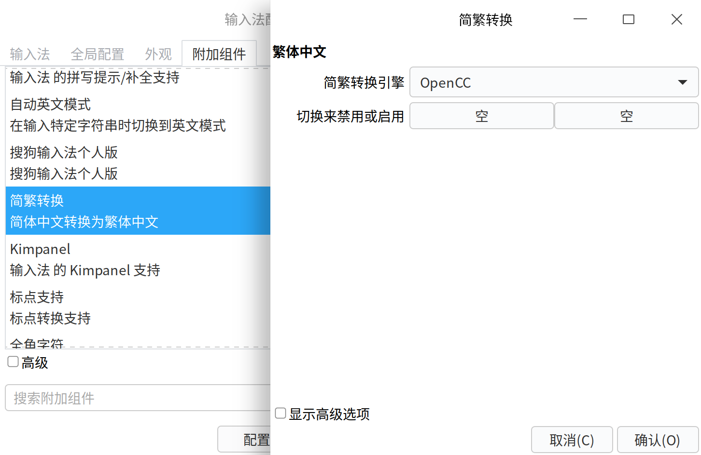

# 可解决 BUG

## 搜狗输入法 Deepin Next 版双拼时 v 模式无法关闭

- [搜狗输入法deepin next选字序号有时候是字母，为啥？－论坛－深度科技](https://bbs.deepin.org.cn/zh/post/276993)
- [搜狗输入法双拼问题－论坛－深度科技](https://bbs.deepin.org/post/281305)

可以先用系统自带的双拼，参考第二个帖子 [14 楼](https://bbs.deepin.org/post/281305?postId=1675406)，或者装搜狗输入法 Linux 版。

## 微信 Linux 无法用 Ctrl + Alt + W 全局快捷键激活窗口

- [【V23】微信Linux 版本快捷键聚焦窗口（等同windows 的 ctrl+alt+w)－论坛－深度科技](https://bbs.deepin.org/post/281125)

下载 [activate-wechat.sh](https://github.com/duanluan/shell-scripts/blob/main/activate-wechat.sh)。

`控制中心`-`键盘和语言`-`快捷键`，最下方新增。

- 名称：微信
- 命令：`上面脚本存放的目录/activate-wechat.sh`
- 快捷键：`Ctrl` `Alt` `W`

## KeePassXC 浏览器集成报错已安装到此位置的代理程序可执行文件丢失

- [Linux/Deepin 23 Edge/Chrome 浏览器 KeePassXC 无法连接数据的问题](https://blog.zhjh.top/?p=hIsteIcAmfn66ZL1sC82u)

`KeePassXC`-菜单栏`工具`-`设置`-`浏览器集成`-`高级`选项卡-`使用自定义代理位置`浏览：`/opt/apps/org.keepassxc.keepassxc/files/squashfs-root/usr/bin/keepassxc-proxy`

## KeePassXC 最小化到托盘而不是关闭

最小化窗口，双击托盘图标。

## IDEA 代码提示插件中文乱码

- [CodeWhisperer has issues with Chinese comments · Issue #3607 · aws/aws-toolkit-jetbrains](https://github.com/aws/aws-toolkit-jetbrains/issues/3607#issuecomment-1707522451)

换其他字体。

## IDEA 中无法在调试时按住 Alt 鼠标左键点击表达式查看值

- [Intellij Idea alt + click to evaluate debugger code not working in Mint - Stack Overflow](https://stackoverflow.com/a/47958926)

IDEA`设置`-`按键映射`中将`XWin`修改为`Windows`。

## 无法使用全局快捷键 Ctrl + Alt + F、Ctrl + Alt + B、Ctrl + Space 等

启动器打开“输入法配置”。

`附加组件`-`简繁转换`，配置中 ESC 去掉快捷键。


同样有快捷键的还有：

- `附加组件`-`输入法的 Unicode 输入支持`
- `全局配置`-`更多快捷键`-`切换激活/非激活输入法`
- `全局配置`-`显示高级选项`-`更多快捷键`-`切换符号键盘`

## 控制中心找不到蓝牙

- [V23 第二次出现丢失蓝牙了－论坛－深度科技](https://bbs.deepin.org/zh/post/261821)
- [更新后，自带蓝牙模块没有了－论坛－深度科技](https://bbs.deepin.org.cn/zh/post/265877)
- [如何手动升级内核？？？－论坛－深度科技](https://bbs.deepin.org.cn/zh/post/265618)
- [蓝牙连不上，显示：bluez守护进程没有运行...－论坛－深度科技](https://bbs.deepin.org/post/284890)
- [找不到蓝牙设置在哪，服务有驱动也有－论坛－深度科技](https://bbs.deepin.org/post/262909)

尝试了以下方案无效：
```shell
# 显示 Running
systemctl status bluetooth
# 安装虽然显示“新安装了 1 个软件包”，但重启无效
sudo apt install bluetooth

# blueman 安装后打开配置后闪退
sudo apt install blueman

# 搜索可用内核，发现已安装最新
sudo apt search linux-image-*
```
最终关机后断开电源一段时间后再开机，蓝牙又有了。

## 键盘突然失效，Ctrl 锁死，点击电源提示“锁屏失败”

[V23系统突然就键盘按键无效了－论坛－深度科技](https://bbs.deepin.org/zh/post/283218)

卸载 VMware Workstation。

```shell
sudo vmware-installer -u vmware-workstation
```

## TeamViewer 在用户登录界面可以远程，登录后无法远程

除了在 TeamViewer 选项中勾选“随系统一同启动 TeamViewer”外，还需在开始菜单 TeamViewer 图标右键勾选“开机自动启动”。
