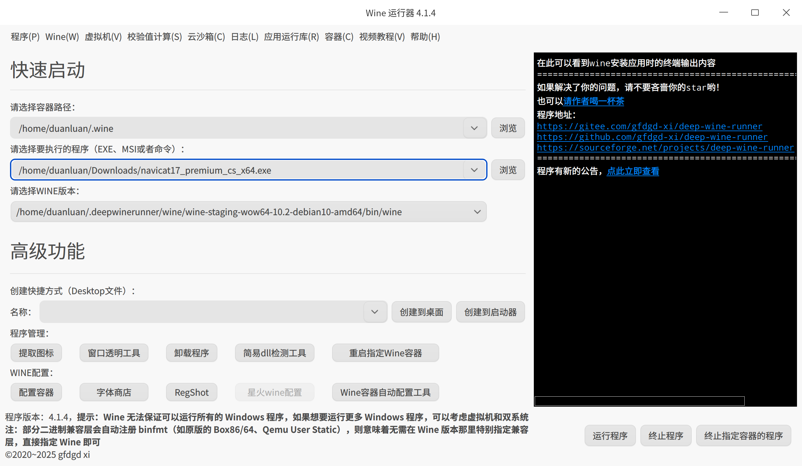
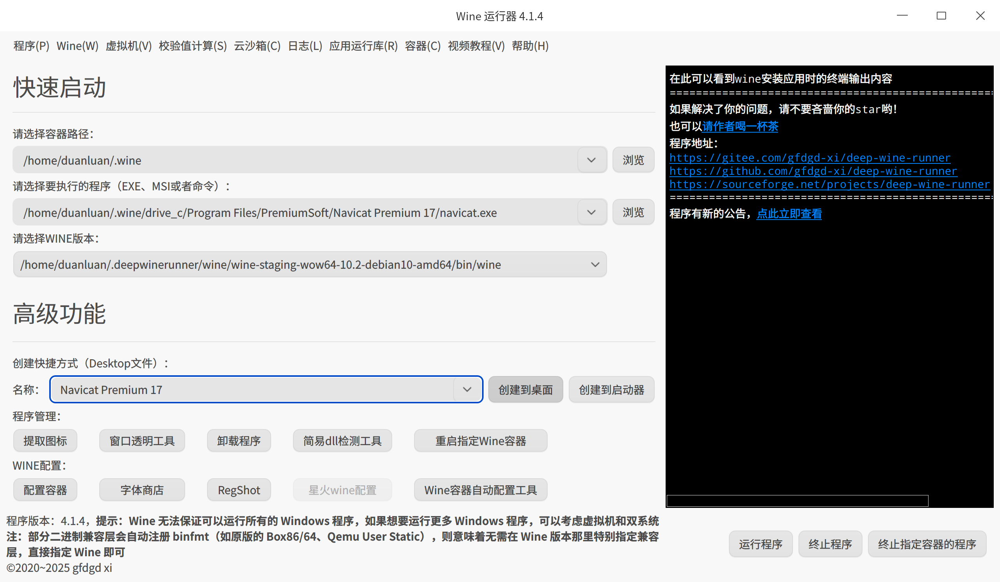

# 开发类

## Another Redis Desktop Manager

更快、更好、更稳定的Redis桌面(GUI)管理客户端，兼容Windows、Mac、Linux，性能出众，轻松加载海量键值


[下载 - Another Redis Desktop Manager](https://goanother.com/cn/#download)

```shell
paru another-redis-desktop-manager
```

## MobaXterm Pro

星火应用商店下载并安装 [MobaXterm Pro（汉化版）](spk://store/development/net.mobatek.mobaxterm-pro-chs)。

## WindTerm

一个更快更好的 DevOps SSH/Telnet/Serial/Shell/Sftp 客户端。


[Releases · kingToolbox/WindTerm](https://github.com/kingToolbox/WindTerm/releases)

```shell
paru windterm-bin
```

解决文件管理器打开文件报错无法创建临时文件：
```shell
sudo mkdir -p /usr/lib/windterm/temp
sudo chmod 1777 /usr/lib/windterm/temp
```

## Git

创建 SSH Key：

参考 [Generating a new SSH key and adding it to the ssh-agent - GitHub Docs](https://docs.github.com/en/authentication/connecting-to-github-with-ssh/generating-a-new-ssh-key-and-adding-it-to-the-ssh-agent)。

```shell
ssh-keygen -t ed25519 -C "your_email@example.com"
cat ~/.ssh/id_ed25519.pub
```

设置 Git 用户信息，否则 clone 时可能会报错`GnuTLS recv error (-110)`。

```shell
git config --global user.name "your_name"
git config --global user.email "your_email@example.com"
```

其他一些忽略：

```shell
# 忽略换行分隔符差异
git config --global core.autocrlf input
# 忽略文件权限修改
git config --global core.fileMode false
```

## nvm + Node.js + pnpm + nrm

- [脚本安装 nvm](https://github.com/nvm-sh/nvm?tab=readme-ov-file#install--update-script)
- [Node.js — Download Node.js®](https://nodejs.org/zh-cn/download)

```shell
# 代理下载安装脚本
proxychains wget https://raw.githubusercontent.com/nvm-sh/nvm/v0.40.3/install.sh
# 替换安装脚本中 git clone 为 proxychains git clone（可选）
sed -i 's/command git clone/command proxychains git clone/g' install.sh
# 执行脚本
bash install.sh
# 生效新环境变量
source ~/.zshrc
# 安装 Node.js
nvm install 24
# 安装 pnpm 方法一
corepack enable pnpm
# 安装 pnpm 方法二
npm install -g pnpm
# 自动安装配置 pnpm
pnpm setup
source ~/.zshrc
# 安装 nrm
pnpm add -g nrm
# 查看所有镜像源
nrm ls
  npm ---------- https://registry.npmjs.org/
  yarn --------- https://registry.yarnpkg.com/
  tencent ------ https://mirrors.tencent.com/npm/
  cnpm --------- https://r.cnpmjs.org/
  taobao ------- https://registry.npmmirror.com/
  npmMirror ---- https://skimdb.npmjs.com/registry/
  huawei ------- https://repo.huaweicloud.com/repository/npm/
# 使用镜像源
nrm use xxx
```

## JDK

[Java 8, 11, 17, 21, 23 Download for Linux, Windows and macOS](https://www.azul.com/downloads/?os=debian&architecture=x86-64-bit&package=jdk#zulu)

```shell
tar zxvf zulu21.42.19-ca-jdk21.0.7-linux_x64.tar.gz
sudo mkdir /opt/java
sudo mv zulu21.42.19-ca-jdk21.0.7-linux_x64 /opt/java/zulu21.42.19-ca-jdk21.0.6
# 末尾追加环境变量
$ nano ~/.zshrc
# jdk
export JAVA_HOME="/opt/java/zulu21.42.19-ca-jdk21.0.6"
export PATH=$JAVA_HOME/bin:$PATH

$ source ~/.zshrc
$ java -version
openjdk version "21.0.6" 2025-01-21 LTS
OpenJDK Runtime Environment Zulu21.40+17-CA (build 21.0.6+7-LTS)
OpenJDK 64-Bit Server VM Zulu21.40+17-CA (build 21.0.6+7-LTS, mixed mode, sharing)
```

## Gradle

[Gradle | Releases](https://gradle.org/releases/) 下载`binary-only`。

```shell
unzip gradle-7.6.5-bin.zip
sudo mkdir /opt/gradle
sudo mv gradle-7.6.5 /opt/gradle/
# 末尾追加环境变量
$ nano ~/.zshrc
# gradle
export GRADLE_HOME="/opt/gradle/gradle-7.6.5"
export PATH=$GRADLE_HOME/bin:$PATH

$ source ~/.zshrc
$ gradle -v

Welcome to Gradle 7.6.5!
……

```

## JetBrains IntelliJ IDEA

[下载 IntelliJ IDEA](https://www.jetbrains.com/zh-cn/idea/download/?section=linux)

[MIME 类型（MIME Type）完整对照表](https://mime.wcode.net/zh-hans/)

```shell
# 解压并移动到 /opt 下
tar zxvf ideaIU-2024.3.4.1.tar.gz
sudo mkdir /opt/jetbrains
sudo mv idea-IU-243.25659.59/ /opt/jetbrains/idea
# 创建快捷方式
sudo nano /usr/share/applications/idea.desktop

[Desktop Entry]
Name=IntelliJ IDEA Ultimate
Comment=The IDE for Professional Development in Java and Kotlin
GenericName=IDE
Exec=/opt/jetbrains/idea/bin/idea %F
Icon=/opt/jetbrains/idea/bin/idea.svg
Type=Application
# 禁用启动时进度通知
StartupNotify=false
# 与应用程序窗口关联的 WM_CLASS 属性
StartupWMClass=jetbrains-idea
Categories=TextEditor;Development;IDE;
MimeType=application/java;application/java-archive;application/java-byte-code;application/java-vm;
Keywords=idea;
```

## Maven

此处用的是 IDEA 自带的。也可以自己下载：[Download Apache Maven – Maven](https://maven.apache.org/download.cgi)

```shell
# 末尾追加环境变量
$ nano ~/.zshrc
# maven
export MAVEN_HOME="/opt/jetbrains/idea/plugins/maven/lib/maven3/"
export PATH=$MAVEN_HOME/bin:$PATH

$ source ~/.zshrc
$ mvn -v
Apache Maven 3.9.9 (8e8579a9e76f7d015ee5ec7bfcdc97d260186937)
Maven home: /opt/jetbrains/idea/plugins/maven/lib/maven3
Java version: 21.0.6, vendor: Azul Systems, Inc., runtime: /opt/java/zulu21.42.19-ca-jdk21.0.6
Default locale: zh_CN, platform encoding: UTF-8
OS name: "linux", version: "6.12.9-amd64-desktop-rolling", arch: "amd64", family: "unix"
```

## JetBrains WebStorm

[下载 WebStorm](https://www.jetbrains.com/zh-cn/webstorm/download/#section=linux)

```shell
# 解压并移动到 /opt 下
tar zxvf WebStorm-2024.3.4.tar.gz
sudo mkdir /opt/jetbrains
sudo mv WebStorm-243.25659.40/ /opt/jetbrains/webstorm
# 创建快捷方式
$ sudo nano /usr/share/applications/webstorm.desktop

[Desktop Entry]
Name=WebStorm
Comment=The JavaScript and TypeScript IDE by JetBrains
GenericName=IDE
Exec=/opt/jetbrains/webstorm/bin/webstorm %F
Icon=/opt/jetbrains/webstorm/bin/webstorm.svg
Type=Application
# 禁用启动时进度通知
StartupNotify=false
# 与应用程序窗口关联的 WM_CLASS 属性
StartupWMClass=jetbrains-webstorm
Categories=TextEditor;Development;IDE;
MimeType=application/xhtml+xml;text/javascript;text/css;
Keywords=webstorm;
```

## JetBrains PyCharm

[下载 PyCharm](https://www.jetbrains.com/zh-cn/pycharm/download/?section=linux)

```shell
# 解压并移动到 /opt 下
tar zxvf pycharm-2025.1.2.tar.gz
sudo mkdir /opt/jetbrains
sudo mv pycharm-2025.1.2 /opt/jetbrains/pycharm
# 创建快捷方式
$ sudo nano /usr/share/applications/pycharm.desktop

[Desktop Entry]
Name=PyCharm
Comment=Pycharm is a Python IDE for professional developers by JetBrains.
GenericName=IDE
Exec=/opt/jetbrains/pycharm/bin/pycharm %F
Icon=/opt/jetbrains/pycharm/bin/pycharm.svg
Type=Application
# 禁用启动时进度通知
StartupNotify=false
# 与应用程序窗口关联的 WM_CLASS 属性
StartupWMClass=jetbrains-webstorm
Categories=TextEditor;Development;IDE;
MimeType=application/xhtml+xml;text/javascript;text/css;
Keywords=pycharm;
```

## Python + pipx + cnpip 切换最快 pip 镜像源

自带 Python，但当你想全局安装依赖时会报错：
```shell
$ pip install cnpip

error: externally-managed-environment

× This environment is externally managed
╰─> To install Python packages system-wide, try 'pacman -S
    python-xyz', where xyz is the package you are trying to
    install.
    
    If you wish to install a non-Arch-packaged Python package,
    create a virtual environment using 'python -m venv path/to/venv'.
    Then use path/to/venv/bin/python and path/to/venv/bin/pip.
    
    If you wish to install a non-Arch packaged Python application,
    it may be easiest to use 'pipx install xyz', which will manage a
    virtual environment for you. Make sure you have python-pipx
    installed via pacman.

note: If you believe this is a mistake, please contact your Python installation or OS distribution provider. You can override this, at the risk of breaking your Python installation or OS, by passing --break-system-packages.
hint: See PEP 668 for the detailed specification.
```
解决方案是使用它推荐的 pipx：
```shell
# pacman 安装 pipx
sudo pacman -S python-pipx
# pipx 安装 cnpip
pipx install cnpip
# cnpip 切换最快镜像源
cnpip set
```

## 微信开发者工具

[msojocs/wechat-web-devtools-linux: 适用于微信小程序的微信开发者工具 Linux 移植版](https://github.com/msojocs/wechat-web-devtools-linux)

```shell
$ cd /opt
$ sudo git clone --recurse-submodules https://github.com/msojocs/wechat-web-devtools-linux.git
$ cd wechat-web-devtools-linux
$ sudo tools/build-with-docker.sh

Unable to find image 'jiyecafe/wechat-devtools-build:v1.0.4' locally
docker: Error response from daemon: Get "https://registry-1.docker.io/v2/": context deadline exceeded

# 方式一：代理运行
$ sudo proxychains tools/build-with-docker.sh
# 方式二：替换镜像源
$ sudo sed -i 's|jiyecafe/wechat-devtools-build:v1.0.4|swr.cn-north-4.myhuaweicloud.com/ddn-k8s/docker.io/jiyecafe/wechat-devtools-build:v1.0.4|g' tools/build-with-docker.sh

# 构建开发者工具
$ sudo tools/build-with-docker.sh
# 创建快捷方式
$ sudo nano /usr/share/applications/wechat-web-devtools.desktop

[Desktop Entry]
Name=WeChat Dev Tools
Name[zh_CN]=微信开发者工具
Comment=The development tools for wechat projects
Comment[zh_CN]=提供微信开发相关项目的开发IDE支持
Categories=Development;WebDevelopment;IDE;
Exec=/opt/wechat-web-devtools-linux/bin/wechat-devtools
Icon=/opt/wechat-web-devtools-linux/res/icons/wechat-devtools.svg
Type=Application
Terminal=false
StartupWMClass=wechat-devtools
Actions=
MimeType=x-scheme-handler/wechatide
```

## Apifox

API 设计、开发、测试一体化协作平台


[下载 Apifox - Apifox 帮助文档](https://docs.apifox.com/download)

```shell
paru apifox
```

## Apipost

API 开发管理工具


[下载中心-Apipost-中文版接口调试与文档管理工具](https://www.apipost.cn/download.html)

```shell
paru apipost-bin
```

## Navicat Premium

Navicat Premium 是强大的一体化数据库开发解决方案，可从单一应用程序无缝连接多个数据库，包括 MySQL、PostgreSQL、MongoDB、MariaDB、SQL Server、Oracle、SQLite、Redis 和 Snowflake。同时，它与 GaussDB 、OceanBase、TiDB、PolarDB 数据库及阿里云、腾讯云和华为云等主流云数据库兼容。


此处安装的是 Windows 版。

[Navicat | 下载 Navicat Premium Windows](https://www.navicat.com.cn/download/navicat-premium#windows)

Wine 运行器菜单栏`程序`-`安装更多Wine`：


菜单栏`Wine`-`安装常见字体`，左下角`WINE配置`-`字体商店`安装 1~5 的字体。

左下角`WINE配置`-`配置容器`，调整`应用程序`-`Windows 版本`为`Windows 11`，`显示`-`屏幕分辨率`调大以适应本机分辨率。


选择下载的安装包，点击`运行程序`安装，安装前会提示先安装 mono。



安装后会在启动器创建快捷方式但打不开。

修改 Wine 运行器中执行程序为`/home/duanluan/.wine/drive_c/Program Files/PremiumSoft/Navicat Premium 17/navicat.exe`，名称随便，创建快捷方式到桌面，参考这个内容修改启动器中现有快捷方式的内容。



```shell
$ vim ~/.local/share/applications/wine/Programs/PremiumSoft/Navicat\ Premium\ 17.desktop

[Desktop Entry]
Name=Navicat Premium 17
Exec=env WINEPREFIX='/home/duanluan/.wine' WINEDEBUG=FIXME,ERR,WARN,TRACE,Message  /home/duanluan/.deepwinerunner/wine/wine-staging-wow64-10.2-debian10-amd64/bin/wine '/home/duanluan/.wine/drive_c/Program Files/PremiumSoft/Navicat Premium 17/navicat.exe'  
Icon=D66E_navicat.0
Type=Application
StartupNotify=true
```

## DBeaver Ultimate

功能齐全的数据库管理工具。


[Download DBeaver Ultimate](https://dbeaver.com/download/ultimate/)

```shell
# 安装 25.0 版本
git clone https://aur.archlinux.org/dbeaver-ee.git
cd dbeaver-ee
git checkout 18d7fe23f27e70c2db8ec413d3fdafa3ca355a34
makepkg -si
```

[AUR : dbeaver-ee.git 25.0 版本 - AUR Package Repositories](https://aur.archlinux.org/cgit/aur.git/commit/PKGBUILD?h=dbeaver-ee&id=18d7fe23f27e70c2db8ec413d3fdafa3ca355a34)

DBeaver Agent：

1. 安装 DBeaver Agent：

   [Releases · wgzhao/dbeaver-agent](https://github.com/wgzhao/dbeaver-agent/releases) 下载压缩包。
    ```shell
    unzip dbeaver-agent-25.0-SNAPSHOT-jar-with-dependencies.jar.zip
    sudo mv dbeaver-agent-25.0-SNAPSHOT-jar-with-dependencies.jar /opt/dbeaver-ee/dbeaver-agent.jar
    ```

2. 配置 DBeaver：
    ```shell
    # 在文件末尾添加內容，保持在 -vmargs 后
    $ sudo nano /opt/dbeaver-ee/dbeaver.ini
    -javaagent:/opt/dbeaver-ee/dbeaver-agent.jar
    -Xbootclasspath/a:/opt/dbeaver-ee/dbeaver-agent.jar
    ```

3. 处理 JRE 依赖：

   [Azul Zulu](https://www.azul.com/downloads/#downloads-table-zulu) 下载 JRE 21。
    ```shell
    tar zxvf zulu21.42.19-ca-jre21.0.7-linux_x64.tar.gz
    sudo mv /opt/dbeaver-ee/jre /opt/dbeaver-ee/jre.bak
    sudo mv zulu21.42.19-ca-jre21.0.7-linux_x64 /opt/dbeaver-ee/jre
    ```

4. 屏蔽 stats.dbeaver.com 域名：
    ```shell
    # 将以下内容追加到 /etc/hosts
    $ sudo nano /etc/hosts
    127.0.0.1 stats.dbeaver.com
    ```

5. 生成许可证密钥：
    ```shell
    $ /opt/dbeaver-ee/jre/bin/java -cp /opt/dbeaver-ee/plugins/\*:/opt/dbeaver-ee/dbeaver-agent.jar com.dbeaver.agent.License -t ee
    --- dbeaver-ee(v25) LICENSE ---
    ……
    --- 请复制上一行 ---
    ```

6. 命令行启动 DBeaver：
    ```shell
    # 命令行启动方便查看日志
    /opt/dbeaver-ee/dbeaver
    ```
   点击“Import License”，粘贴上一步生成的许可证密钥并确定。

鼓励大家支持正版软件，购买正版授权不仅能获得更好的技术支持，还能为软件开发者提供持续的创新动力。

## Docker + Docker Componse + Portainer

```shell
# 安装 Docker + Docker Componse
sudo pacman -S docker docker-compose
# 启动 Docker 服务
sudo systemctl start docker
# 开机启动 Docker 服务
sudo systemctl enable docker
```

[Install Portainer CE | Portainer Documentation](https://docs.portainer.io/start/install-ce/server/docker/linux)

镜像加速请看：[Docker 使用笔记问题答疑及 WSL2 相关 - duanluan 的博客](https://blog.zhjh.top/?p=io0ETi1lKgEyKR0OcDZgS)

```shell
# 创建 Portainer 存储数据库的卷
sudo docker volume create portainer_data
# 启动 Portainer
proxychains sudo docker run -d -p 8000:8000 -p 9443:9443 --name portainer --restart=always -v /var/run/docker.sock:/var/run/docker.sock -v portainer_data:/data portainer/portainer-ce:lts
```

打开 [https://localhost:9443/](https://localhost:9443/) 初始化管理员账号。

## act

本地运行 GitHub Actions。

[Releases · nektos/act](https://github.com/nektos/act/releases) 下载压缩包。

```shell
$ tar zxvf act_Linux_x86_64.tar.gz
$ sudo mkdir /opt/act
$ sudo mv act /opt/act/

# 可执行文件链接到系统路径
$ sudo ln -s /opt/act/act /usr/local/bin/act

# 用本项目做测试
# 查看任务
$ act --list
INFO[0000] Using docker host 'unix:///var/run/docker.sock', and daemon socket 'unix:///var/run/docker.sock' 
Stage  Job ID           Job name         Workflow name  Workflow file    Events
0      deploy-gh-pages  deploy-gh-pages  docs           deploy-docs.yml  pus

# 测试
$ sudo act -j deploy-gh-pages
```
