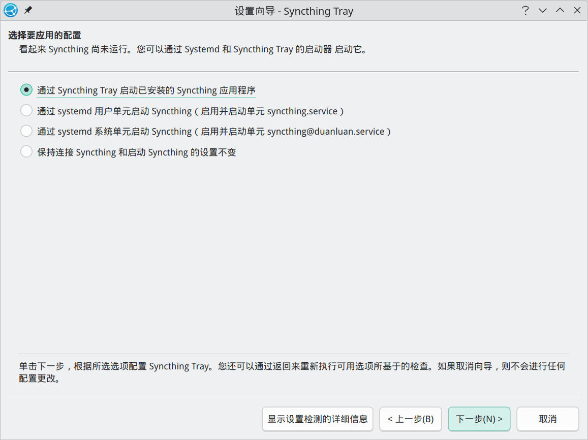

# 工具类

## Geekbench 6 跑分

[Downloading Geekbench 6 for Linux](https://www.geekbench.com/download/linux/)

```shell
paru geekbench
geekbench
```

## Clash Verge

A Clash Meta GUI based on Tauri.


[Releases · clash-verge-rev/clash-verge-rev](https://github.com/clash-verge-rev/clash-verge-rev/releases)

```shell
paru clash-verge-rev-bin
```

配置全局规则：

[Loyalsoldier/clash-rules: Clash Premium 规则集 (RULE-SET)](https://github.com/Loyalsoldier/clash-rules)

在`订阅`-`全局扩展覆写配置`中追加：

```yaml
rule-providers:
  # 直连
  direct:
    type: http
    behavior: domain
    url: "https://cdn.jsdelivr.net/gh/Loyalsoldier/clash-rules@release/direct.txt"
    interval: 86400
  # 代理
  private:
    type: http
    behavior: domain
    url: "https://cdn.jsdelivr.net/gh/Loyalsoldier/clash-rules@release/proxy.txt"
    interval: 86400
```

## proxychains

通过在应用程序与网络之间插入代理链，允许用户将所有流量通过指定的代理服务器进行转发，实现隐匿性和访问受限网络的目的。

安装 proxychains：
```shell
sudo pacman -S proxychains
```

在配置文件`/etc/proxychain.conf`末尾 [ProxyList] 后注释默认代理并添加新代理。
```shell
sudo nano /etc/proxychains.conf
```
```conf
[ProxyList]
socks5 127.0.0.1 7897
```

## Brook

跨平台可编程网络工具，可用于代理。

[Brook](https://www.txthinking.com/brook.html)

```shell
# 方式一：临时设置代理
$ export http_proxy=127.0.0.1:7897
$ export https_proxy=127.0.0.1:7897
# 方式二：使用 proxychains -q 开头

# 使用 nami 安装 brook
$ bash <(curl https://bash.ooo/nami.sh)
$ nami install brook
```

- 服务端
  ```shell
  $ nano brook-server.sh
  
  #!/bin/bash
  pkill -f "brook wsserver"
  sleep 1
  # -l 端口号 -p 密码
  nohup brook wsserver -l :9999 -p 123456 > /dev/null &
  
  $ chmod +x brook-server.sh
  $ ./brook-server.sh
  ```

- 客户端

  ```shell
  # 创建 brook 脚本，自定义目录
  $ nano ~/workspaces/bin/brook.service.sh
  
  #!/bin/bash
  # 查找包含 'brook wsclient' 的进程，并获取 PID
  pids=$(ps aux | grep '[b]rook wsclient' | awk '{print $2}')
  # 判断是否找到了 PID
  if [ -n "$pids" ]; then
    for pid in $pids; do
      echo "正在终止 brook wsclient 进程 (PID: $pid)"
      kill "$pid"
    done
  else
    echo "没有找到 brook wsclient 进程"
  fi
  # 启动 brook，具体命令看官方文档
  /home/duanluan/.nami/bin/brook wsclient -s 1.2.3.4:9999 -p 123456 --socks5 127.0.0.1:1080
  
  
  $ mkdir -p ~/.config/systemd/user
  # 将 brook 脚本创建为 systemd 服务
  $ nano ~/.config/systemd/user/brook.service
  
  [Unit]
  Description=A cross-platform programmable network tool.
  After=network.target
  
  [Service]
  ExecStart=/bin/bash /home/duanluan/workspaces/bin/brook.service.sh
  Restart=always
  RestartSec=5
  #StandardOutput=file:/home/duanluan/workspaces/bin/brook.log
  #StandardError=file:/home/duanluan/workspaces/bin/brook_error.log
  StandardOutput=null
  StandardError=null
  
  [Install]
  WantedBy=graphical-session.target
  
  $ systemctl --user daemon-reload
  $ systemctl --user enable brook
  $ systemctl --user start brook
  $ systemctl --user status brook
  ```

## Sublime Text

[Linux Package Manager Repositories - Sublime Text](https://www.sublimetext.com/docs/linux_repositories.html)

```shell
paru sublime-text-4
```

- [Sublime Text 使用记录](https://blog.zhjh.top/?p=d42feMmERGrK8UUTXUWqu)

## Typora


[Linux - Typora 官方中文站](https://typoraio.cn/#linux)

```shell
paru typora-free-with-plugin
```

[Typora 1.9.3](https://download2.typoraio.cn/linux/typora_1.9.3_amd64.deb) 激活：
```shell
$ git clone https://github.com/hazukieq/Yporaject.git
$ sudo apt install cargo
$ cd Yporaject/
$ cargo build & cargo run
$ sudo cp target/debug/node_inject /usr/share/typora

$ cd /usr/share/typora/
$ sudo chmod +x node_inject
$ sudo ./node_inject
extracting node_modules.asar
adding hook.js
applying patch
packing node_modules.asar
done!

$ cd -
$ cd license-gen/
$ cargo build & cargo run
License for you: ……
```

打开 Typora，菜单栏`帮助`-`我的许可证`-`输入序列号`，邮箱随便，等待一段时间后提示“链接服务器失败，使用尝试访问国内域名进行激活？”，确认即可。

鼓励大家支持正版软件，购买正版授权不仅能获得更好的技术支持，还能为软件开发者提供持续的创新动力。

## Obsidian

从个人笔记到日记、知识库和项目管理，Obsidian 为你提供工具来产生想法并组织它们。


[Download - Obsidian](https://obsidian.md/download)

```shell
paru obsidian-bin
```

## Pandoc

Pandoc 是一个开源的文档转换工具，支持多种文档格式之间的转换，如 Markdown、HTML、LaTeX、Word 等，广泛应用于学术写作和技术文档编写。

[Pandoc - Installing pandoc](https://pandoc.org/installing.html)

```shell
proxychains -q sudo paru pandoc-bin
```

## XnView MP

XnView MP/Classic 是一款免费的图像查看器，可轻松打开和编辑您的照片文件。这款图像查看器支持所有主流图像格式（JPEG、TIFF、PNG、GIF、WEBP、JPEG-XL、AVIF、HEIC、PSD、JPEG2000、OpenEXR、相机 RAW、PDF、DNG、CR2）。

作为图像查看器，它拥有颜色调整、图像大小调整、裁剪、屏幕捕获、元数据编辑（IPTC、XMP）等众多功能。凭借其易于使用的类似资源管理器的界面，XnView MP 允许您快速查看图像和照片，同时也能进行图像管理。它提供了批量重命名、批量转换、查找重复图像、图像比较等功能，您还可以创建联系表和幻灯片。


[XnView MP · Download | Free | XnView.com](https://www.xnview.com/en/xnview-mp/)

```shell
paru xnviewmp
```

## Wine

Wine 不进行模拟、转译或虚拟化，而是通过直接提供一组 Win32 API 的对应实现来运行 Windows 应用程序。

```shell
sudo pacman -Syu wine wine-mono wine-gecko winetricks
```
- wine-mono：Wine 的 Mono 组件，允许在 Wine 环境中运行基于 .NET 的应用程序。
- wine_gecko：Wine 的 Gecko 组件，提供对基于 HTML 的应用程序
- winetricks：Wine 的辅助脚本，简化了安装和配置 Windows 应用程序和组件的过程。

```shell
# 指定 Wine 前缀目录，否则默认为 ~/.wine
export WINEPREFIX=~/.wine-xxx
# 初始化 Wine 容器并设置
winecfg
# 安装中文字体支持
proxychains -q winetricks cjkfonts
```

Wine 设置，`应用程序`可以切换`Windows 版本`，`显示`-`屏幕分辨率`调大以适应本机分辨率。


## Proton-GE-Custom

Proton-GE 是 Proton 的“瑞士军刀”版本。如果 Steam Deck 或 Linux 上的官方 Proton 无法运行某个游戏，或者过场动画黑屏（通常是编码问题），切换到 Proton-GE 通常能解决问题。

```shell
paru -S proton-ge-custom-bin
```

## Wine 运行器

Wine运行器是一个能让Linux用户更加方便地运行Windows应用的程序。原版的 Wine 只能使用命令操作，且安装过程较为繁琐，对小白不友好。于是该运行器为了解决该痛点，内置了对Wine图形化的支持、Wine 安装器、微型应用商店、各种Wine工具、自制的Wine程序打包器、运行库安装工具等。


星火应用商店下载并安装[Wine运行器](spk://store/tools/spark-deepin-wine-runner)。

## uTools


[下载中心 - uTools 官网](https://www.u-tools.cn/download/)

```shell
paru utools
```

注意默认安装的 KRunner 快捷键为`Alt` `Space`。

## Rubick


[Releases · rubickCenter/rubick](https://github.com/rubickCenter/rubick/releases)

```shell
paru rubick
```

## KeePassXC


```shell
paru keepassxc-git
```

`KeePassXC`-菜单栏`工具`-`设置`-`浏览器集成`-`高级`选项卡-`使用自定义代理位置`浏览：`/usr/bin/keepassxc-proxy`

### FSearch

全局搜索文件工具。


```shell
paru fsearch
```

打开后`选项`-`数据库`，添加路径`/`。

### AnyTXT Searcher

免费桌面全文搜索工具


[下载最佳免费桌面全文搜索工具 | Anytxt](https://anytxt.net/download/)

```shell
paru anytxt-bin
```

### SimpleScreenRecorder

SimpleScreenRecorder是一款屏幕录制软件，它具有录制整个桌面、应用窗口、指定窗口大小以及音/视频同步，视频缩放等功能。


[Download - SimpleScreenRecorder - Maarten Baert's website](https://www.maartenbaert.be/simplescreenrecorder/#download)

```shell
# 直接安装会报错
$ paru simplescreenrecorder
……
==> 正在开始 build()...
CMake Error at CMakeLists.txt:1 (cmake_minimum_required):
  Compatibility with CMake < 3.5 has been removed from CMake.

  Update the VERSION argument <min> value.  Or, use the <min>...<max> syntax
  to tell CMake that the project requires at least <min> but has been updated
  to work with policies introduced by <max> or earlier.

  Or, add -DCMAKE_POLICY_VERSION_MINIMUM=3.5 to try configuring anyway.

-- Configuring incomplete, errors occurred!
==> 错误： 在 build() 中发生一个错误。
    正在放弃...
错误： 未能构建 'simplescreenrecorder-0.4.4-3': 
错误： 未能构建的软件包：simplescreenrecorder-0.4.4-3
```

按照它提示的做。

```shell
# 下载源码
$ git clone https://aur.archlinux.org/simplescreenrecorder.git
# 在 cmake 命令后加上 -DCMAKE_POLICY_VERSION_MINIMUM=3.5
$ nano PKGBUILD
……
  cmake -DCMAKE_INSTALL_PREFIX="/usr" -DCMAKE_BUILD_TYPE=Release \
    -DWITH_QT5=on \
    -DCMAKE_INSTALL_LIBDIR='lib' -DCMAKE_POLICY_VERSION_MINIMUM=3.5 ../
……
# 构建安装
$ makepkg -si
```

## Free Download Manager

強大又现代的下载管理器。


[Free Download Manager for Linux | Download](https://www.freedownloadmanager.org/zh/download-fdm-for-linux.htm)

```shell
paru freedownloadmanager
```

安装扩展：
- [Free Download Manager - Chrome 应用商店](https://chromewebstore.google.com/detail/free-download-manager/ahmpjcflkgiildlgicmcieglgoilbfdp?hl=zh-CN)
- [Free Download Manager official extension – Get this Extension for 🦊 Firefox](https://addons.mozilla.org/en-US/firefox/addon/free-download-manager-addon/)

## Gopeed

一款现代化的下载器。开源、轻量、原生，支持（HTTP、BitTorrent、Magnet 等）协议下载。


[Gopeed - 一款现代化的下载器](https://www.gopeed.com/zh-CN)

```shell
paru gopeed-bin
```

扩展：

- [Bilibili 视频下载](https://github.com/monkeyWie/gopeed-extension-bilibili)
  
- [Youtube 视频下载](https://github.com/monkeyWie/gopeed-extension-youtube)
  
- [百度网盘下载](https://github.com/monkeyWie/gopeed-extension-baiduwp)
  

## qBittorrent Enhanced Edition

基于 qBittorrent 的增强版 BT 下载工具。

[Releases · c0re100/qBittorrent-Enhanced-Edition](https://github.com/c0re100/qBittorrent-Enhanced-Edition/releases)

```shell
paru qbittorrent-enhanced
```

## Synology Drive Client

Synology Drive Client 是一款桌面实用程序，可在多台客户端计算机上提供面向集中化服务器 Synology Drive Server 的文件同步和个人计算机备份服务。

[下载中心 | 群晖科技 Synology Inc.](https://www.synology.cn/zh-cn/support/download)

```shell
paru synology-drive
```

## Syncthing + Syncthing Tray

Syncthing 是开源的、跨设备实时文件同步工具。

Syncthing Tray 是 Syncthing 的托盘图标工具。

```shell
paru syncthing-bin
paru syncthingtray
```

Syncthing Tray 设置向导中选择`通过 Syncthing Tray 启动已安装的 Syncthing 应用程序`。



## GnuPG + GpgFrontend

```shell
# 安装 GnuPG
sudo pacman -S gnupg
```

GpgFrontend 是一个现代化的、跨平台的 OpenPGP 图形用户界面工具，旨在为初学者提供简单易用的体验，同时为专家提供强大的功能，且完全开源、可移植。


- [GnuPG - Frontends](https://www.gnupg.org/software/frontends.html)
- [Releases · saturneric/GpgFrontend](https://github.com/saturneric/GpgFrontend/releases)

```shell
paru gpgfrontend
```

## Snipaste

Snipaste 是一个简单但强大的截图工具，也可以让你将截图贴回到屏幕上！下载并打开 Snipaste，按下 F1 来开始截图，再按 F3，截图就在桌面置顶显示了。就这么简单！


[Snipaste 下载](https://zh.snipaste.com/download.html)

```shell
paru snipaste
```

解决 Wayland 下全局快捷键会触发其他软件快捷键问题：

[Manjaro KDE Plasma Wayland 下全局快捷键不能覆盖其他软件，X11 下正常・Issue #3548・Snipaste/feedback](https://github.com/Snipaste/feedback/issues/3548)

右键托盘区 Snipaste 图标-`首选项`-`控制`-`全局快捷键`，将`截屏`的快捷键去除。

`系统设置`-`键盘`-`快捷键`-`新增`-`命令或脚本`，命令为`Snipaste snip`，添加后新增快捷键为`F1`并应用。

但截图后`Ctrl`+`T`贴图快捷键仍然会触发其他软件快捷键。

更多参考：[命令行选项 - Snipaste](https://docs.snipaste.com/zh-cn/command-line-options)

## 🔥 Flameshot 火焰截图

Flameshot 是一款免费且开源的跨平台工具，用于进行截图，具有许多内置功能，可为您节省时间。


- [Download Flameshot | Open Source Screenshot Software](https://flameshot.org/#download)
- [解决 Wayland 上的 Flameshot 问题](https://flameshot.org/docs/guide/wayland-help/)
- [Flameshot 命令行选项](https://flameshot.org/docs/advanced/commandline-options/)

```shell
# 安装 Flameshot
sudo pacman -S flameshot
```

`系统设置`-`键盘`-`快捷键`-`新增`-`命令或脚本`。

| 功能                | 命令                                  | 参考快捷键                |
|-------------------|-------------------------------------|----------------------|
| Flameshot 区域截图    | `flameshot gui`                     | Print                |
| Flameshot 延时区域截图  | `flameshot gui -d 3000`             | Ctrl + Print         |
| Flameshot 区域截图并贴图 | `flameshot gui --pin`               | Shift + Print        |
| Flameshot 全屏截图    | `flameshot full -p ~/Pictures/屏幕截图` | Ctrl + Shift + Print |

- 解决 Wayland 下截图黑屏：

  命令前加`QT_QPA_PLATFORM=xcb`。

- 解决 Wayland 下贴图没有置顶：

  `系统设置`-`窗口管理`-`窗口规则`-`新增`。先贴图，`检测窗口属性`，点击贴的图窗口，添加`窗口类(应用程序)`、`窗口标题`、`窗口置顶`。
  
  
  
  - 描述：Flameshot Pin Top
  - 窗口类（应用程序）：`完全匹配` `flameshot flameshot`
  - 窗口标题：`完全匹配` `flameshot pin`
  - 窗口置顶：`强制` `是`

## eSearch

截屏+OCR+搜索+翻译+贴图+屏幕翻译+以图搜图+滚动截屏+录屏


```shell
paru e-search
```

## VMware Workstation Pro

VMware Workstation Pro 是一款功能强大的虚拟化软件，允许用户在单一物理机上创建和运行多个虚拟机，支持多种操作系统，适用于开发、测试和生产环境。

[如何在 Linux 上下载和安装 VMware Workstation Pro 免费版 - 系统极客](https://www.sysgeek.cn/install-vmware-workstation-pro-on-linux/)

[注册 Broadcom](https://profile.broadcom.com/web/registration) 账号，用邮箱作用户名登录。

[Free Downloads - Support Portal - Broadcom support portal](https://support.broadcom.com/group/ecx/free-downloads) 搜索“VMware Workstation Pro”后下载 Linux 版。

```shell
# 方法一
chmod u+x VMware-Workstation-Full-17.6.3-24583834.x86_64.bundle
sudo ./VMware-Workstation-Full-17.6.3-24583834.x86_64.bundle

# 方法二
paru -S vmware-keymaps vmware-workstation
```

安装过程中“VMware's Customer Experience Improvement Program ("CEIP")”可以选 No。

---

- 安装 [open-vm-tools](https://github.com/vmware/open-vm-tools) 增强虚拟机：
  ```shell
  sudo pacman -S open-vm-tools
  ```

- Could not connect 'Ethernet0' to virtual network '/dev/vmnet8'

  ```shell
  sudo systemctl enable --now vmware-networks
  ```

- Fail Network configuration is missing. Ensure that /etc/vmware/networking exists
  ```shell                                                      INT ✘ 
  systemctl enable --now vmware-networks-configuration.service
  ```

## VirtualBox

VirtualBox 是一款开源的虚拟化软件，允许用户在不同操作系统上创建和运行虚拟机，支持跨平台使用，适用于开发、测试和学习。

[Linux_Downloads – Oracle VirtualBox](https://www.virtualbox.org/wiki/Linux_Downloads)
[Downloads – Oracle VirtualBox](https://www.virtualbox.org/wiki/Downloads)

```shell
# 查看内核版本
$ uname -r
6.12.48-1-MANJARO

# 安装 VirtualBox，选择指定内核版本的 extra，此处为 linux612-virtualbox-host-modules
$ sudo pacman -S virtualbox
:: 有 14 个软件包可提供 VIRTUALBOX-HOST-MODULES ：
:: 软件仓库 extra
   1) linux510-virtualbox-host-modules  2) linux515-virtualbox-host-modules
   3) linux54-virtualbox-host-modules  4) linux61-rt-virtualbox-host-modules
   5) linux61-virtualbox-host-modules  6) linux612-rt-virtualbox-host-modules
   7) linux612-virtualbox-host-modules  8) linux615-rt-virtualbox-host-modules
   9) linux616-rt-virtualbox-host-modules  10) linux616-virtualbox-host-modules
   11) linux617-virtualbox-host-modules  12) linux66-rt-virtualbox-host-modules
   13) linux66-virtualbox-host-modules  14) virtualbox-host-dkms
输入某个数字 ( 默认=1 ): 7

# 加载到内核，否则会报错“Kernel driver not installed (rc=-1908)”
$ sudo modprobe vboxdrv
```

- 不能枚举 USB 设备：

    ```shell
    sudo usermod -aG vboxusers $USER
    ```
    运行后需要重启电脑生效。

- 不显示 USB 设备：

    ```shell
    # 添加 usbfs 用户组（virtualbox 装完成后会有 vboxusers 和　vboxsf）
    sudo groupadd usbfs
    # 将用户添加到 vboxusers、usbfs 组
    sudo usermod -aG vboxusers $USER
    sudo usermod -aG usbfs $USER
    ```
    [使用VirtualBox时，怎么支持USB - 简书](https://www.jianshu.com/p/de430444a8ae)

- VirtualBox can't enable the AMD-V extension：

    
    ```shell
    # 移除 KVM 模块
    sudo rmmod kvm_amd
    sudo rmmod kvm
    # 将 kvm 和 kvm_amt 加入黑名单模块列表
    echo "blacklist kvm" | sudo tee /etc/modprobe.d/blacklist.conf
    echo "blacklist kvm_amd" | sudo tee -a /etc/modprobe.d/blacklist.conf
    sudo update-initramfs -u
    ```
    [VirtualBox can't enable the AMD-V extension | 一张假钞的真实世界](https://www.zhangjc.com/2025/01/20/VirtualBox-can-t-enable-the-AMD-V-extension/)

- Cannot register the hard disk 'xxx.vdi' {new_uuid} because a hard disk 'xxx.vid' with UUID {old_uuid} already exists.

    ```shell
    # 释放硬盘介质
    vboxmanage closemedium disk old_uuid
    ```
    [修复 VirtualBox 中 “UUID 的硬盘已存在” 问题 - Linux-Terminal.com](https://cn.linux-terminal.com/?p=4755)

## 安卓模拟器 麟卓卓懿

[下载 | 北京麟卓信息科技有限公司](https://www.linzhuotech.com/Product/download) 下载。

```shell
tar xvf xDroidInstall-x86_64-v13.2.380-20250306.tar.xz
./xDroidInstall-x86_64-v13.2.380-20250306.run
```

## XMind

思维导图与头脑风暴工具。


[免费下载 Xmind 思维导图 | Xmind 中文官方网站](https://xmind.cn/download/)

```shell
# 克隆并编译安装 v23.08
git clone https://aur.archlinux.org/xmind.git
cd xmind
git checkout f9f4f8
makepkg -si
```

[Releases · henryau53/xmind-crack-patch](https://github.com/henryau53/xmind-crack-patch/releases)

先按照开发类中安装 nvm + Node.js + pnpm + nrm。

```shell
pnpm add -g asar

git clone https://github.com/henryau53/xmind-crack-patch.git
cd xmind-crack-patch

asar pack ./app.asar.non-windows app.asar

sudo cp app.asar /opt/Xmind/resources/app.asar
```

## Draw.io Desktop

免费开源的流程图绘制工具。


[Releases · jgraph/drawio-desktop](https://github.com/jgraph/drawio-desktop/releases)

```shell
sudo pacman -S drawio-desktop
```

## Sunshine + Moonlight

Sunshine + Moonlight 是一套自托管的游戏串流解决方案，其中 Sunshine 作为服务端，Moonlight 作为客户端，使用户可以将 PC 游戏串流到其他设备上，提供低延迟和高质量的游戏体验。

[Sunshine+Moonlight 低延迟远程串流和平板副屏](https://blog.zhjh.top/?p=uvdJRjuB)

```shell
paru sunshine-bin
paru moonlight-qt-bin
```

## OBS Studio

免费且开源的用于视频录制以及直播串流的软件。


[下载 | OBS](https://obsproject.com/zh-cn/download)

```shell
# 方法一
sudo pacman -S obs-studio

# 方法二：ffmpeg-obs 会和 ffmpeg 冲突。
paru obs-studio-tytan652

# 方法三
paru obs-studio-liberty
```

## StartLive 开播器

B 站推流开播。


- [Releases · Radekyspec/StartLive](https://github.com/Radekyspec/StartLive/releases)
- [【腾讯文档】StartLive开播器使用说明](https://docs.qq.com/doc/DTHVMdkhtUWJjRFhv)

先按照开发类中安装`uv`。

```shell
mkdir -p ~/.local/share/startlive
# 克隆源码到指定目录
git clone https://github.com/Radekyspec/StartLive.git ~/.local/share/startlive
cd ~/.local/share/startlive

# 创建虚拟环境
uv venv
# 激活虚拟环境
source .venv/bin/activate
# 安装依赖
uv pip install -r requirements.txt
# 安装备用后端库，确保在系统钥匙串服务（如 Gnome Keyring）缺失或不可用时，仍能通过本地文件存储凭据。
uv pip install keyrings.alt
# 强制指定 Python 使用上述明文文件后端存取 Cookie，彻底绕过尝试连接系统服务导致的报错。
mkdir -p ~/.config/python_keyring/
echo "[backend]
default-keyring=keyrings.alt.file.PlaintextKeyring" > ~/.config/python_keyring/keyringrc.cfg

# 创建快捷方式
cat <<EOF > ~/.local/share/applications/startlive.desktop
[Desktop Entry]
Type=Application
Name=StartLive
Exec=$HOME/.local/share/startlive/.venv/bin/python $HOME/.local/share/startlive/StartLive.py
Icon=$HOME/.local/share/startlive/resources/icon_left.ico
Path=$HOME/.local/share/startlive
Terminal=false
Categories=Network;Video;
EOF
# 更新桌面数据库
update-desktop-database ~/.local/share/applications/
```

## VLC Media Player

VLC 是一款自由、开源的跨平台多媒体播放器及框架，可播放大多数多媒体文件，以及 DVD、音频 CD、VCD 及各类流媒体协议。


```shell
sudo pacman -S vlc
```

## Remote Desktop Manager + FreeRDP

Remote Desktop Manager（RDM）将所有远程连接集中到一个平台上，用户之间以及整个团队都可以安全地共享该平台。RDM 支持数百种集成技术（包括多种协议和 VPN），内置企业级密码管理工具、全局和细粒度访问控制，以及强大的移动应用程序，是 Windows 和 Mac 桌面客户端的补充，是远程访问的 IT 工具箱。


[Download - RDM - Devolutions](https://devolutions.net/remote-desktop-manager/download/)

```shell
# 安装 FreeRDP
sudo pacman -S freerdp
# 安装 Remote Desktop Manager
paru remote-desktop-manager
```

## EasyTier

一个简单、安全、去中心化的内网穿透 VPN 组网方案，使用 Rust 语言和 Tokio 框架实现。


[Releases · EasyTier/EasyTier](https://github.com/EasyTier/EasyTier/releases)

```shell
# 脚本安装
$ wget -O /tmp/easytier.sh "https://raw.githubusercontent.com/EasyTier/EasyTier/main/script/install.sh" && sudo bash /tmp/easytier.sh install
 Install EasyTier successfully!

Default Port: 11010(UDP+TCP), Notice allowing in firewall!

Default Network Name: default, Please change it to your own network name!

Now EasyTier supports multiple config files. You can create config files in the /opt/easytier/config/ folder
For more information, please check the documents in official site
The management example of a single configuration file is as follows

Status: systemctl status easytier@default
Start: systemctl start easytier@default
Restart: systemctl restart easytier@default
Stop: systemctl stop easytier@default

# 停用服务
$ systemctl stop easytier@default
# 通过 https://easytier.cn/web/index.html#/config_generator 生成配置
$ sudo nano /opt/easytier/config/default.conf
# 启动服务
$ systemctl start easytier@default


# 更新 EasyTier 到最新版本
wget -O /tmp/easytier.sh "https://raw.githubusercontent.com/EasyTier/EasyTier/main/script/install.sh" && bash /tmp/easytier.sh update
```

注意事项：
- easytier-core 命令输出的 TOML 中`rpc_portal = "0.0.0.0:15888"`，本机在`/opt/easytier/config/default.conf`保持为`rpc_portal = "0.0.0.0:0`不变才正常连通网络。

## RustDesk

快速开源远程访问和支持软件


[Releases · rustdesk/rustdesk](https://github.com/rustdesk/rustdesk/releases/)

```shell
# 安装
$ paru rustdesk-bin

==> NOTE: The RustDesk daemon must be started for RustDesk to work.
==> NOTE: To start it automatically on boot, run 'sudo systemctl enable --now rustdesk' in a terminal.

# 启动 RustDesk 服务并设置为开机自启
$ sudo systemctl enable --now rustdesk
```

修改缩放：开始菜单搜索`RustDesk`，右键`编辑应用程序`，在`常规`-`环境变量`中添加`GDK_SCALE=2`（2 为缩放比例），保存后重启软件。

## TeamViewer


[下載 Linux | TeamViewer](https://www.teamviewer.cn/cn/download/linux/)

```shell
paru teamviewer
teamviewer --daemon start
```

## AnyDesk


[Remote Desktop Software for Ubuntu and Linux | AnyDesk](https://anydesk.com.cn/en/downloads/linux)

```shell
paru anydesk-bin

# 开机启动
systemctl enable anydesk.service
```

## 向日葵


[向日葵远程控制软件下载 - 贝锐向日葵官网](https://sunlogin.oray.com/download)

```shell
paru sunloginclient

# 开启服务
sudo systemctl start runsunloginclient.service
# 开机启动
sudo systemctl enable runsunloginclient.service
```

## ToDesk


[ToDesk下载 - ToDesk官网_Todesk下载](https://www.todesk1.com/download)

```shell
# 安装 ToDesk
paru todesk-bin
```

安装后网络连接不上，需要启动服务。

- 方式一：开机启动
  
  ```shell
  $ sudo systemctl enable --now todeskd.service
  ```

- 方式二：随软件启动
  ```shell
  $ sudo nano /opt/todesk/bin/start-todesk.sh
  
  #!/bin/bash
  # 检查服务是否运行，如果未运行则请求提权启动
  # quiet 模式下，如果服务未运行返回非 0 状态
  if ! systemctl is-active --quiet todeskd.service; then
      # 使用 pkexec 弹出 GUI 密码输入框
      pkexec systemctl start todeskd.service
  fi
  # 设置环境变量
  export LIBVA_DRIVER_NAME=iHD
  export LIBVA_DRIVERS_PATH=/opt/todesk/bin
  # 启动主程序
  exec /opt/todesk/bin/ToDesk
  
  # 赋予运行权限
  $ sudo chmod +x /opt/todesk/bin/start-todesk.sh
  ```
  开始菜单搜索`ToDesk`，右键`编辑应用程序...`，清空`环境变量`，`程序`修改为`/opt/todesk/bin/start-todesk.sh`后保存。

## CopyQ

CopyQ 监控系统剪贴板并将其内容保存在自定义选项卡中。 保存的剪贴板稍后可以直接复制并粘贴到任何应用程序中。


[Releases · hluk/CopyQ](https://github.com/hluk/CopyQ/releases)

```shell
sudo pacman -S copyq
```

托盘剪贴板图标，右键`配置剪贴板`-`快捷键`，将`在鼠标位置显示剪贴板项目`的全局自定义为无。

打开 CopyQ，`文件`-`首选项`-`快捷键`-`全局`-`显示/隐藏主窗口`设置为`Meta/Super` `V`。

## 闪电藤/LocalSend

闪电藤是基于 LocalSend 的二次开发产品，在原有局域网文件传输基础上，增加了 webdav 传输和云传输的能力，是一个万能的文件传输助手。

[下载 | 闪电藤](https://lightningvine.zishu.life/download.html)

闪电藤还没上 AUR，先用 LocalSend：

```shell
paru localsend-bin 
```

## Calibre

全能电子书管理阅读编辑转换。


[calibre - 下载 Linux版](https://calibre-ebook.com/zh_CN/download_linux)

```shell
# 不用 AUR 中的 calibre-bin，会无法切换中文
sudo pacman -S calibre
```
