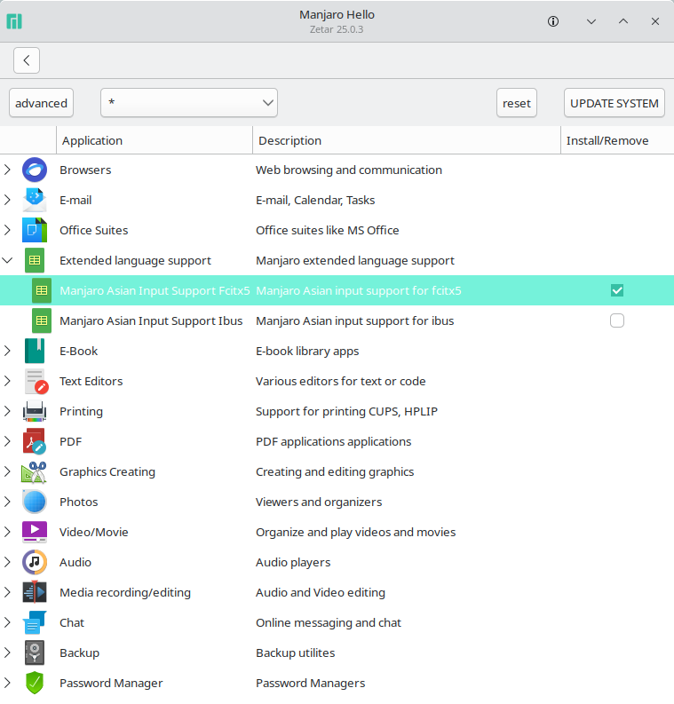
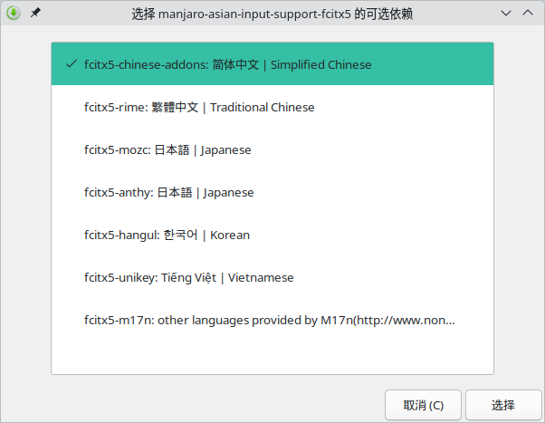
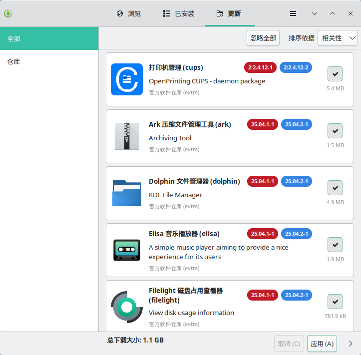
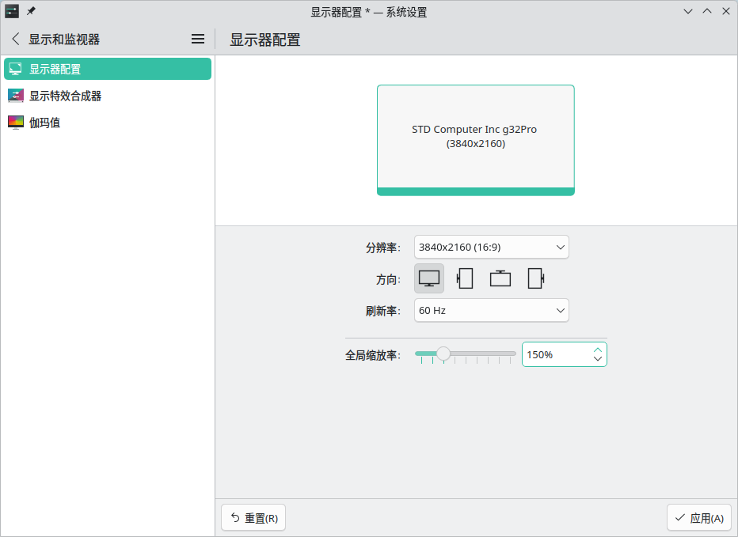
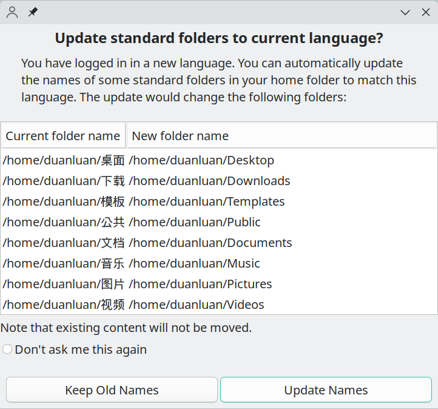
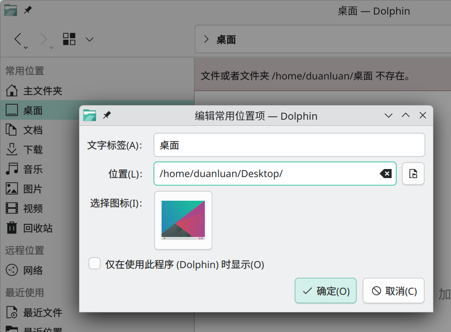
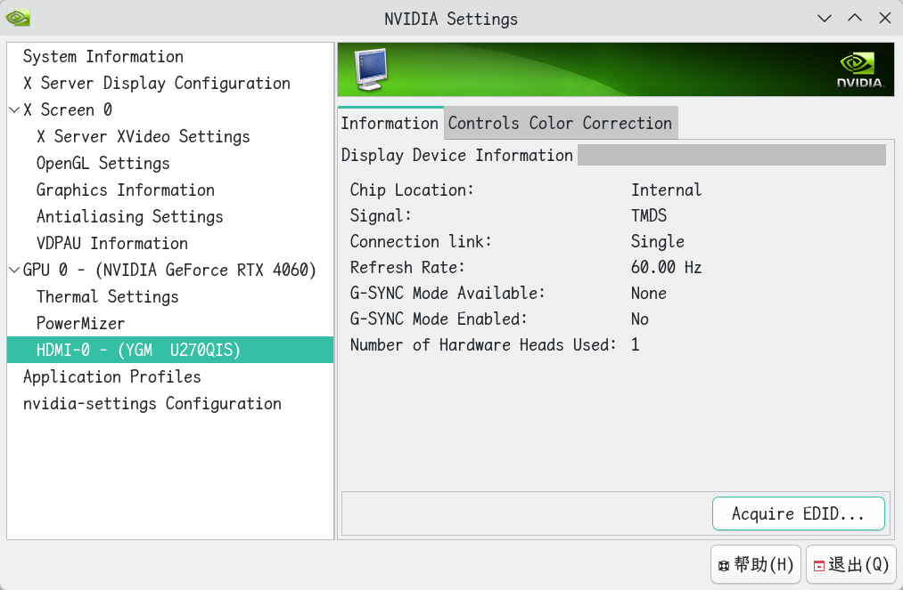

# Hardware Overview

- AMD Ryzen 7 PRO 8845HS
- 32 GB x2 DDR5 5600 MHz
- PCIe 4.0 NVMe SSD 2 TB

Geekbench 6 results:

- Deepin 23.1: [Tianbei GEM12 - Geekbench](https://browser.geekbench.com/v6/cpu/10922940)
- Xubuntu 24.04.2: [Tianbei GEM12 - Geekbench](https://browser.geekbench.com/v6/cpu/12633571)
- Manjaro KDE Plasma 25.0.3: [Tianbei GEM12 - Geekbench](https://browser.geekbench.com/v6/cpu/12680900)

# Back Up the Previous Distro

I did not back up the entire system. I only archived the home directory and copied it out.

```shell
# archive the home directory
sudo tar -cf /tmp/home_xxx.tar /home/xxx
# open another terminal and monitor the size while the archive is being created
watch -n 1 ls -lh /tmp/home_xxx.tar
```

# System Configuration

## Login Failure Count and Lockout Duration

```shell
# edit the faillock configuration file
$ sudo nano /etc/security/faillock.conf

# if the number of failed attempts within this interval exceeds deny, the account is locked
fail_interval = 900
# allowed consecutive password failures within fail_interval
deny = 10
# automatic unlock time after the account is locked; set to 0 or never for manual unlock only
unlock_time = 30
```

## Pacman Mirror Selection

If you selected the time zone and language during installation, the top of `/etc/pacman.d/mirrorlist` usually includes a `Country : China` mirror by default.

```text
##
## Manjaro Linux default mirrorlist
## Generated on 2025-06-30 23:48
##
## Please use 'pacman-mirrors -f [NUMBER] [NUMBER]' to modify mirrorlist
## (Use 0 for all mirrors)
##

## Country : China
Server = https://mirrors.jlu.edu.cn/manjaro/stable/$repo/$arch

## Country : United_States
Server = https://ohioix.mm.fcix.net/manjaro/stable/$repo/$arch

## Country : Bangladesh
Server = https://bd.mirror.vanehost.com/Manjaro/stable/$repo/$arch
```

If not, follow [archlinux | Tsinghua Open Source Mirror Help](https://mirrors.tuna.tsinghua.edu.cn/help/archlinux/) to switch mirrors.

Or use:

```shell
sudo pacman-mirrors -c china
```

## Pacman Configuration

```shell
# edit the Pacman configuration file
sudo nano /etc/pacman.conf
```

- **Enable colored output**: uncomment `#Color` so it becomes `Color`.
- **Adjust parallel downloads**: change the value of `ParallelDownloads = 4`.

## Network Time Synchronization

```shell
# enable network time sync
sudo timedatectl set-ntp true

# on dual-boot systems with Windows, use local RTC time to avoid an 8-hour offset when switching systems
sudo timedatectl set-local-rtc 1 --adjust-system-clock

# check the status
timedatectl status
```

## `^[[200~` Appears When Pasting Into the Terminal

```shell
# temporary fix
$ printf "\e[?2004l"

# permanent fix: append to ~/.zshrc
$ nano ~/.zshrc

# disable Zsh bracketed paste mode
unset zle_bracketed_paste
```

## ArchLinuxCN Repository

```shell
# append the ArchLinuxCN repository block to /etc/pacman.conf in commented form
sudo nano /etc/pacman.conf

# [archlinuxcn]
# Server = https://mirrors.tuna.tsinghua.edu.cn/archlinuxcn/$arch

# enable the repo by removing the leading '#'
sudo sed -i 's/^# *\[\(archlinuxcn\)\]/[\1]/; s/^# *\(Server.*archlinuxcn\)/\1/' /etc/pacman.conf
# install the ArchLinuxCN GPG keyring on first use
sudo pacman -Sy archlinuxcn-keyring
# refresh the package database only; do not do a full -Su here
sudo pacman -Sy
# install the package you need
sudo pacman -S ttf-maplemono-nf-cn-unhinted
# disable the repo again immediately afterwards to avoid mixed-source upgrades
sudo sed -i 's/^\[\(archlinuxcn\)\]/# [\1]/; s/^\(Server.*archlinuxcn\)/# \1/' /etc/pacman.conf
```

## Speed Up AUR GitHub Downloads and `git clone`

Install `axel` and create a wrapper script for GitHub downloads:

```shell
# install axel
$ sudo pacman -S axel
# download the helper script
$ mkdir -p ~/.local/bin
$ curl -fL -o ~/.local/bin/github-mirror-axel.sh https://raw.githubusercontent.com/duanluan/shell-scripts/main/github-mirror-axel.sh
$ chmod +x ~/.local/bin/github-mirror-axel.sh
```

`github-mirror-axel.sh`: [shell-scripts/github-mirror-axel.sh at main · duanluan/shell-scripts](https://github.com/duanluan/shell-scripts/blob/main/github-mirror-axel.sh)

Edit `makepkg.conf`:

```shell
# copy the default file into the home directory so pacman updates do not overwrite it
cp /etc/makepkg.conf ~/.makepkg.conf

# edit ~/.makepkg.conf
nano ~/.makepkg.conf

# find DLAGENTS and change it to:
DLAGENTS=('file::/usr/bin/curl -qgC - -o %o %u'
          #'ftp::/usr/bin/curl -qgfC - --ftp-pasv --retry 3 --retry-delay 3 -o %o %u'
          #'http::/usr/bin/curl -qgb "" -fLC - --retry 3 --retry-delay 3 -o %o %u'
          #'https::/usr/bin/curl -qgb "" -fLC - --retry 3 --retry-delay 3 -o %o %u'
          'ftp::/usr/bin/axel -n 10 -a -o %o %u'
          'http::/usr/bin/axel -n 10 -a -o %o %u'
          "https::$HOME/.local/bin/github-mirror-axel.sh %o %u"
          'rsync::/usr/bin/rsync --no-motd -z %u %o'
          'scp::/usr/bin/scp -C %u %o')
```

If you see `No state file, cannot resume download!`, it usually means curl partially downloaded the file earlier and axel is trying to resume it.

Clear the cache and download again, for example:

```shell
rm -rf ~/.cache/paru/clone/geekbench
paru -S geekbench
```

Example showing that the GitHub download wrapper is working:

```shell
$ paru -S clash-verge-rev-bin

==> Retrieving sources...
  -> Downloading clash-verge-rev-2.4.2-x86_64.deb...
github-mirror-axel.sh is active
Initializing download: https://gh-proxy.com/https://github.com/clash-verge-rev/clash-verge-rev/releases/download/v2.4.2/Clash.Verge_2.4.2_amd64.deb
File size: 47.8972 MB (50223894 bytes)
Opening output file clash-verge-rev-2.4.2-x86_64.deb.part
Starting download

Connection 0 finished
Connection 1 finished
[100%] [.....................................................................................] [   2.7MB/s] [00:00]

Downloaded 47.8972 MB in 17 seconds (2766.17 KB/s)
```

Set up URL rewriting to speed up `git clone` from GitHub:

```shell
# remove old rules if you configured them before
git config --global --unset-all url."https://download.fastgit.org/https://github.com/".insteadof
# add the new rule
git config --global url."https://gh-proxy.com/https://github.com/".insteadof "https://github.com/"
# inspect all configured rules
git config --global --get-regexp url
```

Example showing that accelerated GitHub cloning is working:

```shell
$ paru rime-ice

==> Retrieving sources...
  -> Cloning rime-ice git repo...
Cloning into bare repository '/home/duanluan/.cache/paru/clone/rime-ice-git/rime-ice'...
remote: Enumerating objects: 11879, done.
remote: Counting objects: 100% (44/44), done.
remote: Compressing objects: 100% (35/35), done.
remote: Total 11879 (delta 24), reused 9 (delta 9), pack-reused 11835 (from 3)
Receiving objects: 100% (11879/11879), 232.18 MiB | 7.03 MiB/s, done.
```

Reference: [Complete Archlinux AUR acceleration setup](https://caveallegory.cn/2024/03/archlinux-aur%E5%8A%A0%E9%80%9F%E5%AE%8C%E6%95%B4%E8%AE%BE%E7%BD%AE/)

## Speed Up `curl` and `wget` GitHub Downloads

```shell
# create the helper script
$ mkdir -p ~/.local/bin
$ nano ~/.local/bin/github-wrappers.sh
```

`github-wrappers.sh`: [shell-scripts/github-wrappers.sh at main · duanluan/shell-scripts](https://github.com/duanluan/shell-scripts/blob/main/github-wrappers.sh)

```shell
# make it executable
$ chmod +x ~/.local/bin/github-wrappers.sh
# edit the zsh config and append:
$ nano ~/.zshrc

# load the shell wrappers for GitHub acceleration
if [ -f ~/.local/bin/github-wrappers.sh ]; then
    source ~/.local/bin/github-wrappers.sh
fi

# reload the config
$ source ~/.zshrc
```

## Speed Up GitHub With `/etc/hosts`

```shell
# back up the hosts file
sudo cp /etc/hosts /etc/hosts.bak
```

Visit [https://github-hosts.tinsfox.com/hosts](https://github-hosts.tinsfox.com/hosts) and copy the generated hosts entries.

```shell
# append them to the end of /etc/hosts
nano /etc/hosts
```

Reference: [GitHub Host - Accelerate GitHub access](https://github-hosts.tinsfox.com/)

Or use the script: [shell-scripts/update-github-hosts.sh at main · duanluan/shell-scripts](https://github.com/duanluan/shell-scripts/blob/main/update-github-hosts.sh)

## Install Fcitx5 (Must Read)

After entering the system, in the Manjaro Hello popup click `Applications`, check `Extended language support` -> `Manjaro Asian Input Support Fcitx5`, then click `UPDATE SYSTEM`.



Choose `fcitx5-chinese-addons: Simplified Chinese` and install it.



Log out from `Leave` -> `Log Out`, then sign in again. Use `Ctrl` `Space` to switch input methods.

Search for `Input Method` from the launcher.

Optional configuration changes:

- `Configure global options` -> `Shortcuts`
  - change the shortcut for `Toggle Input Method` to `Ctrl` `Shift`
- `Configure global options` -> `Behavior`
  - set `Share Input State` to `All`

Optional shortcuts to clear:

- `Configure global options` -> `Shortcuts`
  - `Toggle embedded preedit`
- `Keyboard - Chinese` -> right-side configure icon
  - `Switch Hint Mode`
  - `Trigger Hint Mode Once`
- `Configure Addons`
  - `Modules` -> `Punctuation` -> `Toggle Key`
  - `Modules` -> `Clipboard` -> `Trigger Key`
  - `Modules` -> `Simplified and Traditional Chinese` -> `Toggle Key`
  - `Modules` -> `Quick Phrase` -> `Trigger Key`
  - `Modules` -> `Cloud Pinyin` -> `Toggle Key`
  - `Modules` -> `Unicode` -> `Trigger Key`, `Input Unicode characters with hexadecimal numbers`

## System Updates

Search for `Software Update` in the launcher and click `Apply`.



```shell
sudo pacman -Syu
```

Reboot after updates. Otherwise, the running kernel and kernel modules may not match, and commands such as `modprobe tun` can fail.

## DPI Scaling

Search for `Display Configuration`, change `Global scale`, click `Apply`, and then log out and back in for the change to take effect.



## Switch Home Directory Names to English

```shell
# install xdg-user-dirs-gtk
sudo pacman -S xdg-user-dirs-gtk
export LANG=en_US
xdg-user-dirs-gtk-update
```



Choose `Update Names`.

```shell
export LANG=zh_CN.UTF-8
xdg-user-dirs-gtk-update
```

Check `Don’t ask me this again`, then choose `Keep Old Names`.

Manually remove any leftover Chinese-named directories such as Videos, Pictures, Documents, Downloads, and Desktop under the home directory.

In Dolphin, right-click the entries under Places and choose `Edit` to update them.



## Disable Conflicting Global Shortcuts in KRunner, KWin, and Plasma Workspace

In `System Settings` -> `Keyboard` -> `Shortcuts`, clear the active shortcut and click `Apply`.

`KRunner`:

- **Run command**: Alt+F2

`KWin` / `Window Management`:

- **Switch to Desktop 1**: Ctrl+F1
- **Switch to Desktop 2**: Ctrl+F2
- **Switch to Desktop 3**: Ctrl+F3
- **Switch to Desktop 4**: Ctrl+F4
- **Toggle Tiling by Window Class**: Ctrl+F7
- **Toggle Tiling on Current Desktop**: Ctrl+F9
- **Toggle Tiling on All Desktops**: Ctrl+F10
- **Suspend Compositing**: Alt+Shift+F12

`plasmashell` / `Plasma Workspace`:

- **Activate Application Launcher**: Alt+F1
- **Show Desktop**: Ctrl+F12

## Create a Virtual Display (Must Read for Remote Access)

When connecting remotely, if no monitor is attached locally or the monitor is powered off, the session can fail to connect or show a black screen. Forcing a virtual display solves this.

### Open-Source Drivers (Intel / AMD)

Use a kernel parameter to force a virtual output.

```shell
# list the current display connectors detected by the system
$ ls /sys/class/drm/

card1       card1-DP-2  card1-HDMI-A-1  card1-HDMI-A-3  card1-HDMI-A-5  card2-DP-4  card2-DP-6      renderD128  version
card1-DP-1  card1-DP-3  card1-HDMI-A-2  card1-HDMI-A-4  card2           card2-DP-5  card2-HDMI-A-6  renderD129

# list connector status and choose one that is disconnected
$ grep "^" /sys/class/drm/*/status

/sys/class/drm/card1-DP-1/status:disconnected
/sys/class/drm/card1-DP-2/status:disconnected
/sys/class/drm/card1-DP-3/status:disconnected
/sys/class/drm/card1-HDMI-A-1/status:disconnected
/sys/class/drm/card1-HDMI-A-2/status:disconnected
/sys/class/drm/card1-HDMI-A-3/status:disconnected
/sys/class/drm/card1-HDMI-A-4/status:disconnected
/sys/class/drm/card1-HDMI-A-5/status:disconnected
/sys/class/drm/card2-DP-4/status:disconnected
/sys/class/drm/card2-DP-5/status:disconnected
/sys/class/drm/card2-DP-6/status:disconnected
/sys/class/drm/card2-HDMI-A-6/status:connected


# edit the GRUB config
$ sudo nano /etc/default/grub

# append video=connector-name:resolution@refresh-rate to GRUB_CMDLINE_LINUX_DEFAULT
GRUB_CMDLINE_LINUX_DEFAULT='quiet splash udev.log_priority=3 video=HDMI-A-1:3840x2160@60e'

# regenerate the GRUB config
$ sudo grub-mkconfig -o /boot/grub/grub.cfg
```

### NVIDIA Proprietary Driver (X11)

With the NVIDIA proprietary driver, GRUB injection does not work. You need to modify the Xorg config and create a real-display + virtual-display setup.

```shell
# get the GPU PCI address and derive the BusID
$ lspci | grep -i vga

# note 01:00.0; convert it to decimal notation PCI:1:0:0 in the config
01:00.0 VGA compatible controller: NVIDIA Corporation AD107 [GeForce RTX 4060] (rev a1)

# inspect the currently connected display outputs
$ nvidia-settings -q dpys

    [4] njcm-pc:0[dpy:4] (HDMI-0) (connected, enabled)

      Has the following names:
        DFP
        DFP-4
        DPY-EDID-b83621ba-cd9f-fefb-a8c5-a438b3e7a04b
        DPY-4
        HDMI-0
        Connector-1

# click `Acquire EDID...` in nvidia-settings and save the file as `edid.bin` in your home directory
$ nvidia-settings
```



```shell
# move the EDID file into the X11 directory and fix permissions
$ sudo mv edid.bin /etc/X11/edid.bin
$ sudo chmod 644 /etc/X11/edid.bin

# generate a 1080p EDID file for the virtual display
python -c "import binascii; open('virtual_1080p.bin', 'wb').write(binascii.unhexlify('00ffffffffffff0031d8000000000000051601036d3c2278ea5e03a1544c99260f5054a1080081800101010101010101010101010101023a801871382d40582c450056502100001e000000fc004c696e7578204648440a20202020000000fd00323c1e4611000a202020202020000000ff004c696e75782023300a2020202001ba02030400000000000000000000000000000000000000000000000000000000000000000000000000000000000000000000000000000000000000000000000000000000000000000000000000000000000000000000000000000000000000000000000000000000000000000000000000000000000000000000000000000000000000000000000000000092'))"
# move it into place and set permissions
$ sudo mv virtual_1080p.bin /etc/X11/virtual_1080p.bin
$ sudo chmod 644 /etc/X11/virtual_1080p.bin

# create the Xorg config file
$ sudo nano /etc/X11/xorg.conf.d/20-nvidia-headless.conf

# --- file content ---
Section "ServerLayout"
    Identifier     "Layout0"
    Screen      0  "Screen0" 0 0
EndSection

Section "Device"
    Identifier     "Device0"
    Driver         "nvidia"
    VendorName     "NVIDIA Corporation"
    # change BusID based on lspci, for example 01:00.0 becomes PCI:1:0:0
    BusID          "PCI:1:0:0"

    # --- key settings start ---
    # 1. allow startup without a physical monitor
    Option         "AllowEmptyInitialConfiguration" "True"

    # 2. force-enable two outputs: [real connector], [virtual connector]
    Option         "ConnectedMonitor" "DFP-4, DFP-0"

    # 3. load different EDID files for the real and virtual displays
    Option         "CustomEDID" "DFP-4:/etc/X11/edid.bin; DFP-0:/etc/X11/virtual_1080p.bin"
    # --- key settings end ---
EndSection

Section "Screen"
    Identifier     "Screen0"
    Device         "Device0"
    Monitor        "Monitor0"
    DefaultDepth    24
    SubSection     "Display"
        Depth       24
        # default reference resolution for the virtual screen
        Modes      "1920x1080"
    EndSubSection
EndSection

Section "Monitor"
    Identifier     "Monitor0"
    # keep DPMS enabled so KDE can still manage power
    Option         "DPMS"
EndSection
# --- end ---


# disable the auto-generated Xorg config (usually 90-mhwd.conf)
$ sudo mv /etc/X11/xorg.conf.d/90-mhwd.conf /etc/X11/xorg.conf.d/90-mhwd.conf.bak
# disable any dummy driver config if it exists
$ sudo mv /etc/X11/xorg.conf.d/10-headless.conf /etc/X11/xorg.conf.d/10-headless.conf.bak
```

### Fix a Physical Monitor That Stays Black After Power Cycling or Resume

If the physical monitor stays black after being powered back on, or after resume, while remote access still works, the GPU probably failed to renegotiate the display signal. Add a script that force-resets the output.

```shell
# create the reset script
$ mkdir -p ~/.local/bin
$ nano ~/.local/bin/reset_screen.sh

#!/bin/bash
# 1. force-disable the physical display output; replace HDMI-0 with your connector
xrandr --output HDMI-0 --off
# wait a second so the hardware state fully settles
sleep 1
# 2. turn it back on and make it the primary display
# --auto restores the preferred resolution
# --primary makes sure the taskbar returns
# do not specify a relative position; let KDE restore the previous layout automatically
xrandr --output HDMI-0 --auto --primary

# save and make it executable
$ chmod +x ~/.local/bin/reset_screen.sh
```

Search for `Shortcuts` from the launcher, go to `Add New` -> `Command or Script`, and set the command to `~/.local/bin/reset_screen.sh`.

Click `Add` on the right, assign the shortcut `Meta` `F10`, then click `Apply`.

After turning the monitor back on, press `Meta` `F10` and wait a few seconds.

Problem: **global shortcuts do not work while the screen is locked**.

### Recovery

If the system can no longer enter the graphical session after rebooting, log in via SSH or switch to a TTY with `Ctrl` `Alt` `F2` and run:

```shell
# restore the GRUB config
sudo nano /etc/default/grub
# remove the video=connector:resolution@refresh-rate fragment
# regenerate GRUB
sudo grub-mkconfig -o /boot/grub/grub.cfg

# remove the custom Xorg config
sudo mv /etc/X11/xorg.conf.d/20-nvidia-headless.conf /etc/X11/xorg.conf.d/20-nvidia-headless.conf.bak
# restore the auto-generated config
sudo mv /etc/X11/xorg.conf.d/90-mhwd.conf.bak /etc/X11/xorg.conf.d/90-mhwd.conf
# restore the dummy driver config if it exists
sudo mv /etc/X11/xorg.conf.d/10-headless.conf.bak /etc/X11/xorg.conf.d/10-headless.conf

# reboot
sudo reboot
```

## Increase the X11 Client Limit

This fixes `Maximum number of clients reached` when launching new graphical applications.

```shell
$ sudo pacman -S lsof
# show the top 10 processes using the most X11 connections
$ sudo lsof -U | grep X11-unix | awk '{print $1}' | sort | uniq -c | sort -nr | head -n 10

lsof: WARNING: can't stat() fuse.portal file system /run/user/1000/doc
      Output information may be incomplete.
lsof: WARNING: can't stat() fuse.cherry-studio.AppImage file system /tmp/.mount_cherryJWuJUB
Output information may be incomplete.
107 Xorg

# raise the X11 client connection limit
$ sudo nano /etc/sddm.conf.d/x11-clients.conf

# X11 maximum client limit
[X11]
ServerArguments=-nolisten tcp -maxclients 1024

# reboot, or run sudo systemctl restart sddm (this logs you out)
```
