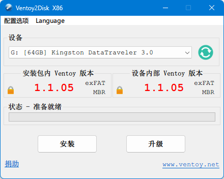

# System Installation

## Version History

- Deepin 23.1: [GitHub - duanluan/deepin-notes at deepin23](https://github.com/duanluan/linux-notes/tree/deepin23)
- Xubuntu 24.04.2: [GitHub - duanluan/linux-notes at xubuntu24](https://github.com/duanluan/linux-notes/tree/xubuntu24)
- Manjaro: current version

## Create the Installation USB

Install [Ventoy](https://www.ventoy.net/cn/index.html) on the USB drive.

On the [Manjaro Homepage](https://manjaro.org/), click `Download`, choose the `KDE Plasma` edition, download the ISO, and place it on the USB drive.

## Install the System

For more details, see: [UEFI - Installation Guide - Manjaro](https://wiki.manjaro.org/index.php/UEFI_-_Install_Guide/zh-cn)

Press `F2` or `Del` during boot to enter the BIOS, then choose the USB drive under `Save & Exit` -> `Boot Override`.

In Ventoy, choose the Manjaro image and select `Boot in normal mode`. If you run into boot issues, try `Boot in grub2 mode`.

Set tz (time zone) to `Asia/Shanghai` and lang (language) to `zh_CN`. After that, pacman will switch to the corresponding mirrors automatically.

Choose `Boot with open source drivers`. After the desktop loads, click `Launch installer` in the `Manjaro Hello` window.

Installer settings:
- Location
  - Set the time zone to Asia/Shanghai.
  - Set the system language to Simplified Chinese (China).
  - Set the numbers and dates locale to Simplified Chinese (China).
- Keyboard
  - Set the keyboard model to Generic 105-key PC.
  - Set the keyboard layout to Chinese/Default.
- Partitions
  - Erase disk
  - Choose swap without hibernation, or swap with hibernation + ext4. For laptops, the hibernation option is recommended.
- Office Suite
  - No Office Suite

After installation finishes, remove the USB drive before rebooting.

## References

- [Clean ad-free PE boot tools and multi-system collection](https://blog.zhjh.top/?p=pe)
- [grub2boot . Ventoy](https://ventoy.net/cn/doc_grub2boot.html)
