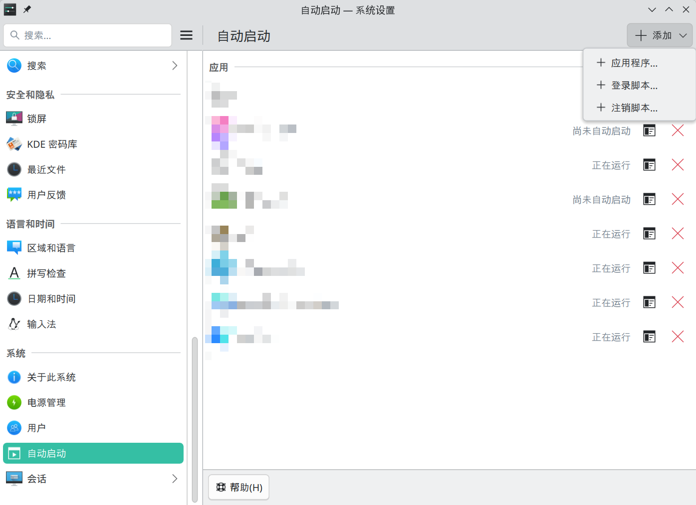

# 使用技巧

## 窗口便捷移动改变大小

`系统设置`-`应用和窗口`-`窗口管理`-`窗口行为`-`窗口操作`中。

- Meta + 左键拖动：移动窗口
- Meta + 右键拖动：改变窗口大小

## 开机自动启动

`系统设置`-`系统`-`自动启动`中添加。

## 关闭动画特效

`系统设置`-`应用和窗口`-`窗口管理`-`桌面特效`，取消勾选不需要的特效。

我只勾选了：

- **无响应窗口灰化**：降低无响应/已卡死窗口的颜色饱和度
- **高亮显示屏幕边缘和四角**：光标靠近触碰时会触发操作的屏幕边缘和四角时高亮显示他们
- **对话框父级窗口变暗**：当前活动对话框的父窗口将会变暗
- **桌面概览**：用于显示虚拟桌面和窗口的概览；使用快捷键激活

## 其他软件打开 Dolphin 文件管理器时在新标签页中打开，而不是新窗口

`Dolphin`地址栏最右边图标-`配置`-`配置 Dolphin`-`界面`-`文件夹与标签页`-`打开文件夹`，勾选`保持单个 Dolphin 窗口，在标签页中打开新文件夹`。
