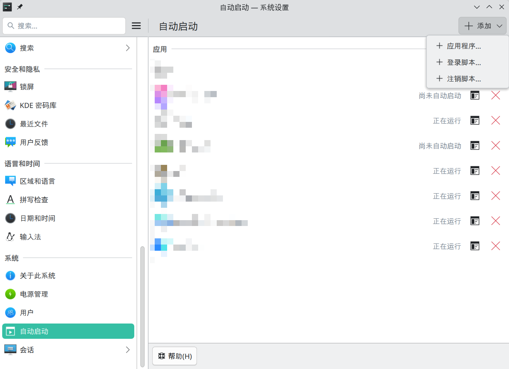

# Tips & Tricks

## Move and Resize Windows Quickly

Go to `System Settings` -> `Apps & Windows` -> `Window Management` -> `Window Behavior` -> `Window Actions`.

- Meta + left-drag: move the window
- Meta + right-drag: resize the window

## Start Apps Automatically at Login

Add the app under `System Settings` -> `System` -> `Autostart`.

## Turn Off Unneeded Desktop Effects

Go to `System Settings` -> `Apps & Windows` -> `Window Management` -> `Desktop Effects`, and disable the effects you do not need.

I only keep these enabled:

- **Dim Inactive Windows**: reduce the color saturation of unresponsive or frozen windows
- **Highlight Screen Edge**: highlight screen edges and corners when the pointer reaches an active trigger area
- **Dim Parent Windows**: dim the parent window of the currently active dialog
- **Desktop Grid**: show an overview of virtual desktops and windows, and activate it with a shortcut

## Open Dolphin Folders in Tabs Instead of New Windows

In `Dolphin`, click the icon at the far right of the address bar, then go to `Configure` -> `Configure Dolphin` -> `Interface` -> `Folders & Tabs` -> `Opening Folders`, and enable `Open new folders in tabs`.
